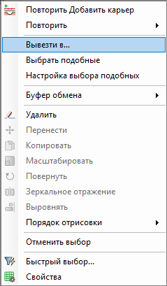
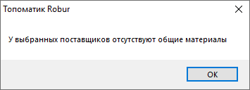
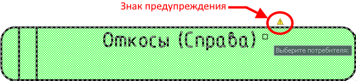
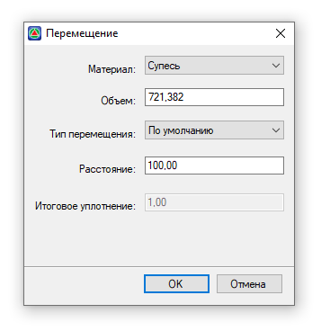
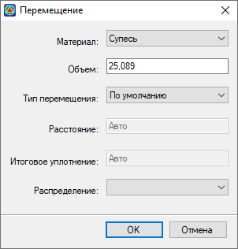
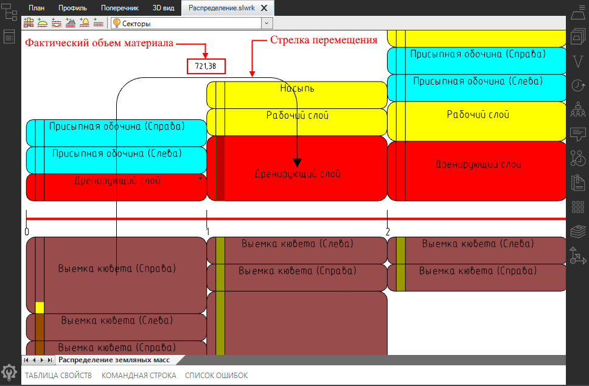

# Ручное перемещение материалов распределения

Ручное перемещение можно создавать как для одного **Поставщика**, так и для нескольких **Поставщиков** одновременно с общими материалами.

Чтобы создать перемещение от **Поставщика** к **Потребителю**:

1. На ленте **Распределения земляных масс** нажмите кнопку  (**Создать перемещение**) и выберите **Поставщика** или на диаграмме выделите **Поставщика**, нажмите ПКМ, откроется контекстное меню из которого выберите **Вывезти в**:

   

   

   Выбрать группу **Поставщиков** по их свойствам можно с помощью функции **Быстрый выбор**, для этого в окне **Свойства** нажмите кнопку  (**Быстрый выбор**), далее см. описание работы с данной функцией [Запуск и настройка Топоматик Robur. Общие настройки. Быстрый выбор.](../../../install_startup/startup/general_setting/quick_selection.md)

   При выделении **Поставщиков** с разными материалами и выборе команды **Вывезти из** программа вынесет предупреждение:

   

   

2. Далее выберите **Потребителя**.

   

   Если **Применимость материала** у **Поставщика** не совпадает с **Применимостью Потребителя**, то при наведении курсора мыши на **Потребителя**, программа отобразит знак предупреждения :

   

   

   После откроется окно, в котором можно настроить параметры перемещения материала, затем нажмите **ОК**:

   

   * В поле **Материал** можно изменить материал перемещения, если **Поставщик** содержит несколько материалов.

   * В поле **Объем** отображается фактический объем, который может быть получен от **Поставщика** или объем **Потребителя**, если он меньше фактического объема от **Поставщика**. Значение в данном поле можно изменить.

     

     При выборе группы **Поставщиков** в данном поле отображается максимальный фактический объем, который может быть получен из выбранных **Поставщиков** или объем **Потребителя**, если он меньше фактического объема из этих **Поставщиков**.

     

   * **Тип перемещения** материала назначается из списка в соответствующем поле (создание типов перемещений см. описание настройки **Типы перемещений** в разделе [Предварительные настройки](../pre_settings_model/pre_settings.md)).

   * В поле **Расстояние** можно изменить значение, если фактическое расстояние возки не соответствует вычисленному по пикетажу.

   * Поле **Итоговое уплотнение** показывает значение произведения коэффициента уплотнения и коэффициента потерь.

     

     В случае выбора нескольких **Поставщиков**, в данном окне появится поле **Распределение**, в котором из селектора можно выбрать способ распределения материалов:

     

     При выборе значения **Равномерно** распределение материалов происходит следующим образом:

     1. Сначала определяется *привозимый фактический объем*, который принимается по объему **Потребителя** или значению в поле **Объем** данного окна, в зависимости что меньше.
     2. Затем определяется *вывозимый фактический объем* из каждого **Поставщика**, который принимается как *привозимый фактический объем* (см. **п.1**), деленный на количество **Поставщиков** или как минимальное значение фактического объема, которое можно привезти из **Поставщика** (определяется среди выделенных **Поставщиков**), в зависимости что меньше.

      

     При выборе значения **По минимальному расстоянию**, материалы будут перемещаться от ближайших **Поставщиков** в порядке приоритета к **Потребителю** по мере его заполнения.

      

3. После задания настроек нажмите **ОК**.

В результате в рабочем поле появится стрелка перемещения с фактическим объемом перемещения, а индикаторы наличия материалов изменят цвет.



Описание свойств стрелки перемещения см. раздел [Редактирование (свойства) перемещения.](working_apportionment.md)


