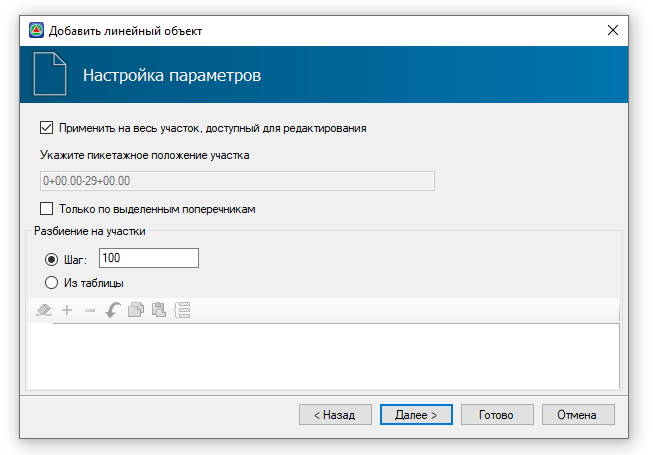

# Обновление

Данная функция предназначена для обновления исходных данных линейного объекта распределения при изменении проектных решений в основном линейном объекте **Автомобильной/ Железной дороги**. Например, при изменении геологического разреза в подобъекте на поперечниках или изменении продольного профиля по оси трассы.

Чтобы обновить данные на ленте **Распределение земляных масс** нажмите кнопку  (**Обновить**), затем выберите ось линейного объекта распределения, откроется окно мастера **Настройка параметров**:

Алгоритм задания настроек аналогичен алгоритму задания параметров при добавлении линейного объекта распределения и создании диаграммы (см. раздел [Добавление линейного объекта/ диаграмма](../working_apportionment_participants/adding_zone_soil_works.md#dobavlenie-linejnogo-obuekta/-diagramma)).

В результате линейный объект распределения обновится с учетом изменений в основном подобъекте. В частности:

* Секторы на диаграмме перестроятся, согласно изменениям в подобъекте.

* Функционал программы позволяет сохранить измененные/ созданные вручную Секторы, предварительно появится предупреждение:

  

  Выберите **Да** для сохранения таких Секторов на линейном объекте распределения. При выборе значения **Нет** Секторы на диаграмме будут перестроены, и распределение материалов необходимо произвести заново.

  * Если после обновления объем Сектора уменьшился и стал меньше объема перемещения, то объем перемещения будет уменьшен до нового объема в Секторе.

  * Если после обновления объем Сектора увеличился, то объем в перемещении останется прежним (как до обновления), необходимо выполнить перераспределение материалов.

  * Измененные/ созданные вручную перемещения останутся неизменными.



Если был изменен шаг разбивки Секторов в поле **Разбиение на участки**, то алгоритм перераспределения объемов для каждого входящего\ исходящего перемещения линейного объекта распределения будет следующим:  

1. Берется диапазон на линейном объекте распределения, который занимал старый Сектор, связанный с перемещением.
2. Программа смотрит, какие Секторы (с соответствующими материалами и применимостями) обновленного линейного объекта распределения пересекают этот диапазон.
3. Для каждого из этих Секторов вычисляется максимальный объем, который может быть вывезен\ привезен - (Длина Сектора, попавшая в диапазон / Длина Сектора) \* Объем сектора.
4. Программа в цикле, берет ближайший Сектор и вывозит или привозит в него либо полностью объем старого перемещения, либо вычисленный для него максимальный объем, в зависимости, что меньше.
5. **П.4** повторяется, пока старое перемещение не будет полностью перераспределено по новым Секторам.


