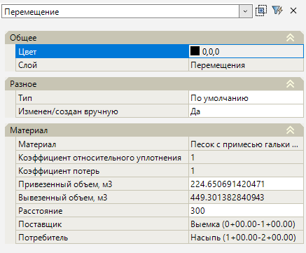
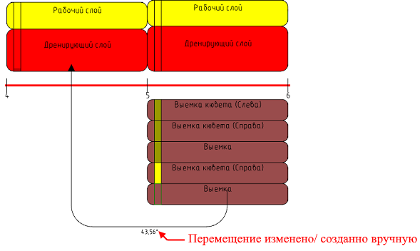

# Редактирование (свойства) перемещения

Стрелки перемещения в рабочем поле можно двигать с помощью грипов. При выборе квадратного грипа  стрелку можно переместить на другой Сектор или точечный объект.

При выборе стрелки перемещения в окне **Свойства** отобразятся ее параметры:

<u>**Общее**</u>

* В данном подразделе задаётся цвет стрелки перемещения в рабочем поле и отображается наименование ее слоя.

<u>**Разное**</u>

* В поле **Тип** отображается выбранный тип Перемещения, который можно изменить выбрав его из списка (создание типов перемещений см. описание настройки **Типы перемещений** в разделе [Предварительные настройки](../pre_settings_model/pre_settings.md)).

* Если перемещение создано вручную или автоматическое перемещение было изменено, то в поле **Изменен/ создан вручную** стоит значение **Да**, а сама стрелка перемещения возле значения объема будет иметь знак «\*»:

  



При обновлении линейного объекта распределения (см. раздел [Обновление](update_apportionment.md)) или при повторном автоматическом распределении материалов (см. раздел [Автоматическое распределение материалов](automatic_apportionment_materials.md)) измененные/ созданные вручную перемещения останутся неизменными.



<u>**Материал**</u>

* Поле **Материал** отображает материал перемещения.

* Поле **Коэффициент относительного уплотнения** показывает коэффициент уплотнения материала, назначенный в таблице **Материалы** (см. раздел [Таблица материалы](../pre_settings_model/table_materials.md)).

* Поле **Коэффициент потерь** отображает коэффициент потерь, назначенный типу Перемещения в предварительных настройках (см. описание настройки **Типы перемещений** в разделе [Предварительные настройки](../pre_settings_model/pre_settings.md)).

* Поле **Привезенный объем, м3** показывает доставленный фактический объем материала.

* Поле **Вывезенный объем, м3** отображает значения отвезенного объема с учетом коэффициента потерь и коэффициента относительного уплотнения. Вывезенный объем рассчитывается по формуле:

$\boldsymbol{V_{вывезенный} = V_{факт} • К_у • К_п (или К_{п.р.})}$

где:

* $\boldsymbol{V_{факт}}$ - фактический объем, который должен получить **Потребитель**.

* $\boldsymbol{К_у}$ - коэффициент относительного уплотнения материала, назначенный в таблице **Материалы** (см. раздел [Таблица материалы](../pre_settings_model/table_materials.md)).

* $\boldsymbol{К_п (или К_{п.р.})}$- коэффициент потерь (или расчетный коэффициент потерь), назначенный типу Перемещения в предварительных настройках (см. описание настройки **Типы перемещений** в разделе [Предварительные настройки](../pre_settings_model/pre_settings.md)).

* В поле **Расстояние** отображается фактическое расстояние возки материала, которое можно изменить.

* В полях **Поставщик/ Потребитель** показано их наименование на диаграмме и пикетажное положение.
