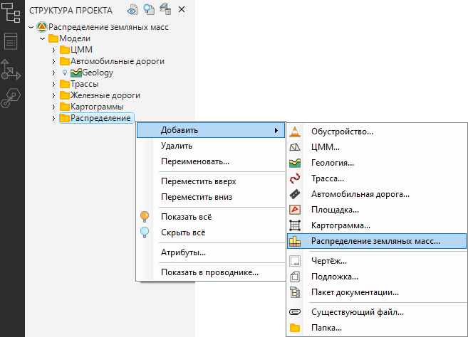
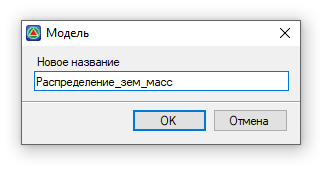
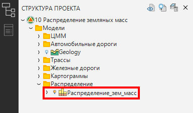

# Создание модели Распределение земляных масс

Работа по распределению земляных масс осуществляется в модели **Распределение земляных масс**, для ее создания:

1. В окне **Структура проекта** нажмите ПКМ на любую из папок и выберите из появившегося контекстного меню **Добавить – Распределение земляных масс**:

   

2. В открывшемся диалоговом окне задайте имя модели и нажмите **ОК**:

   

В результате, в указанной папке появится новая модель типа **Распределение земляных масс**:



Проект может содержать неограниченное число моделей типа **Распределения земляных масс**. Описание действий над моделями проекта в окне **Структура проекта** см. [Запуск и настройка Топоматик Robur. Структура проекта.](../../install_startup/startup/structure_project/structure_project.md)


