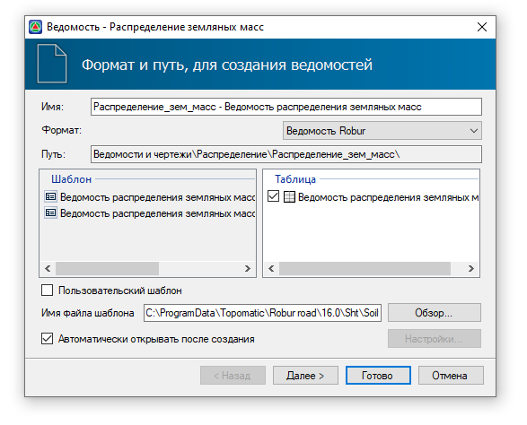
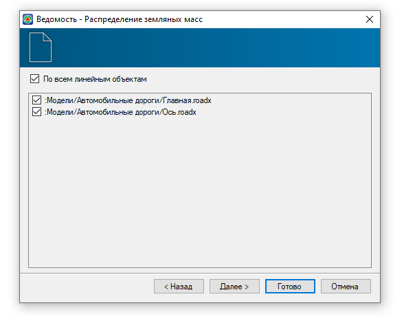
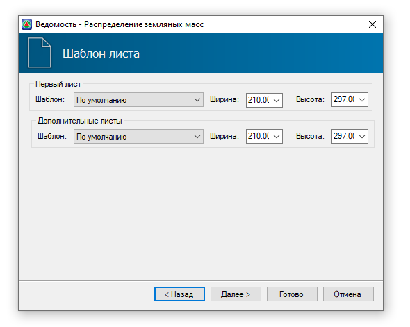
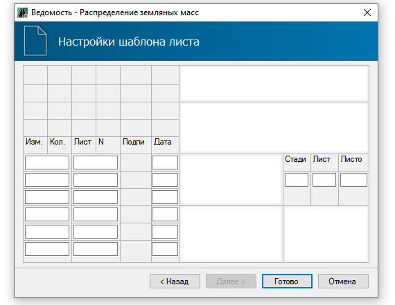
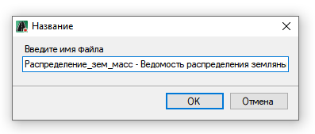

# Формирование выходных ведомостей

Результатом работы модуля **Распределение земляных масс** являются ведомости распределения.

В программе можно создать *обычную* **Ведомость распределения земляных масс**, где будут указаны входящие на участки значения объемов от Поставщиков без учета коэффициентов уплотнения и потерь и **Рабочую ведомость распределения земляных масс**, где будет отражен объем на участках с учетом коэффициентов.

Чтобы создать ведомость:

1. На ленте **Распределения земляных масс** нажмите кнопку  (**Ведомость распределения земляных масс**) или кнопку  (**Рабочая ведомость распределения земляных масс**). Откроется окно мастера ведомости, задайте необходимые настройки и нажмите **Далее**:

   

   * В поле **Имя** задается наименование ведомости.
   * В поле **Формат** можно выбрать формат ведомости в соответствии с редактором, в котором она будет открыта. По умолчанию ведомость представлена в формате Robur.
   * В поле **Путь** отображается адрес папки, в которой по умолчанию сохраняются все созданные ведомости распределения.
   * В поле **Шаблон** отображаются шаблоны ведомости, согласно которым будет формироваться ведомость. В программе по умолчанию добавлено три шаблона ведомости:

     - Стандартная ведомость распределения земляных масс.
     - Упрощенная ведомость распределения земляных масс.
     - Стандартная рабочая ведомость распределения земляных масс.

   

   Чтобы выбрать пользовательский шаблон ведомости включите опцию **Пользовательский шаблон** и выберите соответствующий файл с помощью кнопки **Обзор**. Механизмы настройки индивидуальных шаблонов ведомостей описаны в [Редактирование динамических выходных ведомостей](../../doc/dynamic_vedomosti/edit_vedomosti_and_pattern.md).

  

   * При необходимости отмены автоматического открывания ведомости после ее создания, отключите опцию **Автоматически открывать после создания**.

2. На следующей вкладке определите, для каких линейных объектов распределения будет создана ведомость:

   * По умолчанию включена опция **По всем линейным объектам**, чтобы выбрать определенный линейный объект распределения отключите эту опцию и укажите линейный объект.

   

   Если в **п.1** был выбран формат **Ведомость Robur**, то на данном шаге нажмите **Далее**, затем см. **п.3**. При выборе другого формата ведомости нажмите **Готово**, после см. **п.5**.

   

3. На следующей вкладке задайте форматы листов ведомости и нажмите **Далее**:

   

   

   Если шаблон листа выбран **По умолчанию**, программа автоматически подберет формат листа по размеру ведомости.

   

4. На вкладке Настройки шаблона листа необходимо заполнить штамп ведомости:

   

5. После задания всех настроек нажмите кнопку **Готово**, откроется окно, введите наименование файла ведомости нажмите **ОК**:

   

В результате, ведомость будет сформирована в зависимости от ее формата и добавлена в **Структуру проекта**.



По умолчанию ведомости распределения сохраняются в папку с проектом, в папку **Ведомости и чертежи**. Функционал программы позволяет изменить сохранение ведомостей в папку **Модели**, см. раздел [Запуск и настройка. Общие настройки. Другие.](../../install_startup/startup/general_setting/design.md)
   
Описание работы с ведомостями в формате Robur представлено в разделе [Редактирование динамических выходных ведомостей](../../doc/dynamic_vedomosti/edit_vedomosti_and_pattern.md)


