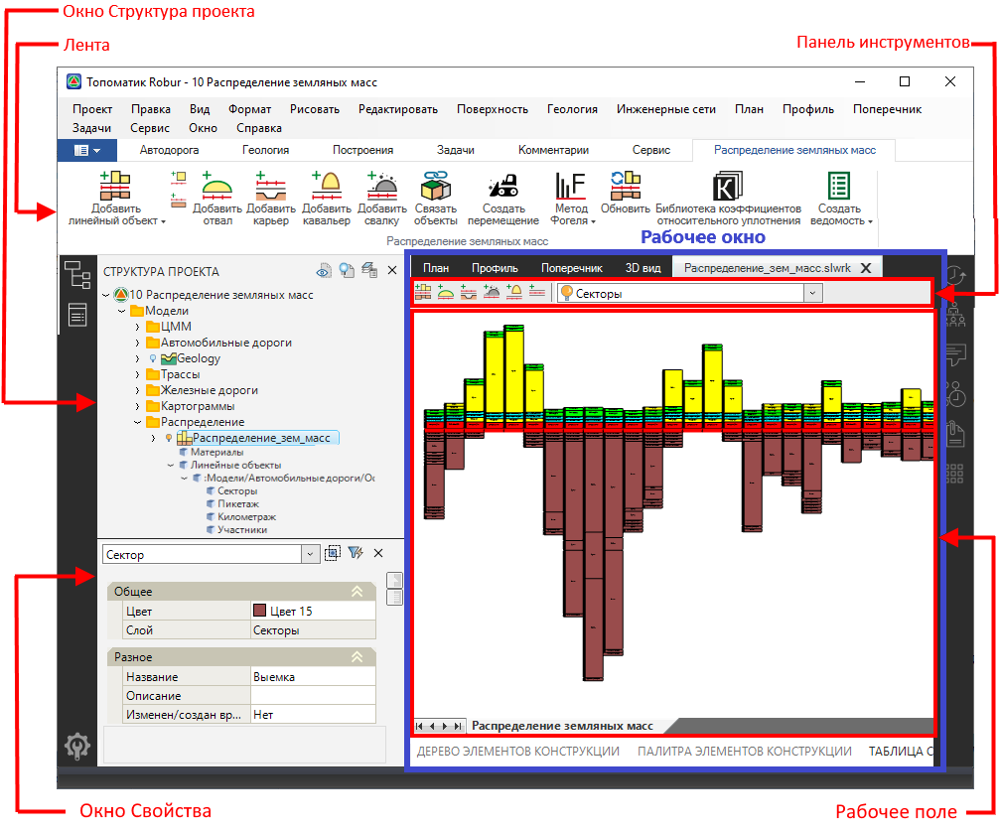

# Интерфейс окна модели Распределения земляных масс

Интерфейс окна модели **Распределения земляных масс** представляет собой:

* **Панель инструментов**.
* **Рабочее поле**.
* **Лента Распределение земляных масс**.
* **Окно Структура проекта**.
* **Окно Свойства**.

* Чтобы открыть/ закрыть рабочее окно модели нажмите ПКМ на нее и из контекстного меню выберите **Открыть/ Закрыть** или откройте/ закройте рабочее окно двойным нажатием ЛКМ по модели.

* **Панель инструментов** состоит из набора функциональных кнопок и селектора с наименованием слоев распределения.

* В **Рабочем поле** производится работа с участниками и остальными элементами распределения.

* **Лента Распределение земляных масс** отображается при активном рабочем окне, на ней представлены функции, используемые при работе с распределением.

  

  Так же данные функции представлены в меню **Задачи – Распределение земляных масс**.

  

* В окне **Структура проекта** модель **Распределения земляных масс** содержит дополнительные таблицы и данные, предназначенные для задания предварительных настроек и хранения данных распределения.

* В окне **Свойства** отображаются параметры выбранного элемента распределения. Свойства каждого элемента будут подробно рассмотрены в соответствующих разделах документации.