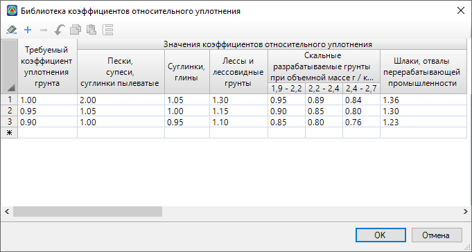

# Библиотека коэффициентов относительного уплотнения

В данной библиотеке хранятся значения коэффициентов уплотнения грунта, которые используются в расчетном коэффициенте относительного уплотнения грунта (см. описание таблицы **Материалы** в разделе [Таблица Материалы](pre_settings_model/table_materials.md)).

Чтобы открыть библиотеку на ленте **Распределение земляных масс** нажмите кнопку  (**Библиотека коэффициентов относительного уплотнения**), откроется окно:

В библиотеке уже имеются стандартные коэффициенты грунтов, их можно редактировать. Так же можно добавлять новые коэффициенты грунтов, для этого в пустой строке введите необходимые значения и нажмите **ОК**.
