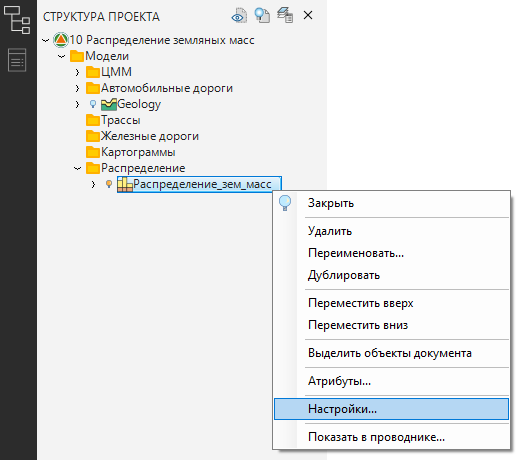
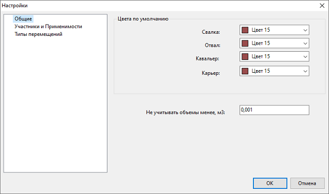
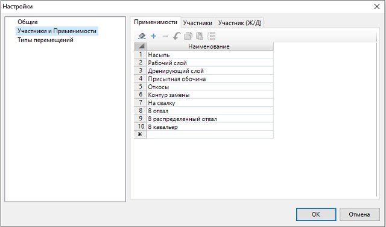
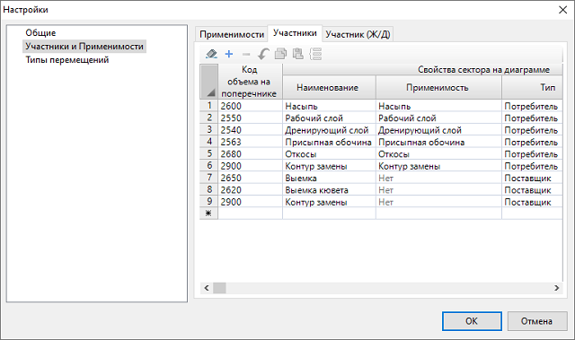
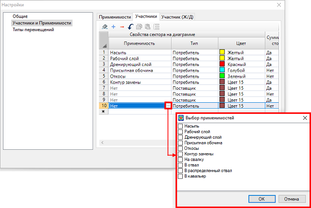
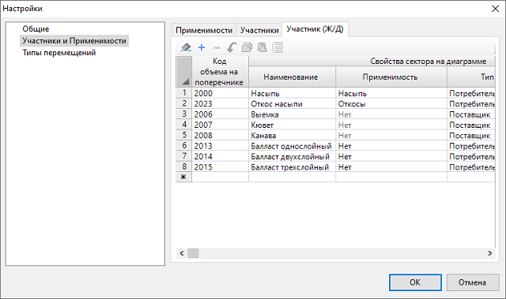
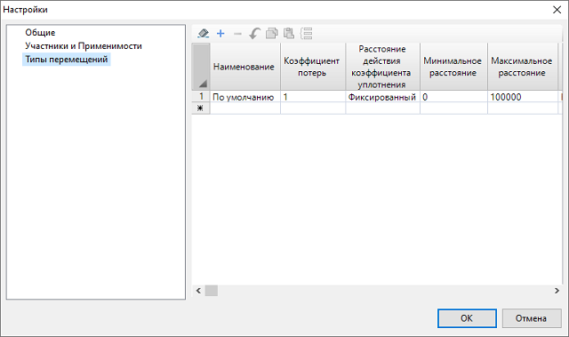
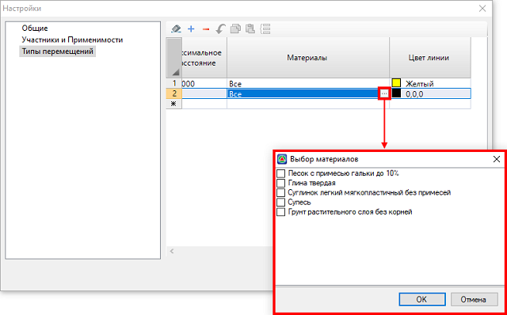

# Предварительные настройки

Чтобы задать предварительные настройки:

* В окне **Структура проекта** нажмите ПКМ на наименование соответствующей модели. В открывшемся контекстном меню выберите пункт **Настройки**:

  

  

  Задать аналогичные настройки для всех новых моделей данного типа, можно в меню **Сервис – Настройка – Новые модели – Распределение земляных масс**.

  

* Откроется окно **Настройки**. В левой его части представлены основные группы настроек:

## Общие

* В поле **Цвета по умолчанию** можно задать цвет точечным объектам в рабочем поле.

* В поле **Не учитывать объем менее, м3** задается значение объема материала, меньше которого не будет создаваться Сектор на диаграмме.

## Участники и Применимости

<u>Вкладка Применимости</u>

* Пригодность материала и его принятие **Потребителем** определяется свойством **Применимость**. На данной вкладке перечислены несколько **типов Применимостей**, которые используются при назначении **Применимости материала** и **Применимости Потребителя** (см. раздел [Термины и участники распределения](../terms_and_participants_apportionment.md)). Для добавления нового **типа Применимости** в пустой строке введите его название.

  

  Для автоматического перемещения материалов (см. раздел [Автоматическое распределение материалов](../apportionment/automatic_apportionment_materials.md)) *тип* **Применимости Потребителя** должен совпадать с *типом* **Применимости материала**. Например, **Потребитель** с **Применимостью** **Рабочий слой** будет получать материал из **Поставщика** с **Применимостью материала** - **Рабочий слой.**

  

<u>Вкладка Участники</u>

На данной вкладке задается список шифров объемов с поперечников модели типа **Автомобильная дорога**, которые преобразуются в Секторы на диаграмме с соответствующими свойствами.



По умолчанию в программе уже заданы некоторые шифры объемов с поперечников и соответствующие параметры Секторов, которые можно изменить. Также в пустой строке таблицы можно добавить пользовательский шифр объема и настроить для него Сектор.



* В столбце **Код объема на поперечнике** задаются шифры объемов, которые программа сопоставляет с шифрами объемов на поперечниках и при их совпадении создаёт **Секторы** на диаграмме (с учетом заданных свойств Сектора, см. описание ниже), которым присваивает значение объемов.

* В столбцах **Наименование** и **Цвет** задается имя Сектора и его цвет на диаграмме.

* В столбце **Тип** определяется, каким участником распределения будет **Сектор** (**Потребитель** или **Поставщик**).

* В столбце **Применимость** назначается **Применимость Потребителя** (см. раздел [Термины и участники распределения](../terms_and_participants_apportionment.md)), для этого в ячейке нажмите кнопку , откроется окно, в котором поставьте «галочку» напротив **Применимости Потребителя** и нажмите **ОК**:

  

* Если в столбце **Суммировать стороны** установлено значение **Нет**, то Сектор на диаграмме будет разделен на два Сектора со значениями объемов из левой и правой частей поперечников. Чтобы объединить два Сектора в один и суммировать их объемы выберите значение **Да**.

<u>Вкладка участники (Ж/Д)</u>

На данной вкладке задается список шифров объемов с поперечников модели типа **Железная дорога**, которые преобразуются в Секторы на диаграмме с соответствующими свойствами. Вкладка аналогична вкладке **Участники**, см. описание выше.

## Типы перемещений

Распределение материалов производится выбранным типом перемещения. На данной вкладке может быть создано несколько типов перемещений, каждое из которых может иметь свои параметры, т.е. какой материал оно может перевозить, на какое расстояние и с каким коэффициентом потерь. Таким образом, различные типы перемещений могут характеризовать различные машины и механизмы, что учитывается также и в ведомости распределения.

* В столбце **Наименование** задается название типа Перемещения.

* В столбце **Коэффициент потерь** с помощью соответствующего коэффициента задается дополнительный запас объема материала, который может быть растерян при его транспортировке. Например, при транспортировании материала автотранспортом на расстояние более 1 км – потери составят **1,0 %**, соответственно коэффициент потерь составит **1,01**. Данный коэффициент будет учитываться в поле **Вывезенный объем** при перемещении материалов (см. описание поля **Вывезенный объем** в разделе [Редактирование (свойства) перемещения](../apportionment/working_apportionment.md)).

* В зависимости от дальности перемещения материала коэффициент потерь может меняться. Дальность действия коэффициента задается в столбце **Расстояние действия коэффициента уплотнения**. В таком случае расчетный коэффициент потерь будет рассчитан по формуле:

  $\boldsymbol{К_{п.р.} = К_п^{(L / L_{действ.коэф.})}}$

  где:

  * $\boldsymbol{К_п}$ – коэффициент, принятый в столбце **Коэффициент потерь**.
  * $\boldsymbol {L_{действ.коэф.}}$ – расстояние действия коэффициента потерь, принятый в столбце **Расстояние действия коэффициента уплотнения**.

  

  Если в столбце **Расстояние действия коэффициента уплотнения** стоит значение **Фиксированный**, то коэффициент потерь не меняется с пройденным расстоянием.

  

* В столбцах **Минимальное расстояние/ Максимальное расстояние** задаётся диапазон расстояний, в пределах которого данный тип перемещения может перевозить материал.

* По умолчанию в столбце **Материалы** в ячейке стоит значение **Все**, это значит, что данным типом Перемещения можно перевозить все материалы, находящиеся в таблице **Материалы** (см. описание [Таблица Материалы](table_materials.md)). Чтобы выбрать определенный материал для типа Перемещения, в ячейке нажмите кнопку , откроется окно, в котором поставьте «галочку» напротив материала и нажмите **ОК**:

  

* В столбце **Цвет линии** из списка выберите цвет стрелки Перемещения в рабочем поле.
