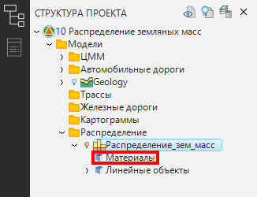
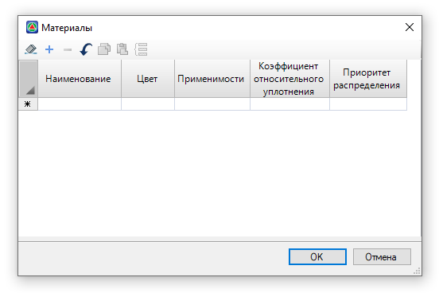
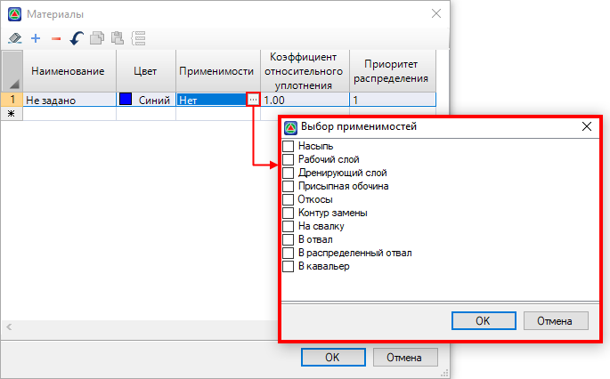
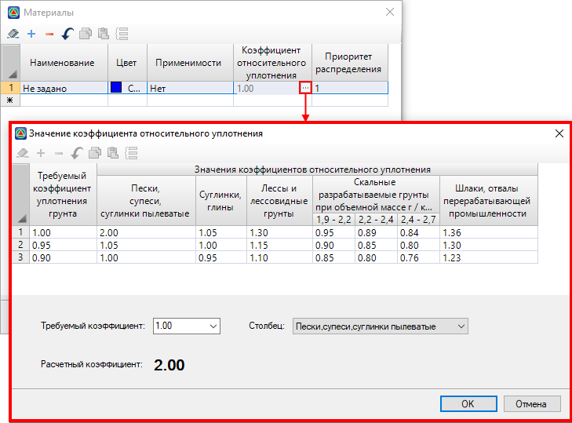
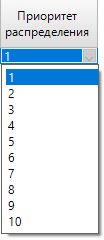

# Таблица Материалы

Таблица **Материалы** находится в **Структуре проекта** в рамках одной модели:

Чтобы добавить новый материал распределения в таблицу:

1. Двойным нажатием мыши откройте таблицу, откроется окно, в котором задайте материал и его параметры:

   

   * В столбце **Наименование** введите имя материала.

   * В столбце **Цвет** из списка выберите цвет материала, который будет отражаться в индикаторе Сектора и точечного объекта.

   * В столбце **Применимости** назначается **Применимость материала** (см. раздел [Термины и участники распределения](../terms_and_participants_apportionment.md)). Для этого в ячейке нажмите кнопку , откроется окно, в котором поставьте «галочку» напротив **Применимости Материала** и нажмите **ОК**:

     

   * В столбце **Коэффициент относительного уплотнения** задается поправочный коэффициент, указывающий насколько больше нужно привезти грунта, чтобы при требуемом уплотнении получить нужный объем. Данный коэффициент учитывается в в поле **Вывезенный объем** при перемещении материалов (см. описание поля **Вывезенный объем** в разделе [Редактирование (свойства) перемещения](../apportionment/working_apportionment.md)) и может быть введен с клавиатуры или рассчитан в специальном диалоговом окне, которое вызывается нажатием кнопки  в ячейке соответствующего столбца:

     

     В верхней части окна информационно приведена таблица **Значения коэффициентов относительного уплотнения** для различных видов грунтов. Данные таблицы приняты из **Библиотеки коэффициентов относительного уплотнения**, в которой можно изменить стандартные коэффициенты и добавить новые (подробное описание см. раздел [Библиотека коэффициентов относительного уплотнения](../library_coefficient.md)).

     Чтобы рассчитать коэффициент относительного уплотнения, в нижней части окна, из соответствующего селектора выберите **требуемый коэффициент**. Значение коэффициента также можно задать с клавиатуры в пределах диапазона от *0,8999999* до *1*. Затем из выпадающего списка (**Столбец**) выберите вид грунта. Программа по данным таблицы интерполирует значения коэффициентов и выводит его в поле **Расчетный коэффициент**. Чтобы рассчитанный коэффициент появился в ячейке столбца **Коэффициент относительного уплотнения**, нажмите **ОК**.

   * В столбце **Приоритет распределения** из списка выберите приоритет использования материала в распределении:

     

     Грунты с более высоким приоритетом при распределении используются в первую очередь. К примеру, если участок выемки содержит два грунта – песок (*приоритет 1*) и супесь (*приоритет 2*), то при распределении вначале будет полностью использован песчаный грунт, а уже затем грунт супеси.

2. После ввода всех настроек нажмите **ОК**.

В результате, материал распределения будет добавлен в таблицу.