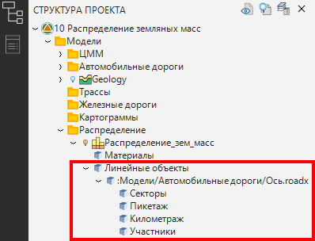
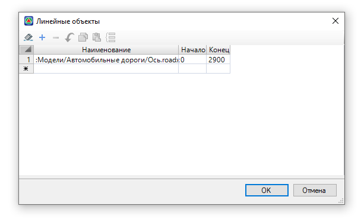
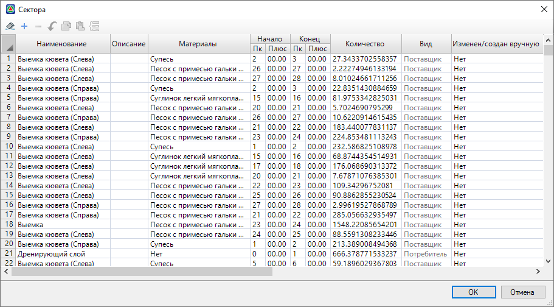
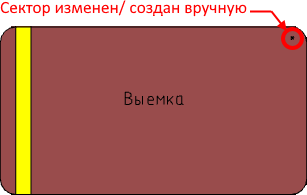
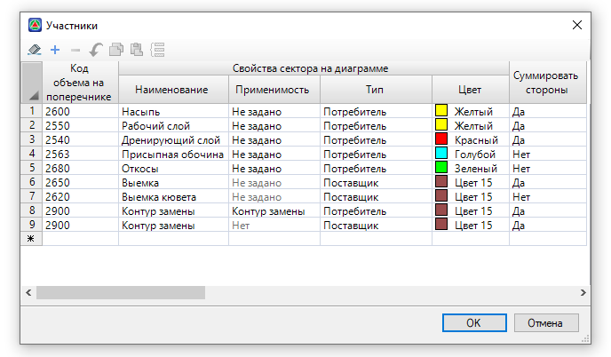
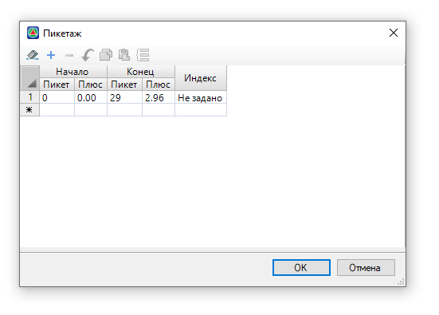

# Табличные данные распределения

Все данные линейного объекта распределения хранятся в таблицах распределения, которые находятся в **Структуре проекта** в рамках одной модели.

Чтобы открыть определенную таблицу, разверните раздел **Линейные объекты**, а затем разверните подкатегорию **:Модели/**:

## Таблица Линейные объекты

В данной таблице перечислены все линейные объекты распределения, входящие в модель.

* В поле **Наименование** отображается название линейного объекта распределения в виде ссылки на подобъект, название можно изменить.
* В полях **Начало** и **Конец** отображается начало и конец оси линейного объекта распределения, данные значения можно изменить.
* Чтобы удалить линейный объект распределения из модели, выберите строку с линейным объектом и нажмите кнопку  .

## Таблица Секторы

В данной таблице перечислены все Секторы, входящие в диаграмму распределения. По каждому Сектору показаны параметры, которые можно редактировать (кроме столбца Вид).

* В столбце **Наименование** отображается имя Сектора на диаграмме.
* В столбце **Описание** вносятся дополнительные сведения о Секторе.
* В столбце **Материалы** показаны материалы, входящие в Сектор. Ячейки данного столбца аналогичны полю **Материалы** в окне **Свойства** Сектора (см. раздел [Редактирование линейного объекта/ диаграммы](working_apportionment_participants/editing_zone_soil_works.md#redaktirovanie-linejnogo-obuekta/-diagrammy)).
* Столбцы **Начало** и **Конец** отображают пикетажное положение Сектора на диаграмме.
* В столбце **Количество** в Секторе типа **Поставщик** показан объем всего материала входящего в Сектор, в Секторе типа **Потребитель** показан общий объем, который может принять Сектор.
* Столбец **Вид** показывает, к какому типу участника распределения принадлежит Сектор (**Поставщик** или **Потребитель**).
* Столбец **Изменен/ создан вручную** аналогичен полю **Изменен/ создан вручную** в окне **Свойства** Сектора (см. раздел [Редактирование линейного объекта/ диаграммы](working_apportionment_participants/editing_zone_soil_works.md#redaktirovanie-linejnogo-obuekta/-diagrammy)).

В данную таблицу можно добавить новый Сектор в границах линейного объекта распределения. Для этого в пустой строке таблицы заполните параметры столбцов и нажмите **ОК**. Сектор появится на диаграмме распределения и будет иметь знак «*»:

## Таблица Участники

В данной таблице отображается список заданных в предварительных настройках участников распределения - **Поставщиков** и **Потребителей**, а также их параметры (см. описание вкладки **Участники** в разделе [Предварительные настройки](pre_settings_model/pre_settings.md)).

## Таблица Пикетаж

В данной таблице показано пикетажное значение границ линейного объекта распределения, которое может меняться. В столбце **Индекс** задаются имена пикетов в виде 1а, 1б, 1в.

