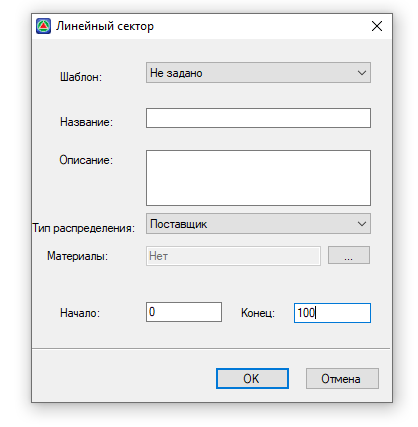
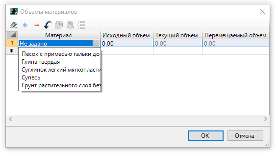
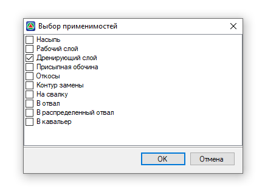
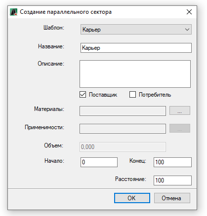

# Добавление прочих элементов распределения



## {#dobavlenie-pustogo-linejnogo-obuekta}

Данная функция предназначена для добавления пустого объекта распределения, который можно использовать, например, для линейного складирования материалов.

Чтобы добавить пустой объект распределения на панели инструментов нажмите кнопку  (**Добавить пустой линейный объект**), далее в рабочем поле укажите точку вставки объекта. В результате, в рабочем поле добавится ось линейного объекта распределения:

Работа с пустым линейным объектом аналогична работе с линейным объектом распределения, созданным на основе с подобъекта **Автомобильной** или **Железной дороги** (см. раздел [Редактирование линейного объекта/ диаграммы](editing_zone_soil_works.md#redaktirovanie-linejnogo-obuekta/-diagrammy)).

Протяженность объекта распределения можно задать в таблице **Линейные объекты**, см. раздел [Табличные данные распределения](../tabular_apportionment_data.md).

Чтобы добавить Секторы пустому линейному объекту распределения см. разделы [Добавление нового сектора](adding_element_soil_works.md#dobavlenie-novogo-sektora) и [Добавление параллельного сектора](adding_element_soil_works.md#dobavlenie-parallelnogo-sektora).

Чтобы добавить точечный объект, привязанный к пустому линейному объекту распределения см. раздел [Добавление точечных объектов](adding_zone_soil_works.md#dobavlenie-tochechnyh-obuektov).





## {#dobavlenie-novogo-sektora}

Функционал программы позволяет добавить новый Сектор в диаграмму. Для этого:

1. На ленте **Распределение земляных масс** нажмите кнопку  (**Добавить сектор**), курсор примет форму прицела.
2. ЛКМ выберите линейный объект распределения, куда будет добавлен Сектор, откроется окно:

   

   * В поле **Шаблон**, из списка выберите, на основе какого Сектора линейного объекта распределения будет добавлен новый Сектор.

   

   Список Секторов линейного объекта распределения см. во вкладке **Участники** в разделе [Предварительные настройки.](../pre_settings_model/pre_settings.md)

   

   * В поле **Название** введите имя Сектора на диаграмме.

   * В поле **Описание** вносятся дополнительные сведения о Секторе.

   * В поле **Тип распределения** из списка выберите тип Сектора, **Поставщик** или **Потребитель**.

   * При выборе типа распределения **Поставщик** появится поле **Материалы**, где при нажатии на кнопку  откроется окно:

     

     В столбце **Материал** из списка выберите необходимый материал, в столбце **Исходный объем** задайте количество этого материала и нажмите **ОК**.

     

     Список материалов в столбце **Материал** принят из таблицы **Материалы** (см. [Таблица Материалы](../pre_settings_model/table_materials.md)).

     

   * Если в поле **Тип распределения** указан **Потребитель**, то появится поле **Применимости**, где при нажатии на кнопку , откроется окно, в котором поставьте «галочку» напротив **Применимости Потребителя** и нажмите **ОК**:

     

     

     Список Применимостей принят из предварительных настроек (см. описание вкладки **Применимости** в разделе [Предварительные настройки](../pre_settings_model/pre_settings.md)).

     

   * В полях **Начало** и **Конец** задайте расположение Сектора относительно начала оси линейного объекта распределения и нажмите **ОК**.

В результате, в диаграмму добавится новый Сектор.





## {#dobavlenie-parallelnogo-sektora}

Данная функция позволяет добавлять в диаграмму вдоль линейного объекта распределения Сектор, в котором, при расчете расстояния перевозки, расстояние в любой точке на протяжении всего Сектора до линейного объекта всегда постоянно. В основном данная функция используется для создания распределенного отвала в линейном объекте.

Чтобы добавить параллельный Сектор в диаграмму:

1. На ленте **Распределение земляных масс** нажмите кнопку  (**Добавить параллельный сектор**), курсор примет форму прицела.

2. ЛКМ выберите линейный объект распределения, куда будет добавлен Сектор, откроется окно:

   

   * В поле **Шаблон**, из списка выберите, на основе какого точечного объекта будет добавлен параллельный Сектор (Карьер, Отвал, Кавальер, Свалка).

   * В поле **Название** можно изменить имя создаваемого Сектора на диаграмме. По умолчанию название соответствует выбранному шаблону, см. описание выше.

   * В поле **Описание** вносятся дополнительные сведения о Секторе.

   * Активируйте опции **Поставщик** или **Потребитель**, в зависимости от того, каким типом распределения будет создаваемый Сектор.

   * При выборе типа **Поставщик** поле **Материалы** будет активным, нажмите кнопку , в открывшемся окне в столбце **Материал** из списка выберите материал и задайте его исходный объем в соответствующем столбце:

     

     

     Список материалов в столбце **Материал** принят из таблицы **Материалы** (см. [Таблица Материалы](../pre_settings_model/table_materials.md)).

     

   * Если тип распределения выбран **Потребитель**, то поле **Применимости** станет активным, нажмите кнопку , откроется окно, в котором поставьте «галочку» напротив **Применимости Потребителя** и нажмите **ОК**:

     

     

     Список Применимостей принят из предварительных настроек (см. описание вкладки **Применимости** в разделе [Предварительные настройки](../pre_settings_model/pre_settings.md)).

     

   * Так же станет активным поле **Объем**, в котором задайте значение объема, который сможет принять создаваемый Сектор.

   * В полях **Начало** и **Конец** задайте длину Сектора относительно начала оси линейного объекта распределения.

   * В поле **Расстояние** отображается расчетное расстояние перевозки от любой точки на протяжении всего Сектора до линейного объекта. Данное расстояние постоянно и его можно изменить.

В результате в диаграмму добавится дополнительный Сектор параллельный линейному объекту распределения.


