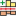
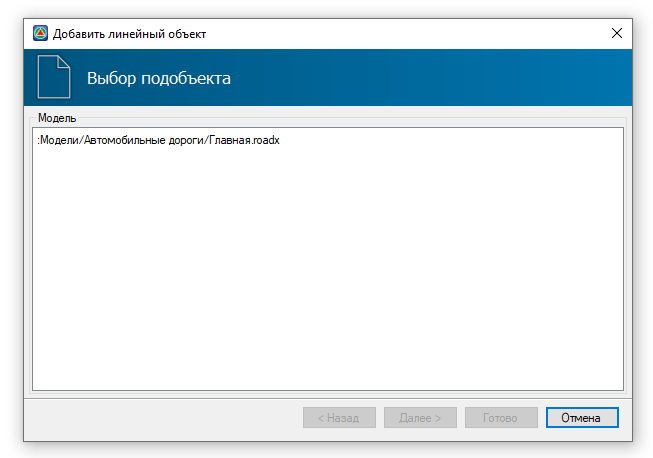
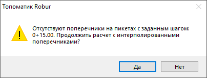
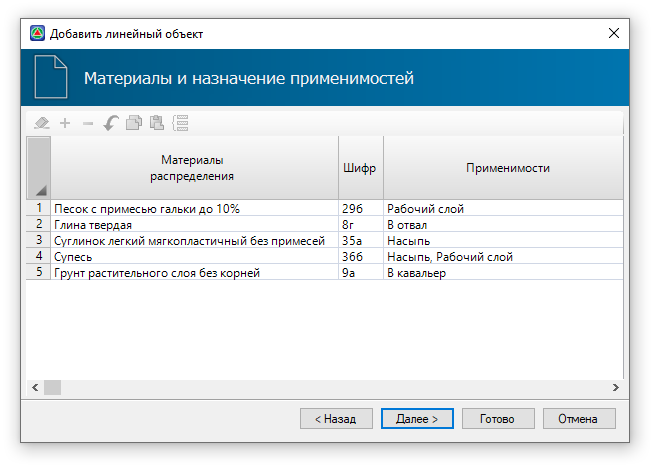
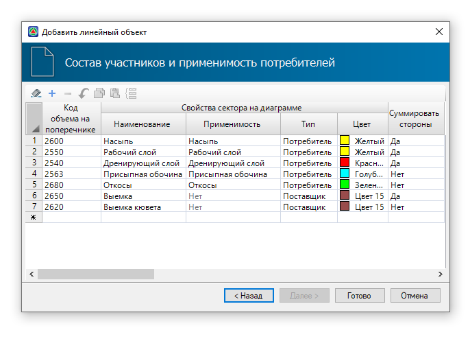
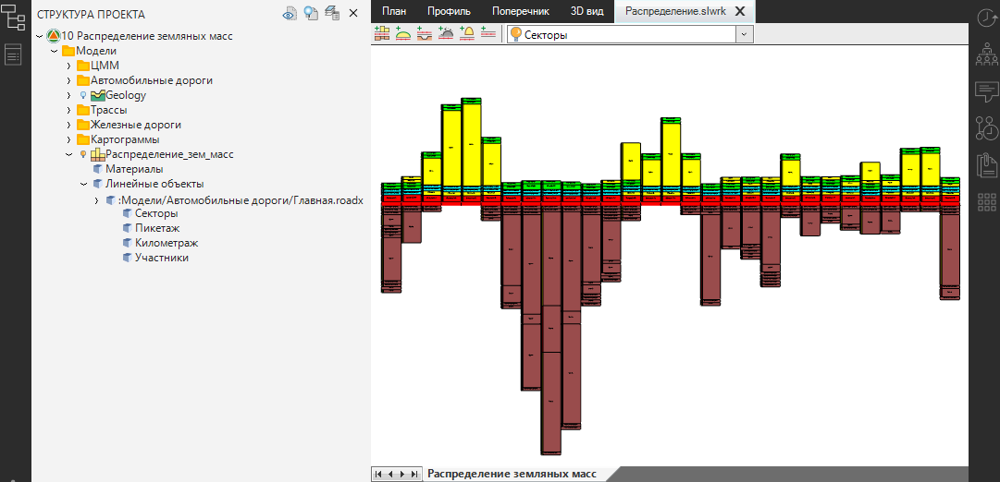
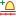
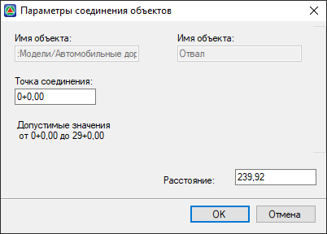
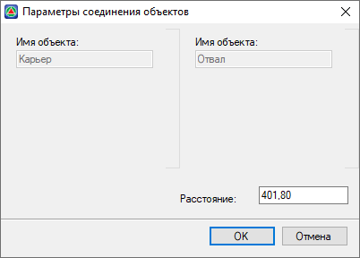
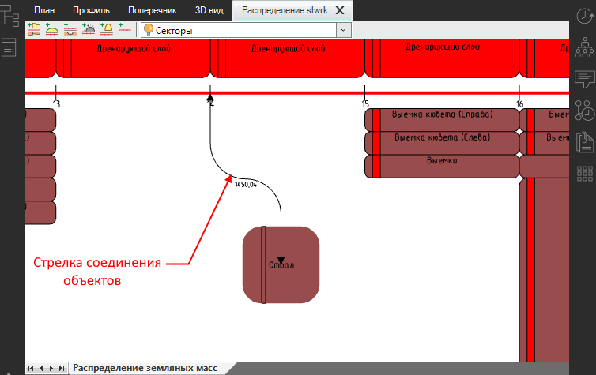

# Добавление участников распределения



## {#dobavlenie-linejnogo-obuekta/-diagramma}

В качестве исходных данных для создания диаграммы распределения используется предварительно запроектированный подобъект **Автомобильной** или **Железной дороги**. Поперечники подобъекта должны быть запроектированы полностью, с учетом всех поправок к объемам работ (снятие растительного слоя, укрепление откосов, выторфовывание и т.д., см. [Автомобильные дороги Проектирование поперечных профилей](../../../road/road_crossection/total/general_information.md)). На поперечных профилях обязательно должны быть нанесены геологические слои (см. [Обработка геологических материалов](../../../rb_survey/glg/creation_legend_ground.md)).

Чтобы добавить линейный объект типа **Автомобильная/ Железная дорога** в модель и создать на его основе диаграмму:

1. На панели инструментов нажмите кнопку  (**Добавить линейный объект**), в открывшемся диалоговом окне выберите подобъект и нажмите **Далее**:

   

2. В открывшейся вкладке задайте границы участка распределения и шаг разбивки Секторов, затем нажмите **Далее**:

   

   * Границы участка распределения определяются пикетажным положением оси линейного объекта. Чтобы задать границы снимите «галочку» в наименовании **Применить на весь участок, доступный для редактирования**, поле с пикетажным положением участка станет активным, задайте пикеты границ участка.

     

     Если на границах заданного участка или на границах заданного шага (см. описание ниже поле **Разбиение на участки**) отсутствуют поперечники, то при переходе на следующую вкладку появится предупреждение:

     

     В этом случае значение площади контура грунта с поперечников на границе участка рассчитывается по формуле:

     $\boldsymbol{S1 + (S2 - S1)((L - L1) / (L2 - L1))}$

     где:
    
     **S1** и **S2** - площади контура предыдущего и следующего поперечника соответственно.
     **L1** и **L2** - расстояния между предыдущим и следующим поперечником.
     **L** - расстояние, от начала объекта точки, в которой происходит интерполяция, до предыдущего поперечника.

     Чтобы продолжить расчет нажмите **Да**. Чтобы вернуться назад и изменить границы участка, нажмите **Нет**.

     

   * Если включена опция **Только по выделенным поперечникам**, то расчет объемов будет производиться только по помеченным поперечникам (см. [Работа с трассой. Поперечные профили. Пометить поперечники](../../../rb_survey/alg/track_crossection/mark_diameters.md)).

   * В поле **Разбиение на участки** задается шаг разбивки Секторов на диаграмме в пределах целых пикетов. Чтобы редактировать пикетажное значение границ Секторов в пределах целых пикетов активируйте опцию **Из таблицы**.

     

     Максимальный шаг разбивки Секторов ограничен длиной пикета линейного объекта.

     

3. На данном шаге программа по грунтам выемки на поперечниках создала материалы распределения и занесла по ним данные в таблицу. На этой вкладке можно назначить **Применимость материала** и настроить их свойства, после нажмите **Далее**:

   

   

   Полученные данные будут занесены в таблицу **Материалы** (см. [Таблица Материалы](../pre_settings_model/table_materials.md)), где их можно отредактировать, например, изменить **Применимость материала**.

   

   * Столбцы **Материалы распределения** и **Шифр** содержат сведения о материалах, полученных по выемке поперечников. Эти столбцы доступны для редактирования.

   * Столбец **Применимости** и группа столбцов **Свойства материалов** заполняются аналогично столбцам в таблице **Материалы** (см. [Таблица Материалы](../pre_settings_model/table_materials.md)).

   * Столбец **Описание (грунт)** заполняется автоматически согласно наименованию в **Таблице грунтов**. Столбец недоступен для редактирования

    

4. На данной вкладке отображается список заданных в **Предварительных настройках** участников распределения - **Поставщиков** и **Потребителей**, а также их параметры. На этом шаге можно изменить полученные параметры или установить их ранее (см. описание вкладки **Участники** в разделе [Предварительные настройки](../pre_settings_model/pre_settings.md)).

   

   После задания всех параметров нажмите **Готово**.

В результате в рабочем окне появится диаграмма распределения (описание диаграммы и ее редактирование см. [Редактирование линейного объекта/ диаграммы](editing_zone_soil_works.md#redaktirovanie-linejnogo-obuekta/-diagrammy)).



В пределах одной модели типа **Распределения земляных масс** можно добавлять неограниченное число линейных объектов распределения.  
   
При последующем добавлении линейного объекта предварительно программа запросит указать точку вставки объекта.



 





## {#dobavlenie-tochechnyh-obuektov}

Добавление любых точечных объектов распределения осуществляется по общему принципу. Для этого:

1. На панели инструментов нажмите на одну из следующих пиктограмм:

*  - **Добавить отвал**.
*  - **Добавить карьер**.
*  - **Добавить свалку**.
*  - **Добавить кавальер**.

2. В рабочем поле ЛКМ укажите точку вставки точечного объекта.

   

   Если модель содержит один линейный объект распределения, и нет других точечных объектов, то программа автоматически свяжет точечный объект с линейным объектом. В этом случае просто укажите точку вставки точечного объекта и см. **п.3**.  

   Если модель содержит несколько линейных объектов распределения и/ или имеются другие точечные объекты, то предварительно укажите объект, с которым будет связан точечный объект, а затем укажите точку вставки точечного объекта, далее см. **п.3**.

   Если модель содержит несколько линейных объектов распределения и/ или имеются другие точечные объекты и чтобы вставить точечный объект не связанный с этими объектами, предварительно нажмите ПКМ, а затем укажите точку вставки точечного объекта. Точечный объект отобразится в рабочем поле.

   

3. Откроется диалоговое окно, в котором задайте параметры соединения объектов и нажмите **ОК**:

   

   

   Если добавляемый точечный объект был привязан к имеющемуся точечному объекту (см. **п.2** примечание), то откроется окно следующего вида:  

   

   

   * В полях **Имя объекта** отображаются наименования объектов.

   * В поле **Точка соединения** можно задать пикет оси линейного объекта, с которым будет соединен точечный объект.

   * В поле **Расстояние** отображается значение смещения центра точечного объекта относительно центра другого точечного объекта или относительно начала оси линейного объекта. Данное расстояние можно редактировать.

В результате, в рабочем поле появится точечный объект, соединенный с осью линейного объекта стрелкой соединения (описание свойств стрелки соединения см. раздел [Связывание объектов](connecting_objects.md)).



В рамках одной модели может быть добавлено неограниченное количество точечных объектов распределения.




