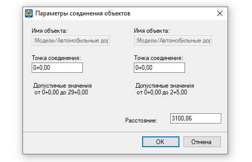
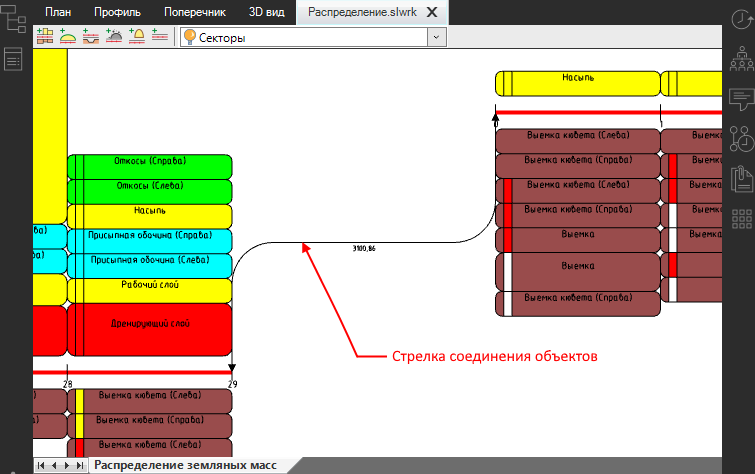
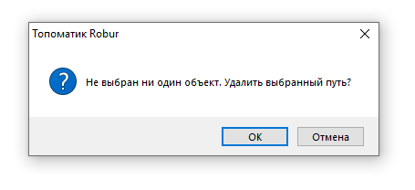
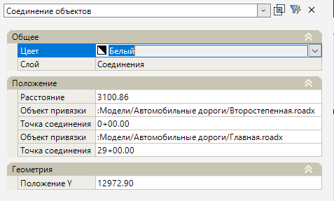
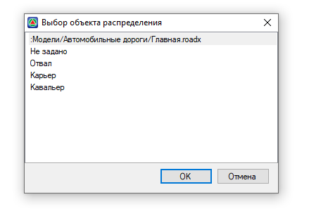

# Связывание объектов

Чтобы перемещать материалы между объектами, необходимо связать эти объекты друг с другом.

Функционал программы позволяет создавать несколько связей с одним объектом. Например, один Карьер может быть связан с двумя линейными объектами распределения.

Допустимо соединять следующие объекты: точечный объект может быть связан с другим точечным объектом, точечный объект с линейным объектом распределения и линейный объект распределения с другим линейным объектом распределения. Соединение объектов осуществляется по общему принципу.

Рассмотрим пример соединение линейного объекта распределения (*объект 1*) с другим линейным объектом распределения (*объект 2*):

1. На ленте **Распределение земляных масс** нажмите кнопку  (**Связать объекты**), выберите *объект 1*, а затем *объект 2*, откроется окно:

   

   * В поле **Имя объекта** отображается наименование объектов соединения.

   * В поле **Точка соединения** задайте пикет соединения на первом и втором объекте в пределах допустимых значений.

   * В поле **Расстояние** можно поменять значение, если фактическое расстояние соединения объектов не соответствует вычисленному по идентичным пикетам между линейными объектами распределения.

2. После всех настроек нажмите **ОК**.

В результате в рабочем поле между связываемыми объектами появится стрелка соединения.

При выборе стрелки соединения ее можно двигать с помощью грипов. При выборе квадратного грипа  стрелку можно присоединить к другому объекту. Если при этом не будет выбран ни один объект, то программа вынесет предупреждение:

Чтобы изменить параметры соединения объектов, выберите стрелку соединения и откройте окно **Свойства**:

<u>**Общее**</u>

* В данном подразделе задаётся цвет стрелки соединения в рабочем поле и отображается наименование ее слоя.

<u>**Положение**</u>

* В поле **Расстояние** можно редактировать расстояние между объектами.
* В поле **Объект привязки** можно изменить привязанный объект на другой линейный или точечный объект. Для этого в этом поле нажмите кнопку , откроется окно, выберите нужный объект и нажмите **ОК**:

* В поле **Точка соединения** можно отредактировать пикет соединения на первом и втором объекте.

<u>**Геометрия**</u>

* В данном подразделе отображается положение стрелки соединения по оси Y.