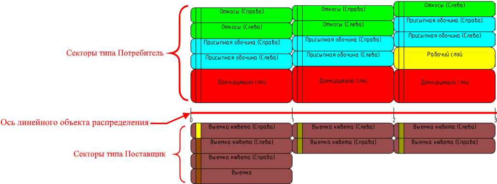
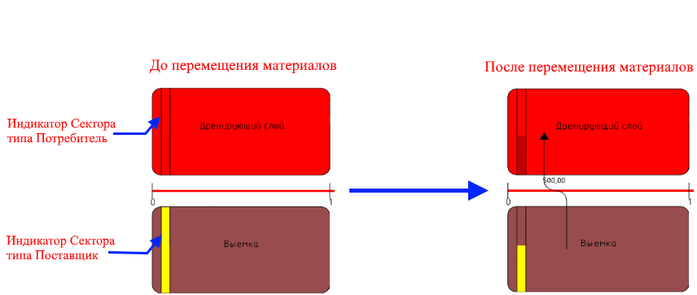
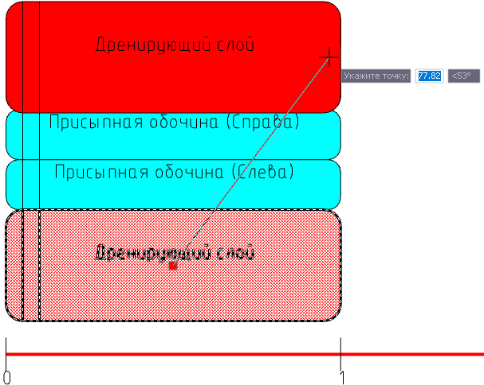
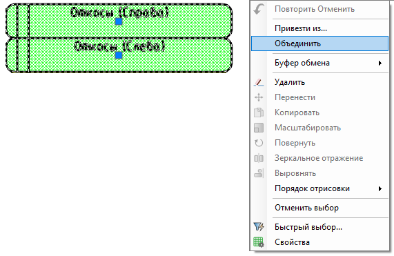
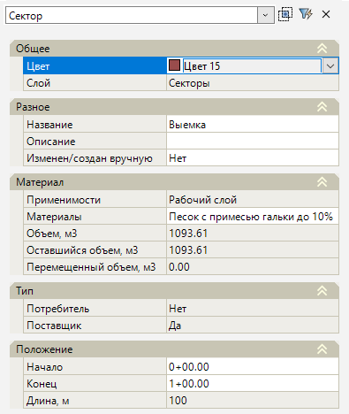
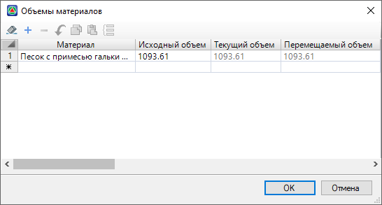
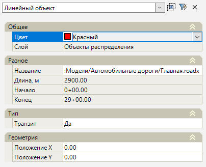
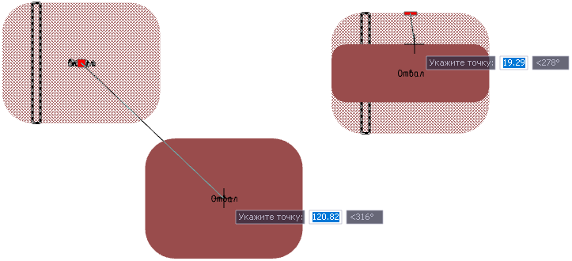
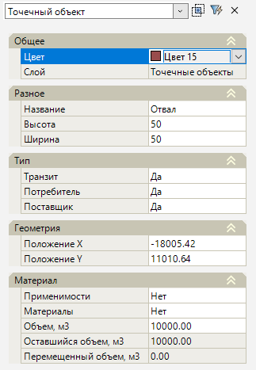
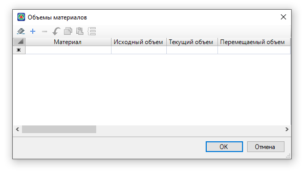

# Редактирование (свойства) участников распределения



## {#redaktirovanie-linejnogo-obuekta/-diagrammy}

На диаграмме распределения отображаются:

* Ось линейного объекта распределения с пикетажным значением.
* В нижней части Секторы типа **Поставщик**.
* В верхней части Секторы типа **Потребитель**.

Каждый Сектор имеет индикатор наличия материала в нем. Цвет индикатора Сектора типа **Поставщик** соответствует цвету материала распределения в таблице **Материалы** (см. [Таблица Материалы](../pre_settings_model/table_materials.md)), цвет индикатора сектора типа **Потребитель** соответствует цвету Сектора. По мере опустошения/ заполнения Сектора материалами цвет индикатора будет меняться:

Сектор можно менять местами между собой. Для этого выделите Сектор, затем выберите грип , курсором мыши определите место вставки Сектора и нажмите ЛКМ:

Так же Секторы одного типа можно объединить, для этого выберите несколько Секторов и нажмите ПКМ, в контекстном меню выберите **Объединить**:



Секторы типа **Потребитель** можно объединить только с общим типом **Применимости**. Объемы объединенных Секторов суммируются.



Свойства Сектора

Выделив ЛКМ мыши любой Сектор диаграммы можно увидеть и настроить его параметры в окне **Свойства**:



Так же задать параметры (Цвет, Название, Применимость Потребителя) всем Секторам на диаграмме можно во вкладке **Участники** в [Предварительных настройках](../pre_settings_model/pre_settings.md).



<u>**Общее**</u>

* В данном подразделе задаётся цвет Сектора и отображается наименование его слоя.

<u>**Разное**</u>

* В поле **Название** отображается наименование Сектора на диаграмме, которое можно изменить.

* В поле **Описание** можно добавить дополнительные сведения.

* При изменении Сектора вручную (например, изменение материала в Секторе) или добавлении нового Сектора через таблицу **Секторы** (см. раздел [Табличные данные распределения](../tabular_apportionment_data.md)) в поле **Изменен/ создан вручную** будет установлено значение **Да**, а сам Сектор будет иметь знак «*»:

  



При обновлении линейного объекта распределения, функционал программы позволяет сохранить измененные вручную Секторы неизменными (см. раздел [Обновление](../apportionment/update_apportionment.md)).



<u>**Материалы**</u>

* В поле **Применимости** показана **Применимость материала** (если выбран Сектор типа **Поставщик**) или **Применимость Потребителя** (если выбран сектор типа **Потребитель**).

  **Применимость Потребителя** на данном шаге можно изменить, для этого в данном поле нажмите кнопку , откроется окно **Выбор применимостей**, назначение **Применимости потребителя** аналогично как при предварительной настройке модели (см. описание вкладки **Участники** в разделе [Предварительные настройки](../pre_settings_model/pre_settings.md)).

* В поле **Материалы** отображаются данные о материале входящем в Сектор, которые в Секторе типа **Поставщик** можно изменить. Для этого нажмите кнопку , откроется окно:

  

  В столбце **Материал** из списка можно выбрать материал распределения (список материалов в данном столбце принят из таблицы **Материалы**, см. раздел [Таблица Материалы](../pre_settings_model/table_materials.md)).

  В столбце **Исходный объем** показано значение объема, принятого с поперечников линейного объекта, которое можно изменить.

  Столбцы **Текущий объем** и **Перемещаемый объем** – показывают объем материала в Секторе после перемещения.

* В поле **Объем, м3** в Секторе типа **Поставщик** показан объем всего материала входящего в Сектор (исходный объем принят с поперечников линейного объекта), в Секторе типа **Потребитель** показан общий объем, который может принять Сектор (исходный объем принят с поперечников линейного объекта и его можно изменить).

* В поле **Оставшийся объем, м3** в Секторе типа **Поставщик** отображен остаток материала после перемещения, в Секторе типа **Потребитель** показан остаток объема, который он может принять.

* Поле **Перемещенный объем, м3** в Секторе типа **Поставщик** показывает объем вывезенного материала с учетом коэффициентов уплотнения и потерь (данное поле соответствует полю **Вывезенный объем, м3** в свойствах стрелки перемещения, см. раздел [Редактирование (свойства) перемещения](../apportionment/working_apportionment.md)), в Секторе типа **Потребитель** отображается фактический принятый объем.

<u>**Тип**</u>

* В этом подразделе показано, какой тип участника назначен Сектору (**Потребитель** или **Поставщик**). Напротив типа участника, назначенного Сектору, установлено значение **Да**.

<u>**Положение**</u>

* В данном подразделе отображается пикетажное положение Сектора, принятое при разбивке Секторов диаграммы, а так же показана длина Сектора. Чтобы изменить пикет начала и конца Сектора введите значение в соответствующих полях.

Свойства оси линейного объекта

Чтобы в окне **Свойства** увидеть параметры оси линейного объекта распределения нажмите ЛКМ на нее в рабочем поле.

<u>**Общее**</u>

* В данном подразделе задаётся цвет оси линейного объекта распределения и отображается наименование ее слоя.

<u>**Разное**</u>

* В поле **Название** отображается имя ссылки на подобъект, на основе которого был создан линейный объект распределения.

* Поле **Длина** отображает протяженность оси линейного объекта.

* Поля **Начало** и **Конец** показывают пикетажное значение начала и конца оси линейного объекта распределения.

<u>**Тип**</u>

* **Транзит** это свойство означает, можно ли при построении маршрутов перемещения материалов использовать пути, проходящие через этот объект.

<u>**Геометрия**</u>

* Поля **Положение Х/ Положение Y** показывают расположение начала оси линейного объекта относительно оси координат.





При выборе точечного объекта в рабочем поле, у него появляются грипы. Чтобы изменить местоположение объекта ЛКМ нажмите на квадратный грип , укажите сторону и нажмите ЛКМ. Чтобы изменить размеры объекта, ЛКМ нажмите на прямоугольный грип  и с помощью курсора мыши расширьте/ сожмите объект, нажмите ЛКМ:

Точечный объект, аналогично Сектору, имеет индикатор наличия материалов (см. раздел [Редактирование линейного объекта/ диаграммы](editing_zone_soil_works.md#redaktirovanie-linejnogo-obuekta/-diagrammy)).

Свойства точечного объекта

Чтобы задать параметры точечному объекту выберите его и откройте окно **Свойства**:

<u>**Общее**</u>

* В данном подразделе задаётся цвет точечному объекту в рабочем поле и отображается наименование его слоя.

  

  Так же задать цвет всем точечным объектам можно в группе настроек **Общие** в [Предварительных настройках](../pre_settings_model/pre_settings.md).

  

<u>**Разное**</u>

* В поле **Название** отображается наименование точечного объекта в рабочем поле, которое можно изменить.

* В полях **Высота** и **Ширина** можно задать размеры объекта (так же размеры можно указать визуально с помощью грипов, см. описание выше).

<u>**Тип**</u>

* **Транзит** это свойство означает, можно ли при построении маршрутов использовать пути, проходящие через точечный объект.

* В полях **Потребитель** и **Поставщик**, напротив типа участника, назначенного точечному объекту, установлено значение **Да**. Чтобы отключить тип участника, в поле участника из селектора выберите **Нет**.

<u>**Геометрия**</u>

* Поля **Положение Х/ Положение Y** показывают расположение точечного объекта относительно оси координат.

<u>**Материал**</u>

* В поле **Применимости** показана **Применимость материала** (если точечный объект является **Поставщиком**) или **Применимость Потребителя** (если точечный объект является **Потребителем**).

  

  Если точечный объект является **Потребителем**, то ему можно назначить **Применимость Потребителя**, для этого в данном поле нажмите кнопку , откроется окно **Выбор применимостей**, назначение **Применимости потребителя** аналогично как при настройке модели (см. описание вкладки **Участники** в разделе [Предварительные настройки](../pre_settings_model/pre_settings.md)).

  

* В поле **Материалы** отображаются данные о материалах входящих в точечный объект. Чтобы добавить или изменить материал и его объем нажмите кнопку , откроется окно:

  

  В столбце **Материал** из списка можно выбрать нужный материал (список материалов в данном столбце принят из таблицы **Материалы**, см. раздел [Таблица Материалы](../pre_settings_model/table_materials.md)).

  Столбец **Исходный объем** показывает заданный объем материала, например, можно назначить объем материала в **Карьере**.

  Столбец **Текущий объем** показывает остаток объема материала после перемещения.

  Если точечный объект является **Поставщиком** и **Потребителем** одновременно (например, **Отвал**), то он может, как принимать, так и вывозить материал, в этом случае столбец **Перемещаемый материал** показывает объем материала, который можно вывезти **Потребителю**.

* В поле **Объем, м3** в точечном объекте типа **Поставщик** показан объем всего материала входящего в этот объект, в точечном объекте типа **Потребитель** показан общий объем, который может принять этот объект.

* В поле **Оставшийся объем, м3** в точечном объекте типа **Поставщик** отображен остаток материала после перемещения, в точечном объекте типа **Потребитель** показан остаток объема, который он может принять.

* Поле **Перемещенный объем, м3** в точечном объекте типа **Поставщик** показывает объем вывезенного грунта с учетом коэффициентов уплотнения и потерь, в точечном объекте типа **Потребитель** отображается фактический принятый объем. Если точечный объект является **Поставщиком** и **Потребителем** одновременно (например, **Отвал**), то данное поле показывает, сколько было принято материала с учетом вывезенного материала.


