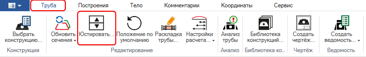
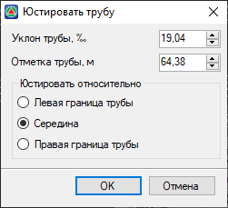
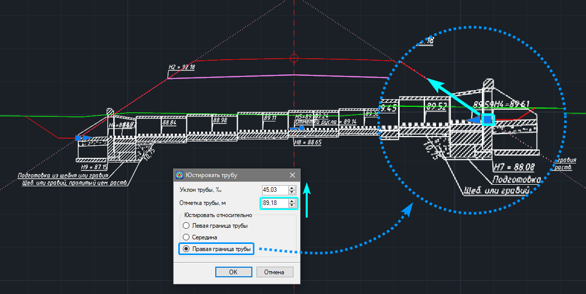
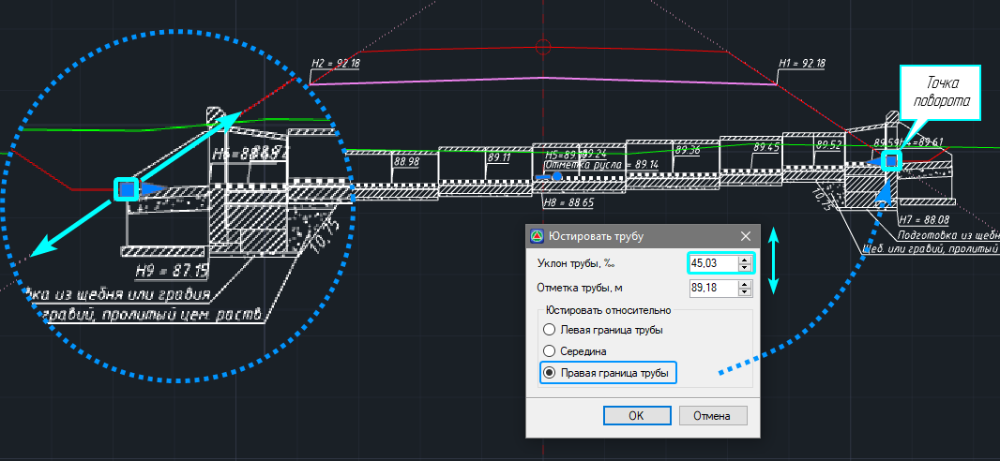
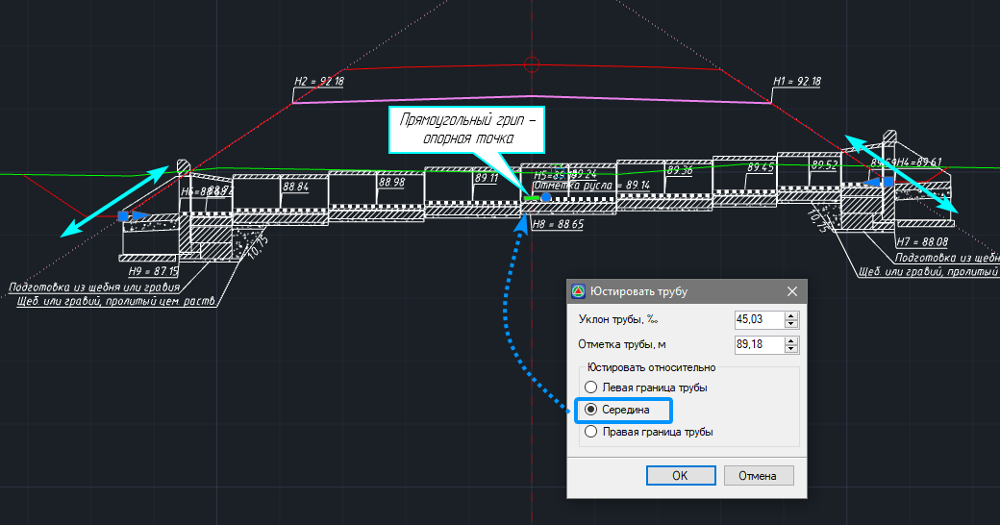

# Юстировать положение трубы

Данная функция позволяет корректировать вертикальное положение трубы с помощью изменения ее уклона или отметок. Для этого:

1. Выберите элемент меню **Водопропускные трубы – Юстировать…** или на ленточном меню **Труба – Редактирование – Юстировать…**:

   

2. Откроется окно **Юстировать трубу**:

   

   **Уклон и Отметка трубы** настраиваются в соответствующих полях как вводом значений, так и последовательным подбором с помощью стрелок. При изменении отметки будет пересчитываться уклон трубы и наоборот.

   В поле **Юстировать относительно** можно выбрать опорную точку, у которой будет юстироваться отметка, или относительно которой будет изменяться уклон:

* **Левая/правая граница трубы** – при юстировании отметки будет происходить изменение вертикального положения выбранной точки вдоль луча откоса. При изменении уклона вращение происходит относительно выбранной точки, при этом точка с противоположной стороны перемещается вдоль луча откоса. Границами трубы являются крайние точки лотка трубы теоретической длины, которые обозначены в рабочем окне квадратными грипами.

#|
||||
||При изменении отметки правой границы трубы, эта точка будет перемещаться вдоль луча откоса.||
|#

#|
||||
||При изменении уклона фиксируется выбранная граница трубы, в данном случае правая. При вращении трубы точка левой границы перемещается вдоль луча откоса.||
|#

* **Середина** – при юстировании отметки и изменении уклона за опорную принимается точка на пересечении лотка трубы и оси сечения. Перемещение трубы происходит параллельно исходному положению, без изменения ее уклона.

#|
||||
||При юстировании или изменении уклона трубы относительно середины, точки левой и правой границы перемещается вдоль лучей откосов.||
|#
