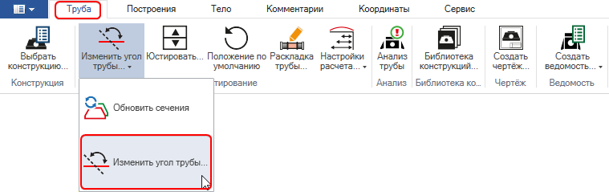
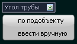

# Изменить угол трубы

Данная функция позволяет изменить угол укрепления откосов трубы в рабочем окне **План**.

Для этого:

1. Выберите элемент меню **Водопропускные трубы –Изменить угол трубы** или на ленточном меню **Труба – Редактирование – Изменить угол трубы:**

   

2. Выберите способ задания угла для расчета укреплений:

   

   2.1. **По подобъекту** – необходимо выбрать ось для автоматического расчета угла относительно нее.

   2.2. **Ввести вручную** – необходимо ввести значение угла в поле динамического ввода или указать угол на плане.

В результате угол укрепления трубы будет изменен в соответствии с заданными параметрами:



В программе значение угла укреплений транслируется в окно **Анализ трубы** и выходную документацию, как **Угол пересечения водотока**.

