# Выбор и настройка конструкции

Завершающим этапом создания модели Водопропускная труба является назначение параметров ее конструкции. После определения положения трубы откроется окно **Выбор конструкции трубы**:

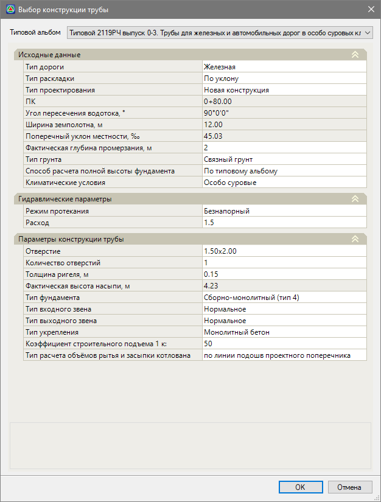

В зависимости от выбранного типового альбома, набор параметров может быть различным. Параметры, расположенные ниже в данном окне, зависят от тех, что находятся выше. Например, в соответствии с типовым альбомом 2119РЧ выпуск 0-2 для всех труб, кроме труб с отверстием 3,00×2,5 и 4,00×2,5, можно запроектировать входной оголовок с повышенным входным звеном. Поэтому для отверстий 3,00×2,5 и 4,00×2,5 при выборе **типа входного звена** отсутствует **повышенный** тип:

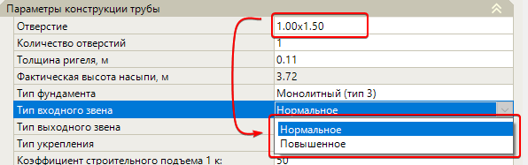

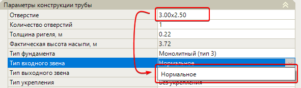

Далее рассмотрим более подробно отдельные разделы окна **Выбор конструкции трубы**:

**Типовой альбом** – список доступных для использования типовых альбомов, в соответствии с которым проектируется водопропускная труба. В зависимости от выбранного типового альбома список параметров ниже может быть различным.

## Исходные данные

**Тип раскладки** – тип раскладки секций трубы в продольном сечении:

* **По уклону** – раскладка трубы происходит единым уклоном по всем секциям:

  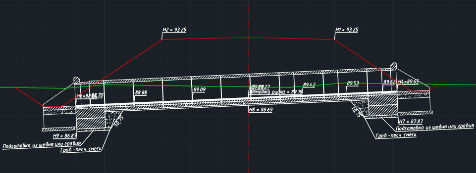

* **Ступенями** – раскладка трубы происходит ступенями, т.е. каждая секция трубы имеет продольный уклон 0 промилле, а общий уклон формируется за счет вертикального смещения секций относительно друг друга:

  

**Тип дороги** – параметр назначаемый исходя из условий проектирования.

**Тип проектирования** – предусматриваемый пользователем тип проектирования: **новая конструкция** или **реконструкция**.



Подробнее см. раздел [Реконструкция](reconstruction.md).



**Пикет** и **Угол пересечения водотока** – значения, которые берутся из настроек модели трубы.

**Ширина земляного полотна** – определяется как горизонтальное расстояние между крайними точками управляющего элемента **Низ конструкции**.

**Поперечный уклон местности** – определяется как уклон линии между точками проектного сечения с кодами 376 и 377.

**Фактическая глубина промерзания** – параметр назначаемый исходя из условий проектирования. По умолчанию принимается равным величине, заложенной в выбранном типовом альбоме. Данный параметр влияет:

* при отличной от типовой глубины промерзания заложение фундамента (оголовка) пересчитывается в соответствии с выбранной методикой в параметре **Способ расчета полной высоты фундамента**.

**Тип грунта** – параметр назначаемый исходя из условий проектирования. Данный параметр влияет:

* на выбор коэффициента строительного подъема: 1/50 для несвязных грунтов и 1/80 связных грунтов.
* на выбор типа оголовка при проектировании металлических гофрированных труб.

**Климатические условия** – параметр назначаемый исходя из условий проектирования.

**Тип местности** – параметр назначаемый исходя из условий проектирования.

**Способ расчета полной высоты фундамента** – значение в данном поле зависит от значения **Фактической глубины промерзания**: при расчете трубы с глубиной промерзания принятой по типовому альбому расчет высоты фундамента может быть произведен как **По типовому**, так и по **СП 22.13330.2016**; для значений отличных от приведенных в типовом альбоме способ расчета полной высоты производится по **СП 22.13330.2016**.

## Гидравлические параметры

Группа параметров, в которой содержится исходная информация необходимая для проведения гидравлического расчета создаваемой конструкции трубы. В качестве исходных данных пользователем задаются **Режим протекания** и **Расход трубы**.



Подробнее см. раздел [Приложение А. Гидравлические расчеты](hydraulic_calculation.md).



## Параметры конструкции трубы

**Отверстие** – в данном поле осуществляется выбор размеров отверстия трубы. Для круглых труб указывается диаметр (Dт), для прямоугольных - ширина и высота (Dт× Hт).

**Количество отверстий/очков** – в данном поле осуществляется выбор количества труб в сечении проектируемого сооружения.

**Фактическая высота насыпи** – значение равное разности абсолютной отметки средней точки управляющего элемента **Низ конструкции**, который отображает положение верха земполотна или низа конструкции дорожной одежды, и отметки русла.



Подробнее см. раздел [Управляющий элемент Низ конструкции](customization_window_culvert.md#niz-konstrukcii)



**Тип укрепления** – типа укрепления назначается одинаковым для откосов и русла входного и выходного оголовков.

**Коэффициент строительного подъема** – величина коэффициента назначаемая исходя из типа грунта основания. Для связных грунтов – 1/50, для несвязных – 1/80.

## Параметры конструкции железобетонных труб

**Толщина ригеля/стенки** – в данном поле осуществляется выбор толщины стенки (δст) и толщины ригеля (δр) для круглых и прямоугольных ж/б труб соответственно.

**Тип фундамента** – в данном поле осуществляется выбор типа фундамента трубы доступного в рамках выбранного типового альбома.

**Тип входного/выходного звена**– в данном поле осуществляется выбор конструкции оголовочного звена железобетонной трубы. Для круглых труб – **цилиндрическое** и **коническое** звено, для прямоугольных – **нормальное** и **повышенное** звено.

#|
||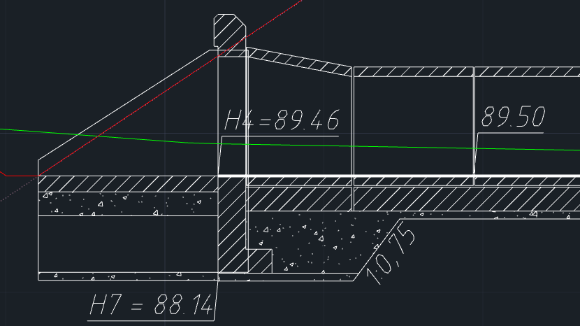|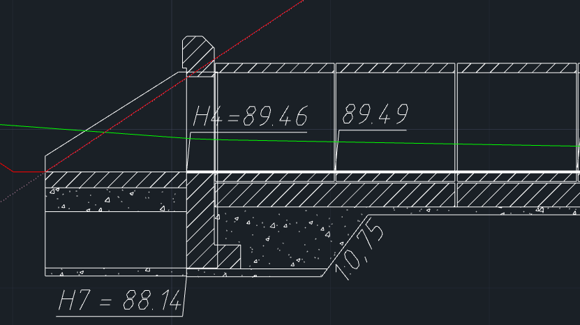||
||Оголовок с **коническим** звеном (Типовой 1484-02. Трубы железобетонные круглые для автомобильных дорог).|Оголовок с **цилиндрическим** звеном (Типовой 1484-02. Трубы железобетонные круглые для автомобильных дорог).||
|#

#|
||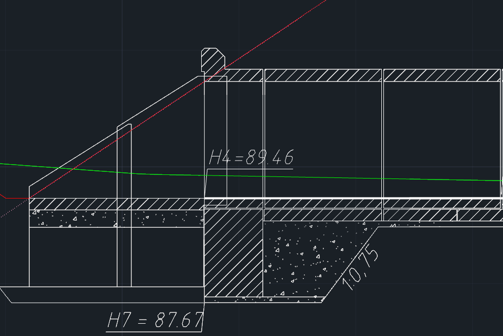|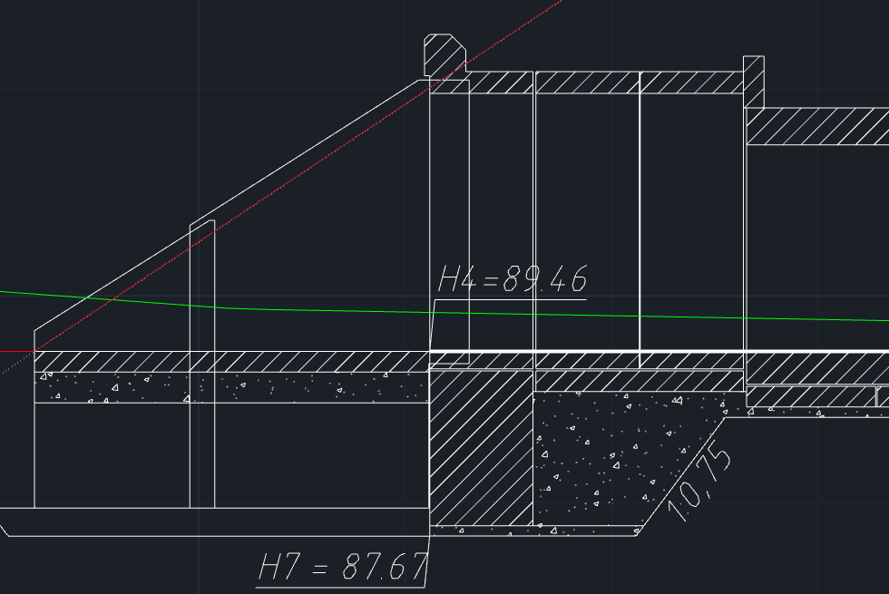||
||Оголовок с **нормальным** звеном (Типовой 2119РЧ 0-2 Трубы для автомобильных дорог в умеренных и суровых климатических условиях).| Оголовок с **повышенным** звеном (Типовой 2119РЧ 0-2 Трубы для автомобильных дорог в умеренных и суровых климатических условиях).||
|#

## Параметры конструкции гофрированных труб

**Толщина металла** – в данном поле осуществляется выбор толщины металла, используемого в конструкции металлических гофрированных труб.

**Модуль деформации** – в данном поле осуществляется выбор модуля деформации грунта засыпки, не менее.

**Длина секции** – в данном поле указана длина секции полной заводской готовности в соответствии с типовым альбомом.

**Способ раскладки** – в данном поле осуществляется выбор способа раскладки конструкции металлической гофрированной трубы.



Подробнее см. в разделе [Раскладка металлических гофрированных труб](layout.md#raskladka-metallicheskih-gofrirovannyh-trub).



**Тип оголовка** – в данном поле осуществляется выбор типа конструкции оголовочного звена металлической гофрированной трубы. Есть возможность выбора между звеном **с вертикально срезанным торцом** и **торцом, срезанным параллельно откосу насыпи**. Также в зависимости от буквенного обозначения типа оголовка зависит конструкция противофильтрационных перемычек под оголовком, например, перемычка из сборного/монолитного бетона или из цементо-грунтовой смеси.

#|
||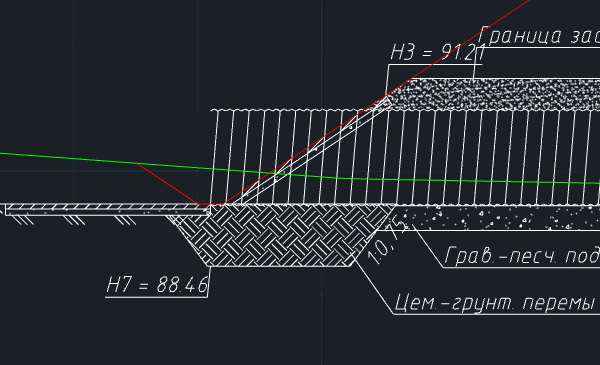|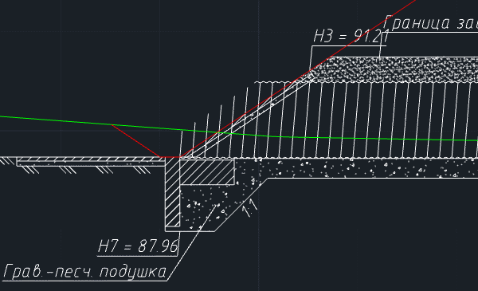||
|| Оголовок металлической гофрированной трубы с **вертикально срезанным торцом** и **цементо-грунтовой перемычкой – тип оголовка 1а**.|Оголовок металлической гофрированной трубы с **торцом, срезанным параллельно откосу насыпи** и **перемычкой из сборного бетона – тип оголовка 2**.||
|#

**Покрытие металлических элементов** – в данном поле осуществляется выбор типа защитного покрытия секций трубы. Выбор какого-либо покрытия отражается в маркировке секций в соответствии с типовыми альбомами.

После назначения всех параметров проектируемой водопропускной трубы нажмите **ОК**. В результате, в структуре проекта будет создана модель типа **Водопропускная труба**, а сама модель будет доступна для дальнейшего редактирования в рабочем окне **Труба**.



Настройка или изменение конструкции трубы могут быть произведены на любом этапе проектирования водопропускной, для этого выберите меню **Водопропускные трубы – Выбрать конструкцию…** или на ленточном меню **Труба – Конструкция – Выбрать конструкцию….**:

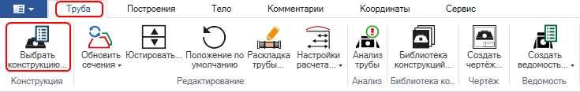

