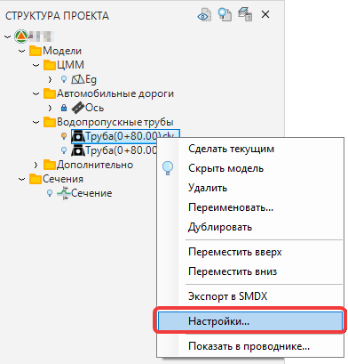
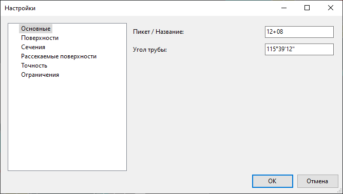
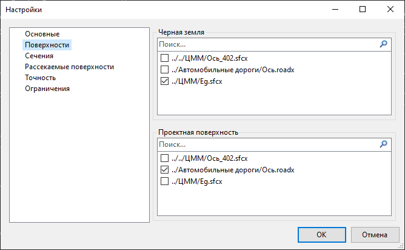
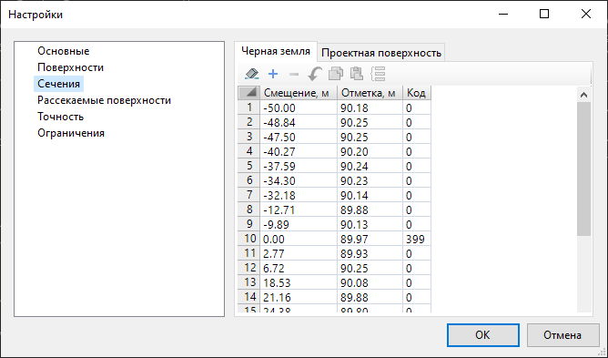
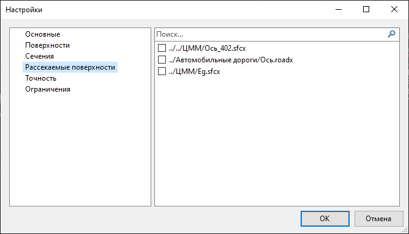
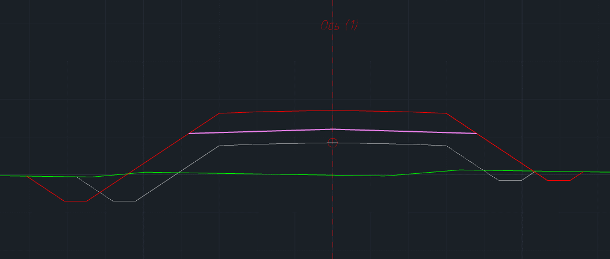
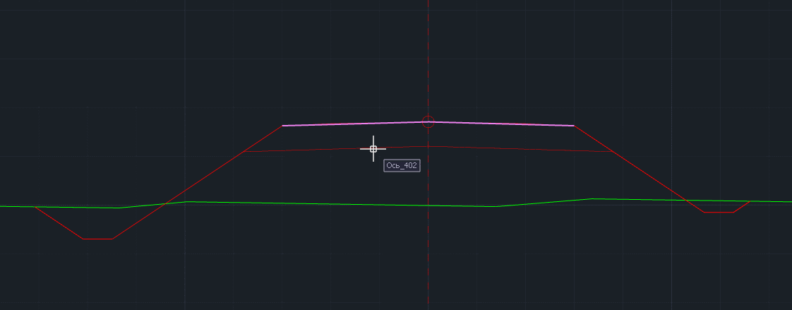
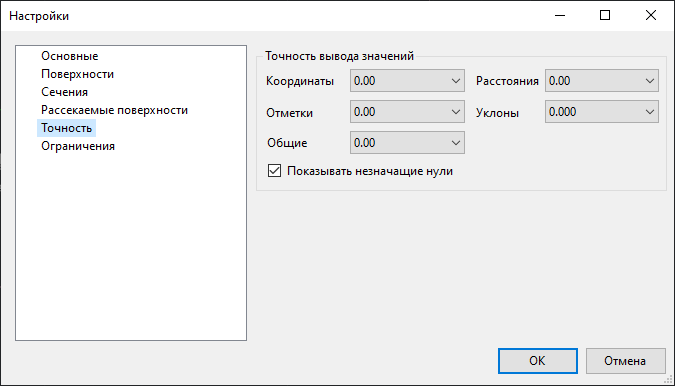
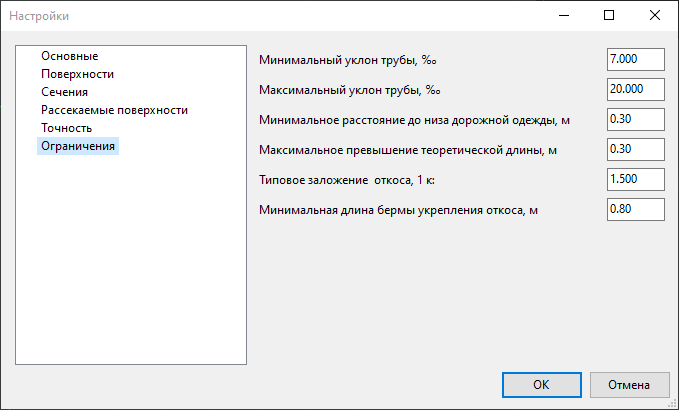
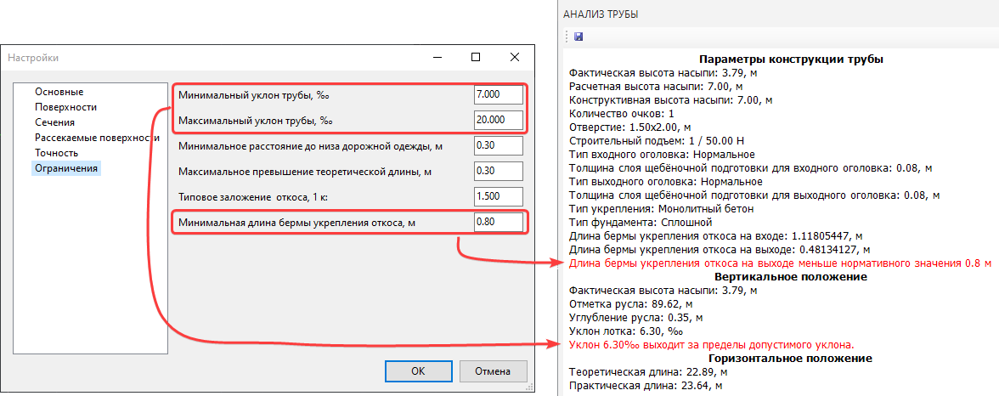

# Настройка модели Водопропускная труба

Для того чтобы открыть окно настройки модели водопропускной трубы:

1. В окне **Структура проекта** нажмите **ПКМ** на наименовании необходимой модели водопропускной трубы. В открывшемся контекстном меню выберите пункт **Настройки**:

   

2. Откроется окно **Настройки**. В левой части окна представлены следующие группы настроек:

## Основные

Группа **Основные** включает следующие настройки:

**Пикет/ Название** – в поле задается пикетажное положение трубы. Данное поле является информационным и заполняется автоматически при создании модели, в дальнейшем значение пикета может быть изменено. Информация из данного поля попадает в окно Анализ трубы, ведомость и чертеж в графу Пикет.



При создании водопропускной трубы по пикету и углу ее пикетажное положение определяется автоматически. В остальных случаях вводится вручную.



**Угол трубы** – значение угла определяется автоматически или задается вручную на этапе ввода трубы и используется исключительно для расчета геометрической формы укреплений. Информация из данного поля попадает в окно Анализ трубы, ведомость и чертеж.

## Поверхности

Группа настроек **Поверхности** содержит две области, в которых могут быть выбраны черная и проектная поверхности, по которым формируются соответствующие линии сечения. В свою очередь сечения хранятся в табличном виде во вкладке **Сечение**.

## Сечения

В данной вкладке находятся таблицы сечений черной земли и проектной поверхности.



Таблицы сечений (черной земли и проектной поверхностей) не динамические и формируются в момент создания модели или во время использования функции Обновить поверхности.



## Рассекаемые поверхности

В данной вкладке находится список моделей, которые могут быть выбраны для отображения в рабочем окне **Труба** в качестве вспомогательных линий сечений.



Рассекаемые поверхности - динамические, поэтому в качестве рассекаемых могут быть выбраны модели проектной поверхности и черной земли сечения трубы для контроля за их изменениями.

Также в качестве рассекаемой поверхности, например, может быть выбрана поверхность по верху земполотна автомобильной дороги.



## Точность

В поле **Точность вывода значений** задается необходимое количество знаков после запятой для координат, расстояний, отметок, уклонов и общих значений (к общим относятся характеристики сечения и показатели объемов работ). Настройка точности в данном окне используется для отображения данных в окне **Труба**, а также при формировании чертежей и ведомостей.

Опция **Показывать незначащие нули** позволяет включать/ отключать видимость нулей дробной части числа, находящихся правее последней значащей цифры. Например, отметка 37,5: при заданной точности отметок 0,00 и включенной опции **Показывать незначащие нули** отметка будет отображаться как 37,50; при отключении данной опции отметка будет отображаться как 37,5.



Настройка точности и формата отображения углов происходит в меню **Сервис – Настройки – Настройки среды – Представление чисел.**



## Ограничения

Данная группа настроек включает в себя перечень параметров, за которыми может быть осуществлен контроль в ходе работы. В соответствующих полях задаются значения контролируемых параметров, если при настройке и раскладке трубы какой-либо из параметров выходит за пределы установленных ограничений, то в окне **Анализ трубы** появляется уведомление об этом, выделенное красным цветом:

