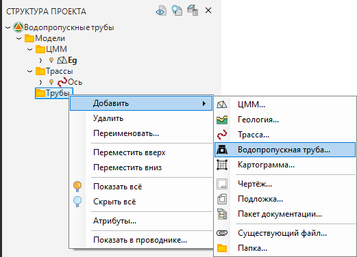
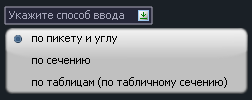
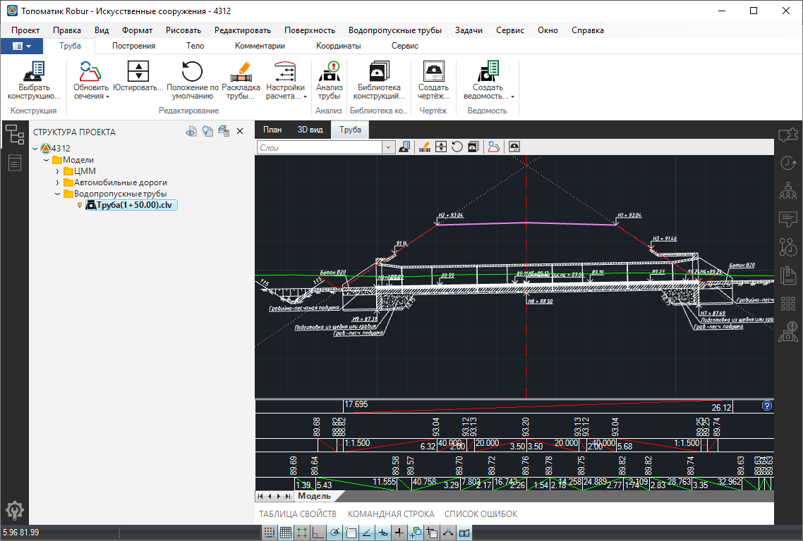

# Создание модели Водопропускная труба

Для создания новой модели водопропускной трубы выполните следующие действия:

1. В окне **Структура проекта** нажмите **ПКМ** на папке, в которой необходимо создать новую модель водопропускной трубы. В появившемся контекстном меню выберите **Добавить - Водопропускная труба**:

   

2. Затем рядом с курсором в пространстве окна **План** появится список возможных способов ввода трубы. Выберите наиболее удобный способ ввода и следуйте командам в контекстном меню:

   

   

   Функциональные особенности и последовательность действий при выборе того или иного способа ввода представлены в разделе [Способы ввода](input_method.md)

   

3. После того, как будет определено положение трубы откроется окно **Выбор конструкции трубы**. Заполните все необходимые поля и нажмите **ОК**:

   

   

   Описание работы в окне **Выбор конструкции трубы** представлено в разделе [Выбор и настройка конструкции](choose_customization_constructions.md)

   

4. В результате в структуре проекта в выбранном расположении будет создана модель Водопропускной трубы. По умолчанию наименование модели соответствует ее пикетажному положению, при необходимости модель может быть переименована:

   

   

   Функционал по работе с данным окном был подробно описан ранее ([Запуск и настройка. Структура проекта](../install_startup/startup/structure_project/structure_project.md)).

   