# Создание чертежей

Программа **Топоматик Robur Искусственные сооружения** позволяет сформировать стандартный чертеж запроектированной трубы, который включает:

* **чертеж продольного разреза по оси трубы**.
* **чертеж плана трубы**.
* **чертеж поперечного разреза и фасада трубы**.
* **схема строительного подъема**.
* **таблицы основных показателей, объемов работ, объемов работ укреплений и спецификации сборных элементов конструкции**.

Кроме возможности создавать чертежи на основе стандартного шаблона в программе присутствует возможность редактировать и создавать пользовательские шаблоны.



Для того чтобы создать чертеж:

1. Выберите элемент меню **Водопропускные трубы –Создать чертеж** или на ленточном меню **Труба – Чертеж – Создать чертеж**:

   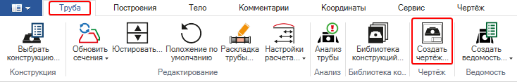

2. Откроется окно стандартного мастера создания чертежей:

   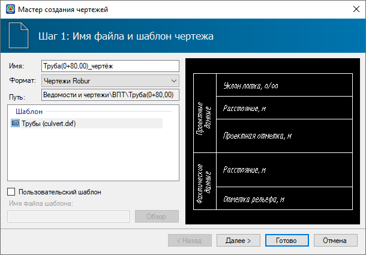

   В данном окне:

  * **Имя** – текстовое поле для ввода наименования создаваемого файла, по умолчанию имя формируется в формате *(наименование модели)\_чертёж*.
  * **Формат** – в поле задается формат формируемого файла чертежа.
  * **Путь** – в поле отображается расположение файла ведомости в структуре проекта после его создания.
  * **Шаблон** – в списке находятся доступные стандартные шаблоны, по которым может быть создан чертеж.
  * **Пользовательский шаблон** – опция позволяет выбрать пользовательский шаблон для формирования чертежа. Для того чтобы выбрать шаблон из расположения используйте кнопку **Обзор**.

    После задания всех параметров нажмите **Далее**.

3. На следующей вкладке настройте параметры чертежа и листа, затем нажмите **Далее**:

   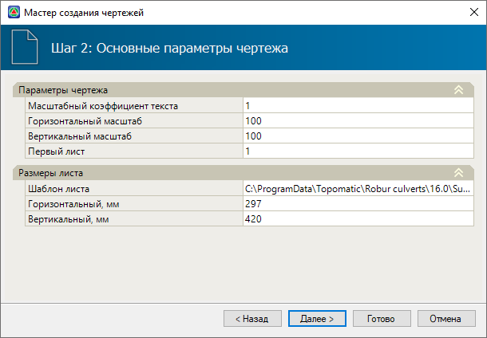

4. При необходимости заполните основную надпись и нажмите **Готово**:

   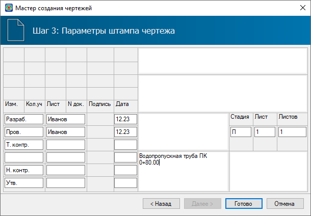

В результате в структуре проекта появится папка **Ведомости и чертежи**, в которой отобразится созданный чертеж. Этот чертеж автоматически будет открыт для просмотра или дальнейшего редактирования:

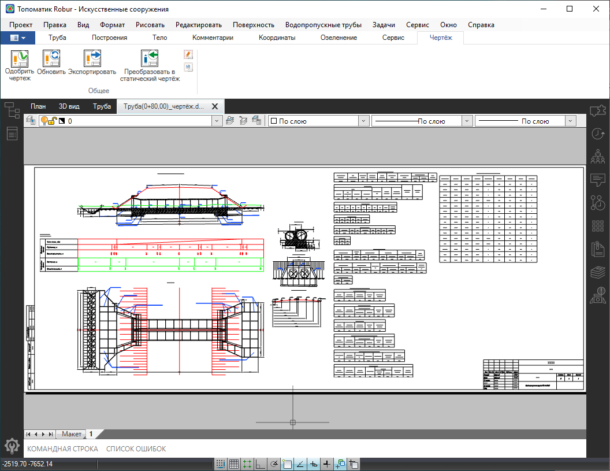







Основная информация по работе в режимах **Редактирование макета** и **Редактирование шаблона** представлена в разделе [Чертежи и ведомости](../doc/edit_dynamic_drawing/working_in_layout/edit_layout.md).



Особенность работы в динамических чертежах водопропускных труб заключается в компоновке элементов чертежа: в пространстве **шаблона** элементы расположены независимо друг от друга, в то время как в пространстве **макета** эти элементы размещаются внутри специальной сетки. Такой подход к формированию чертежа позволяет использовать универсальный шаблон и применять его для различных типов и вариантов водопропускных труб.

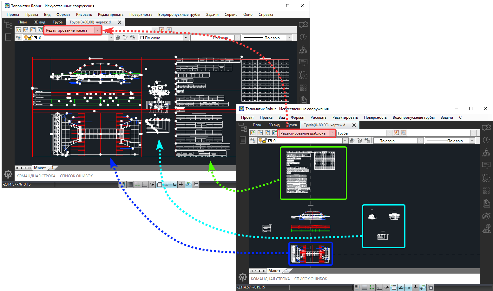

По умолчанию видимость сетки и границ элементов (тэгов) отключена. Для того, чтобы отобразить сетку и границы тэгов:

1. Необходимо открыть динамический чертеж и перейти в пространство **Макет**, в режим **Редактирование макета**:

   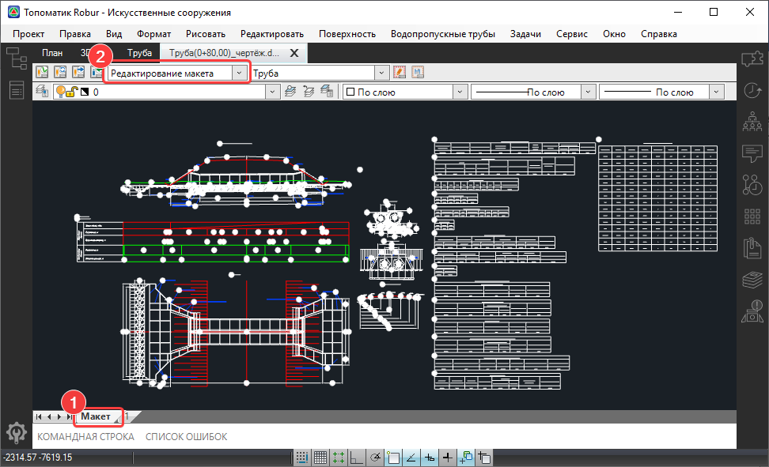

2. В данном режиме включите видимость слоев **Layout** (слой, на котором размещена **сетка**) и **Bounds** (слой с **границами тэгов**):

   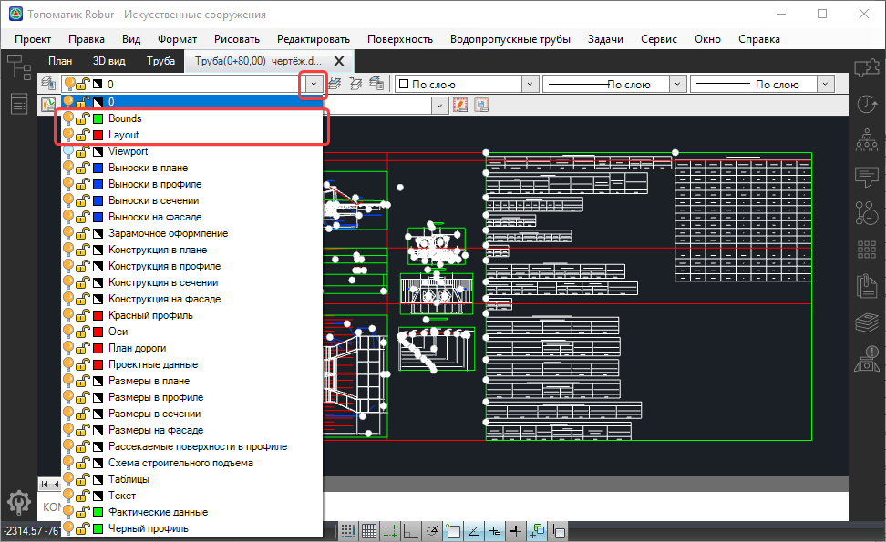

В результате в рабочем окне отобразятся **сетка** (красные линии) и **границы** тэгов (зеленые линии).

Сетка макета чертежа имеет табличную форму и состоит из строк и столбцов. Нумерация строк и столбцов начинается с нуля. В стандартном шаблоне сетка состоит из пяти строк и четырех столбцов. Ниже на рисунке представлен пример стандартного шаблона чертежа с номерами строк и столбцов:

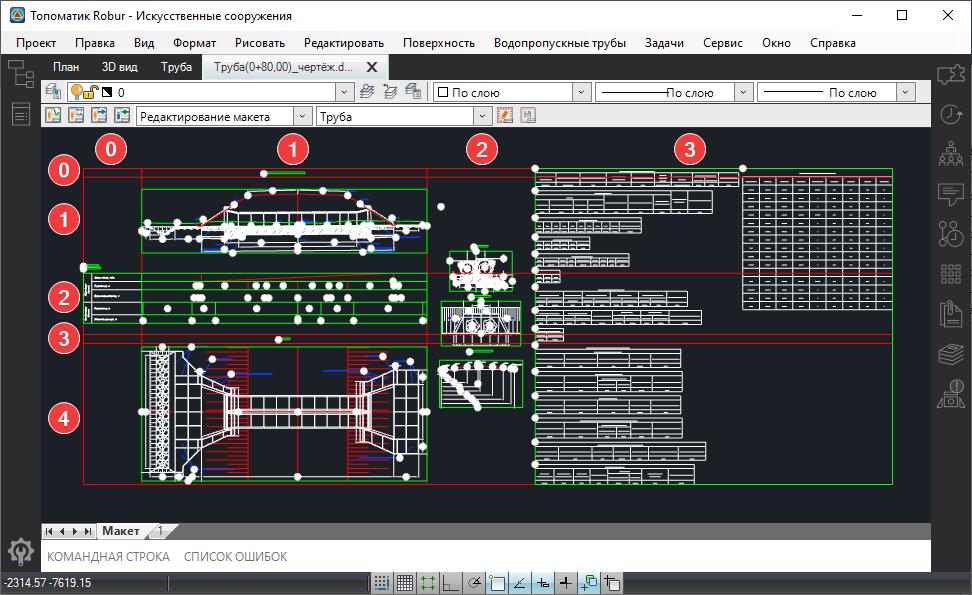

Ширина и высота строк и столбцов автоматически настраиваются в зависимости от расположения и настройки в них элементов чертежа (примитивов и тэгов).

## Основные параметры тэгов чертежа водопропускной трубы

Для внесения изменений в шаблон динамического чертежа водопропускной трубы, после его открытия следует перейти в пространство **Макет**, а затем активировать режим **Редактирование шаблона**:

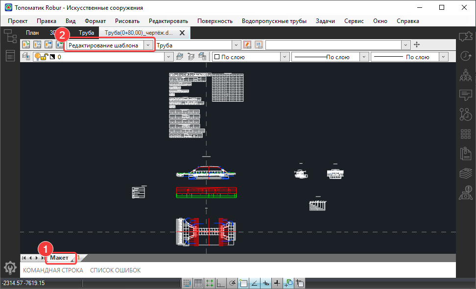

В данном режиме элементы чертежа (тэги и примитивы) разнесены в пространстве шаблона, таким образом, чтобы не происходило их наложения при различных вариантах водопропускных труб. За размещение элементов в пространстве шаблона отвечают координаты из раздела свойств элемента - **Геометрия** (поля **Положение Х** и **Положение Y**), тогда как за положение в пространстве макета (режим **Редактирование макета**) отвечает раздел настроек **Параметры тэга**:

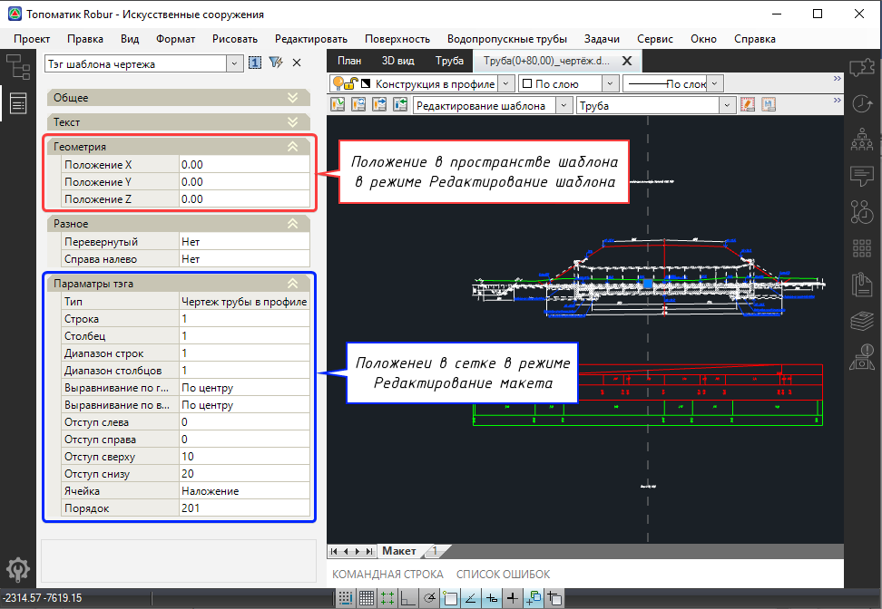

Раздел свойств тэга **Геометрия**:

* **Положение X**/ **Положение Y** – в данных полях отображаются значения смещения элемента в пространстве шаблона по осям X и Y, которые можно изменить.

Раздел свойств тэга **Параметры тэга**:

* **Тип** – в данном поле отображается наименование тэга.
* **Строка** – в данном поле отображается номер строки сетки макета чертежа, в которой расположен тэг.
* **Столбец** - в данном поле отображается номер столбца сетки макета чертежа, в котором расположен тэг.
* **Диапазон строк/ Диапазон столбцов** – в данном поле можно задать количество строк/ столбцов, в которых будет размещаться тэг. Это удобно, например, для размещения в заданном диапазоне строк нескольких тэгов **стопкой** (описание режима **Стопка** см. ниже). При задании диапазона строк (например, значение 5) выравнивание тэга будет применяться на заданный диапазон строк (т.е. на эти 5 строк).
* **Выравнивание по горизонтали/ Выравнивание по вертикали** – в данных полях из списка можно выбрать выравнивания тэга внутри ячейки сетки макета чертежа (выравнивание по горизонтали – **По центру, Слева, Справа**, выравнивание по вертикали – **По центру, Сверху, Снизу**).
* **Отступ слева/ Отступ справа/ Отступ сверху/ Отступ снизу** – в данные поля можно внести значения, на которые будет отступать тэг от границ ячейки, в которой он находится.
* **Ячейка** – в данном поле из списка можно выбрать режим размещения тэгов относительно друг друга в ячейке (диапазоне ячеек):

С помощью режима **Наложение** можно размещать тэги путем накладывания одного на другой. Например, чертеж продольного разреза по оси трубы, состоит из нескольких тэгов, накладывающихся друг на друга (**Чертеж трубы в профиле, Выноски в профиле, Размеры трубы в профиле**).

Режим **Стопка** позволяет располагать несколько тэгов вертикально друг под другом, при этом порядок расположения определяется порядковым номером в поле **Порядок** (чем меньше значение порядкового номера, тем выше будет расположен соответствующий тэг, и наоборот – чем больше порядковый номер, тем ниже его положение).

