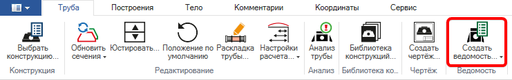
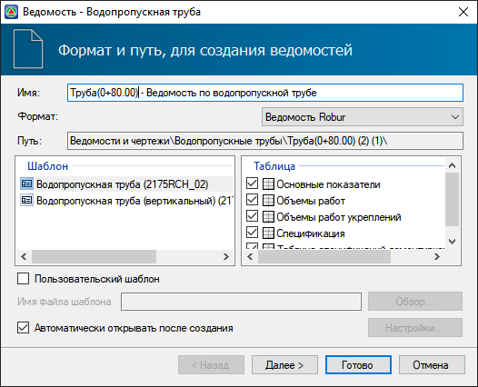
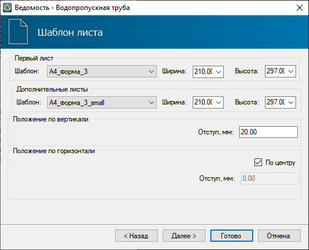
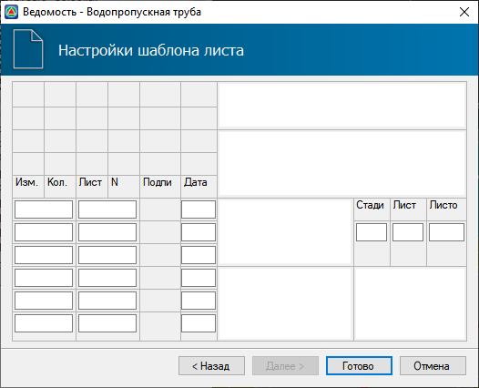
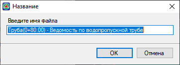
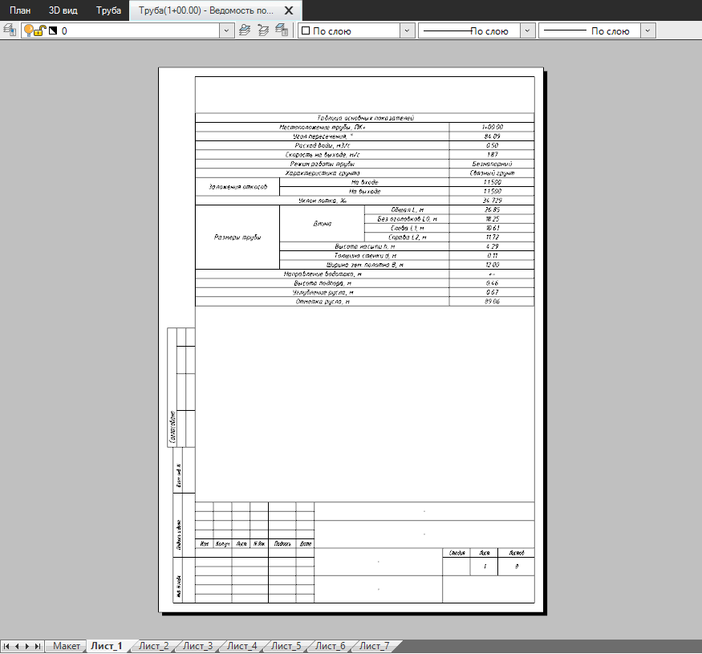
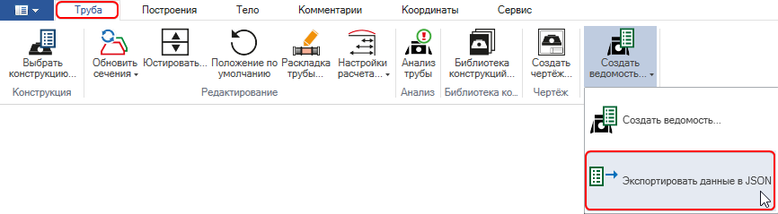
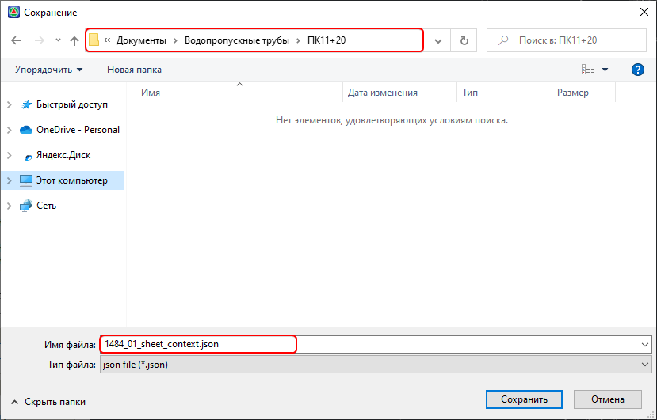
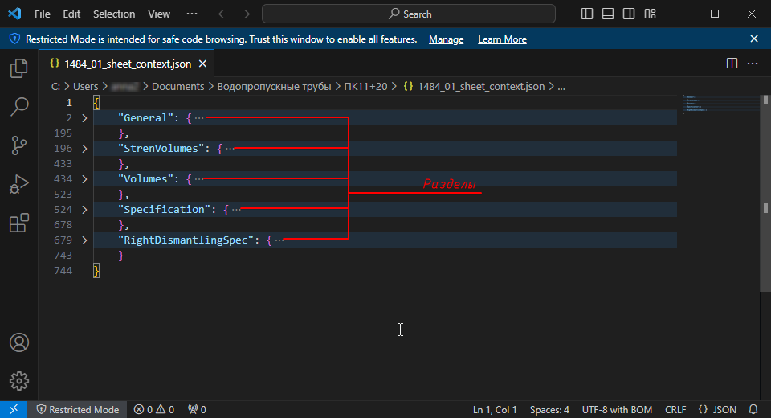
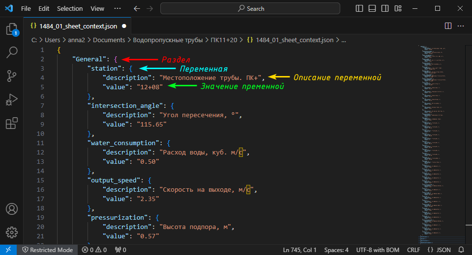

# Создание ведомостей

Программа позволяет сформировать ведомость запроектированной трубы, которая включает таблицы:

* **основных показателей** – включает: информацию о местоположении трубы, ее гидравлические параметры и размеры. информацию о характерных отметках и геометрии укреплений.
* **объёмов работ по трубе** - включает в себя ведомость объемов работ по средней части трубы и оголовкам.
* **объёмов работ укреплений** - включает в себя ведомость объемов работ укрепления откосов и русла входного и выходного оголовков, а также конца укрепления.
* **спецификации** - включает ведомость всех блоков, используемых в запроектированной конструкции.
* **спецификации демонтируемых блоков** - включает ведомость всех блоков, используемых в запроектированной конструкции.

Все ведомости формируются в рамках единого шаблона, при этом список создаваемых таблиц может быть настроен. Например, при проектировании новой конструкции трубы можно исключить из списка создаваемых таблиц **Спецификацию демонтируемых блоков**. В программе доступно 2 стандартных шаблона: с вертикальной и горизонтальной конфигурацией таблиц.

Для того чтобы создать ведомость:

1. Выберите элемент меню **Водопропускные трубы –Создать ведомость** или на ленточном меню **Труба – Создать ведомость**:

   

2. Откроется окно стандартного мастера ведомости:

   

   **Имя** – в поле задается наименование файла ведомости, по умолчанию содержит название модели и ведомости.

   **Формат** – в поле задается формат формируемого файла ведомости.

   **Путь** – в поле отображается расположение файла ведомости в структуре проекта после его создания.

   **Шаблон** – в списке находятся доступные стандартные шаблоны, по которым может быть создана ведомость.

   **Таблицы** – в списке перечислены все доступные для создания таблицы в рамках выбранного шаблона. При необходимости можно пометить только часть таблиц для выходной ведомости.

   **Пользовательский шаблон** – опция позволяет выбрать пользовательский шаблон для формирования ведомостей. Для того чтобы выбрать шаблон из расположения используйте кнопку **Обзор**.

   

   Механизмы настройки индивидуальных шаблонов ведомостей описаны в  разделе[Чертежи и ведомости](../doc/dynamic_vedomosti/edit_vedomosti_and_pattern.md).

   

   **Автоматически открывать после создания** – опция позволяет включить или отключить автоматическое открытие ведомости после ее создания.

   После задания всех параметров нажмите **Далее**.

3. Выберите форматы листов и положение таблицы на листе. После задания всех параметров нажмите **Далее**:

   

4. При необходимости заполните основную надпись и нажмите **Готово**:

   

5. В открывшемся окне отредактируйте наименование файла или оставьте без изменения и нажмите **Ок**:

   

6. В результате будет создана ведомость по запроектированной трубе в выбранном формате:

   

## Экспортировать данные в json

В программе присутствует возможность экспортировать данные запроектированной трубы в текстовый файл в формате json. Для этого:

1. Выберите элемент меню **Водопропускные трубы – Экспортировать данные в json** или на ленточном меню **Труба – Ведомость – Экспортировать данные в json**:

   

2. В открывшемся окне перейдите в расположение, где необходимо сохранить файл, введите **Имя файла** и нажмите **Сохранить**:

   

В результате данные по водопропускной трубе будут сохранены в выбранное расположение в формате json. Созданный json -файл имеет следующую структуру разделов:

* **General** – общие показатели.
* **StrenVolumes** – объемы работ укреплений.
* **Volumes** – объемы работ.
* **Specification** – спецификация.
* **Right(Left)DismantlingSpec** – спецификация демонтируемых блоков справа (слева).

В свою очередь каждый раздел включает в себя определенное количество переменных, которые имеют текстовое описание (**description**) и значение (**value**):

