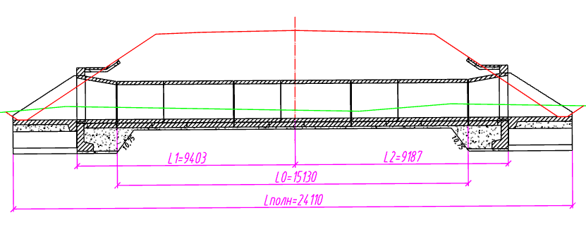
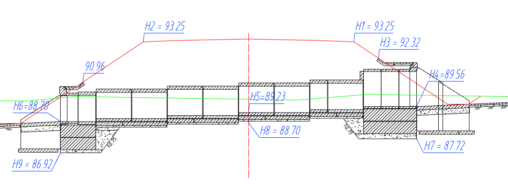

# Окно Анализ трубы

Для просмотра сводной информации о проектируемой трубе выберите меню **Водопропускные трубы – Анализ трубы** или на ленточном меню **Труба – Анализ – Анализ трубы**:

В окне содержатся следующие логические разделы:

## Исходные данные

Раздел включает в себя данные на основе, которых производится расчет конструкции водопропускной трубы:

**Тип проектирования, Расход, Фактическая глубина промерзания, Тип грунта** – параметры, задаваемые исходя из условий проектирования в окне **Выбор конструкции**.



Подробнее см. раздел [Выбор и настройка конструкции](choose_customization_constructions.md)



**Пикет** и **Угол пересечения водотока** – значения, которые берутся из настроек модели трубы.

**Поперечный уклон местности** – определяется как уклон линии между квадратными грипами управляющих элементов **Лучи откоса**.



Подробнее см. раздел [Настройка управляющих элементов в рабочем окне Труба](customization_window_culvert.md)



## Данные поперечного профиля

Раздел содержит информацию о параметрах проектного сечения:

**Ширина земполотна** – определяется как горизонтальное расстояние между крайними точками управляющего элемента **Низ конструкции**, который отображает положение верха земполотна или низа конструкции дорожной одежды.



Подробнее см. раздел [Настройка управляющих элементов в рабочем окне Труба](customization_window_culvert.md)



**Заложение откоса на входе/выходе** – определяется в соответствии с положением управляющих элементов **Луч откоса**.



Помимо фактической информации о заложении откосов, в данном разделе отображаются предупреждения, информирующие о пересчете укреплений под заложение отличное от принятого в типовом альбоме.



## Параметры конструкции трубы

**Фактическая высота насыпи** – расстояние равное разности абсолютной отметки средней точки управляющего элемента **Низ конструкции**, который отображает положение верха земполотна или низа конструкции дорожной одежды, и отметки русла.

**Расчетная высота насыпи** – верхний предел расчетных (допустимых) высот насыпи согласно типовым альбомам, в которые попадает **Фактическая высота насыпи** над трубой.

**Конструктивная высота насыпи** – верхний предел расчетных (допустимых) высот насыпи согласно типовым альбомам для выбранной толщины звена.

**Диаметр, толщина стенки, количество очков, строительный подъем, тип входного (выходного) оголовка, тип укрепления, тип фундамента** – параметры, назначенные в окне **Выбор конструкции**.

**Толщина слоя щебёночной подготовки для входного (выходного) оголовка** –величина, принимаемая согласно типовому альбому.

**Длина бермы укрепления откоса на входе (выходе)** – фактическая величина бермы укрепления, полученная в результате раскладки трубы.

## Вертикальное положение

**Отметка русла** – отметка лотка трубы, определяемая в месте его пересечения с осью поперечника (сечения).

**Углубление русла** – разность между абсолютной отметкой точки сечения земли с нулевым смещением и отметки русла.

**Уклон лотка** – продольный уклон управляющего элемента **Положение трубы**, т.е. самой трубы.



Подробнее см. раздел [Настройка управляющих элементов в рабочем окне Труба](customization_window_culvert.md)





Помимо фактической информации об уклоне трубы, в данном разделе отображается предупреждение, информирующие о превышении уклона, заданного в разделе настроек модели **Ограничения**.



## Горизонтальное положение

Раздел содержит информацию о продольных размерах водопропускной трубы:

**Теоретическая длина** – длина трубы в первом приближении, без учета раскладки секций. Численно равна длине управляющего элемента **Положение трубы**.

**Практическая длина** – длина трубы с учетом конструкции, т.е. после раскладки секций. Определяется как расстояние, измеряемое между ее крайними точками, включая открылки.

**Отклонение длины** – определяется как разность между практической и теоретической длиной трубы.

**Длина без оголовка (L0)** – длина средней части трубы.

**Длина без оголовка слева(L1)/справа(L2)** – определяется как расстояние вдоль лотка от торца входного/выходного оголовка до оси поперечника (сечения).

## Гидравлические расчеты

Раздел содержит результаты гидравлического расчета конструкции трубы.



Подробнее см. раздел [Приложение А. Гидравлические расчеты](hydraulic_calculation.md).



## Раскладка блоков

Раздел содержит информацию об использованных при раскладке средней части звеньях и секциях, их наименование и количество. Для металлических труб раздел также включает информацию о бандажах.

## Проектные отметки по трубе

В данном разделе содержится список проектных отметок и пояснения относительно их положения на сечении:

#|
||||
||**H1** - отметка бровки на входе, **H2** - отметка бровки на выходе, **H3** - Отметка верха укрепления на входе, **H4** - Отметка входа, **H5** - Отметка русла с учетом строительного подъема, **H6** - Отметка выхода, **H7** - Отметка низа фундамента оголовка на входе: **H8** - Отметка русла с учетом фундамента, **H9** - Отметка низа фундамента оголовка на выходе.||
|#



Информация из данного окна может быть сохранена в виде текстового файла в формате rtf, для этого в верхней части окна необходимо нажать кнопку .

