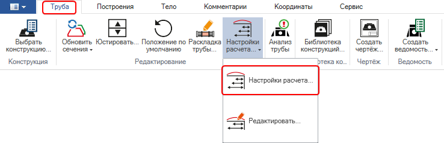
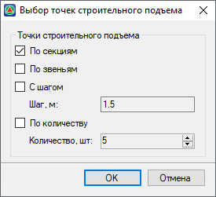
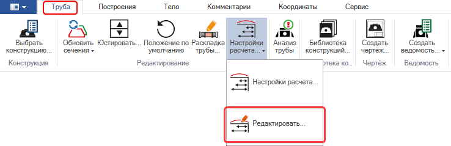
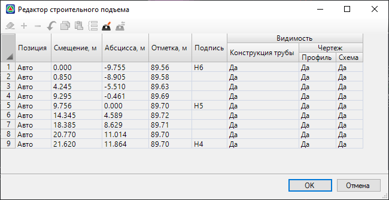
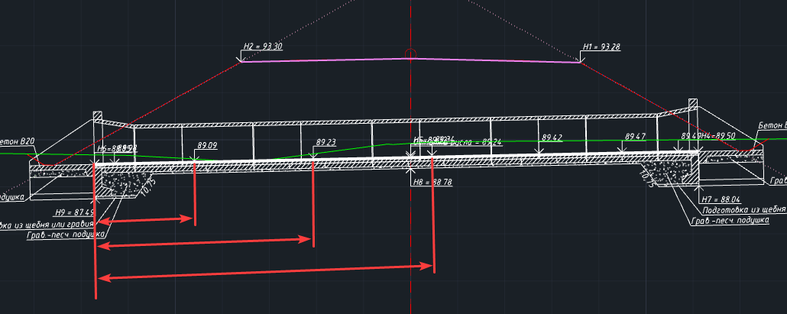
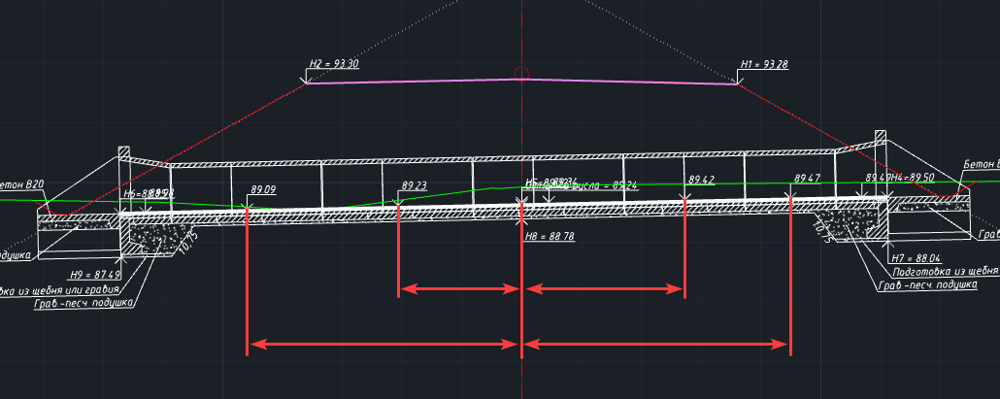

# Настройка расчета строительного подъема

Отметки вдоль лотка водопропускных труб всегда указываются с учетом строительного подъема. В программе предусмотрен функционал для автоматической и ручной настройки расстановки точек строительного подъема.



Настройка непосредственно расчета строительного подъема осуществляется в окне [Выбор конструкции трубы](choose_customization_constructions.md).



По умолчанию отметки вдоль лотка расставляются по секциям трубы для железобетонные труб и по количеству для металлических. Для того, чтобы настроить автоматическую расстановку отметок строительного подъема:

1. Выберите элемент меню **Водопропускные трубы - Строительный подъем – Настройки расчета...** или на ленточном меню **Труба - Редактирование - Настройки расчета...**:

   

2. Откроется окно с доступными для выбора вариантами автоматической расстановки точек строительного подъема вдоль лотка трубы:

   

  * **По секциям** – точки строительного подъема расставляются вдоль лотка по центру каждой секции трубы, в том числе оголовочной.
  * **По звеньям** – точки строительного подъема расставляются вдоль лотка по центру каждого звена трубы, в том числе оголовочных.
  * **С шагом** – точки строительного подъема расставляются вдоль лотка с заданным шагом. За начало расстановки отметок принимается граница трубы у входного оголовка.
  * **По количеству** – точки строительного подъема расставляются вдоль лотка в заданном количестве на равном расстоянии друг от друга.

    Одновременно могут быть выбраны несколько вариантов расстановки точек, выберите необходимые варианты и нажмите **ОК** для подтверждения.

В результате на профиле трубы будут расставлены точки строительного подъема в соответствии с выбранным способом.

## Редактор точек строительного подъема

Помимо автоматической расстановки точек строительного подъема в программе предусмотрен редактор точек строительного подъема в табличном виде.

Для пользовательской расстановки и редактирования уже расставленных точек:

1. Выберите элемент меню **Водопропускные трубы - Строительный подъем – Редактировать...** или на ленточном меню **Труба - Редактирование - Редактировать...**:

   

2. Откроется окно с таблицей точек строительного подъема:

   

   По умолчанию таблица заполнена точками автоматической расстановки и заблокирована для редактирования. Для того чтобы разблокировать таблицу нажмите на кнопку  (**Использовать пользовательские точки**). После этого рабочая область таблицы будет разблокирована и доступна для редактирования.

   

   После того, как таблица будет разблокирована, все точки кроме точек с подписями H4, H5, H6 будут доступны для редактирования и удаления.

   

   Каждая точка строительного подъема задается отдельной строкой в таблице и имеет следующие параметры:

   **Позиция** – параметр, определяющий метод вставки точки вдоль лотка трубы:

   * **Авто** – положение точки определено автоматической раскладкой. После разблокировки таблицы тип **Авто** будет назначен только для обязательных отметок H4, H5, H6.
   * **Смещение** – положение точки определяется по расстоянию смещения вдоль лотка трубы от выходного оголовка:

     

   * **Абсцисса** - положение точки определяется по расстоянию смещения вдоль лотка трубы относительно оси сечения:

     

     **Смещение/Абсцисса** – расстояние смещения вдоль лотка трубы, определяющее положение точки строительного подъема. В зависимости от выбранного метода вставки в столбце **Позиция** будет активен для заполнения тот или иной столбец метода вставки.

    **Отметка** – абсолютная отметка точки строительного подъема. Рассчитывается автоматически в зависимости от положения вдоль лотка.

    **Подпись** – поле дополнительной информации, позволяющее отразить ее рядом с отметкой на чертеже.

    **Видимость** – в данных столбцах настраивается отображение точки строительного подъема:

    * **Конструкция трубы** – настройка видимости точек в рабочем окне **Труба**.
    * **Профиль** – настройка видимости точек на профиле трубы на чертеже.
    * **Схема** – настройка видимости точек на схеме строительного подъема на чертеже.

    

    Для точек рассчитанных по смещению есть возможность за начало отсчета принять входной оголовок. Для этого в верхней части окна нажмите на кнопку  **(Использовать раскладку от входа)**. После выбора данного режима расстановки у точек с параметром **Позиция – Смещение** будет пересчитано расстояние в поле **Абсцисса**. 

    

    Для того чтобы сбросить пользовательские изменения таблицы точек строительного подъема необходимо отжать кнопку  **Использовать пользовательские точки**. После этого таблица вновь будет заблокирована и расстановка точек будет осуществлена по автоматическому варианту расстановки.

3. По завершению редактирования таблицы отметок строительного подъема нажмите **ОК** для подтверждения изменений.