# Настройка управляющих элементов в рабочем окне Труба

Помимо линий проектного и существующего сечений в рабочем окне **Труба** имеются элементы, управляющие проектным положением конструкции и влияющие на ее расчет. К ним относятся:



## Низ конструкции

**Линия низа конструкции** (верха насыпи) – управляющий элемент рабочего окна **Труба**, отвечающий за положение низа конструкции или верха земполотна. Данная линия является базовой для отсчета высоты насыпи (фактической высоты насыпи), в зависимости от которой происходит назначение толщины стенки (ригеля) звеньев или расчет строительного подъема.

В рабочем окне **Труба** линия низа конструкции фиолетового цвета строится автоматически по трем точкам проектного сечения с кодами 394 – 257 – 395, при необходимости ее положение может быть откорректировано с помощью грипов:

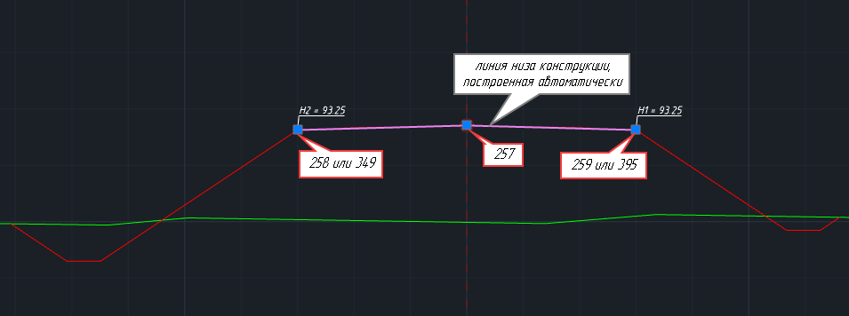



Линия низа конструкции также автоматически строится по кодам 258 – 257 – 259.



В случае отсутствия закодированных точек проектного сечения линия будет построена по точке со смещением 0 и ближайшими от нее точками справа и слева.

### Пример редактирования положения управляющего элемента Низ конструкции:

Проектное сечение было создано по верху проектной конструкции модели Автомобильная дорога. Также в качестве рассекаемой поверхности отображается линия низа конструкции дорожной одежды. В свою очередь вершины управляющего элемента **Низ конструкции** расположены автоматически в точках с кодами 394, 257, 395.

Необходимо переместить линию низа конструкции в соответствии с ее реальным положением, которое соответствует рассекаемой поверхности:

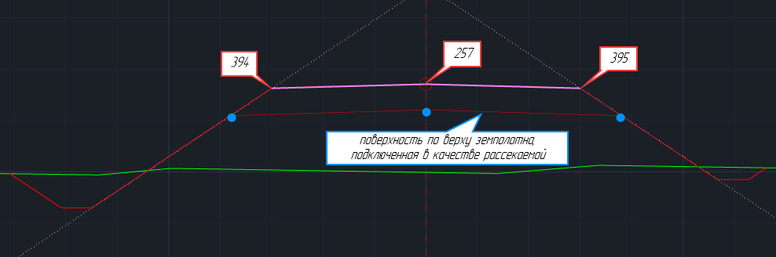

Для перемещения линии низа конструкции:

1. В рабочем окне **Труба** левой кнопкой мыши выберите линию фиолетового цвета.
2. На линии отобразятся квадратные грипы. Левой кнопкой мыши выберите грип и перенесите его в новое положение, проделайте это со всеми вершинами:

   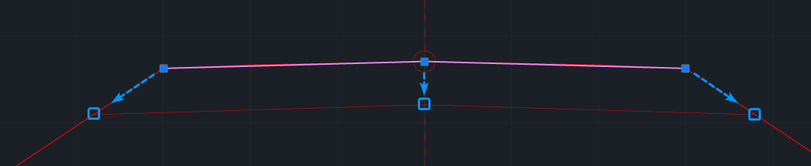

3. В результате линия низа конструкции будет перемещена в положение рассекаемой поверхности:

   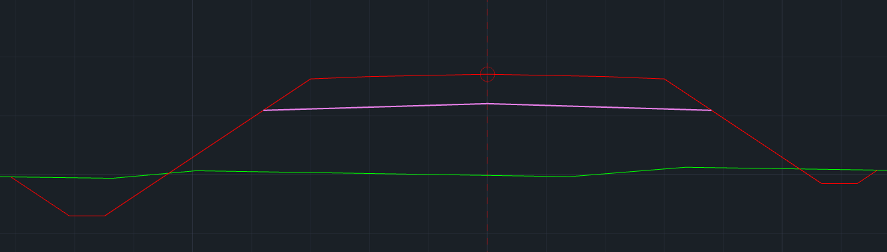





## Лучи откосов слева и справа Призма откоса

**Призма откоса** – это управляющие элементы рабочего окна **Труба**, представляющие из себя два двунаправленных луча, расположенных вдоль откосов насыпи. По умолчанию призмой откосов ограничено положение трубы в теле насыпи, и даже в случае изменения положения трубы, ее длина будет непосредственно зависеть от расстояния между лучами призмы откосов. Также данные элементы отвечают за положение укреплений.

Автоматически лучи призмы откосов строятся по двум точкам проектного сечения с кодами 376-394(258) – слева и 377-395(259) – справа.

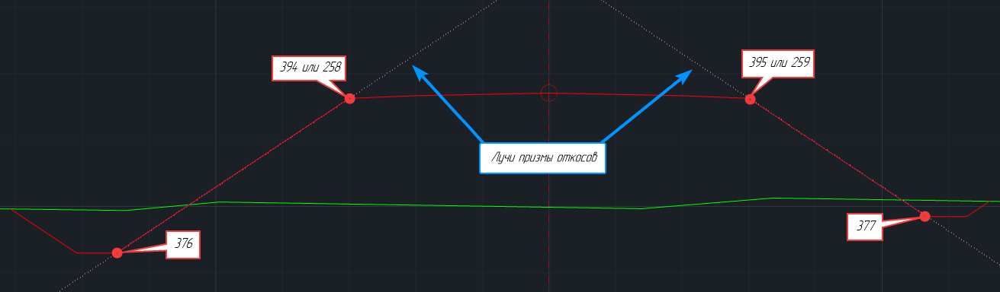

Луч призмы откоса имеет 2 грипа:

- **Квадратный грип** – это точка привязки луча, с помощью него осуществляется параллельный перенос луча в рабочем окне.

  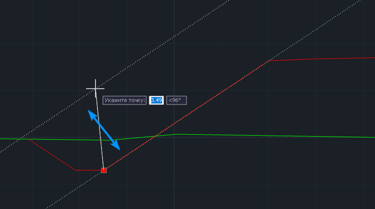

- **Круглый грип** – отвечает за поворот луча относительно точки привязки, т.е. квадратного грипа. Наведите курсор на круглый грип и нажмите правую кнопку мыши. Появится контекстное меню:

  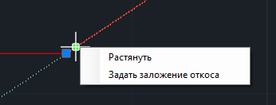

  * **Растянуть** – функция позволяет корректировать положение луча непосредственно в рабочем окне:

    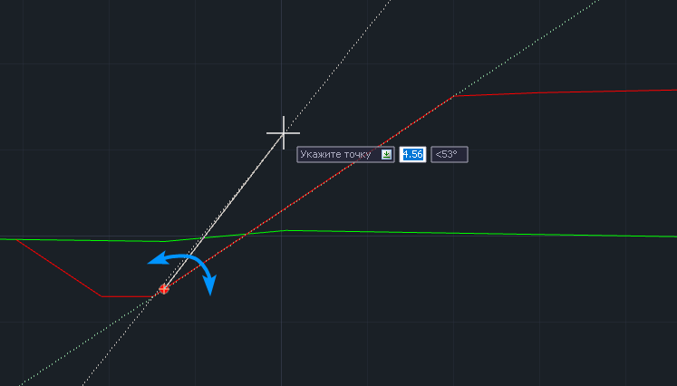

  * **Задать заложение откоса** – функция позволяет указать заложение откоса для луча призмы откоса в поле динамического ввода:

    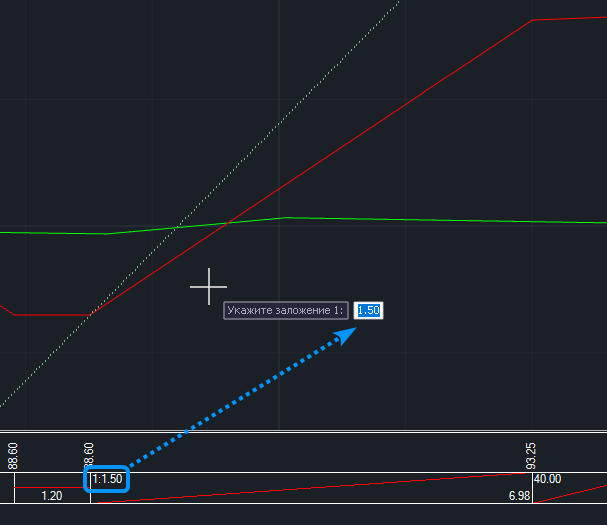

### Пример редактирования положения управляющего элемента Призма откоса №1

Полученное исходное проектное сечение представляет из себя откос с бермой слева и откос с переменным заложением справа:

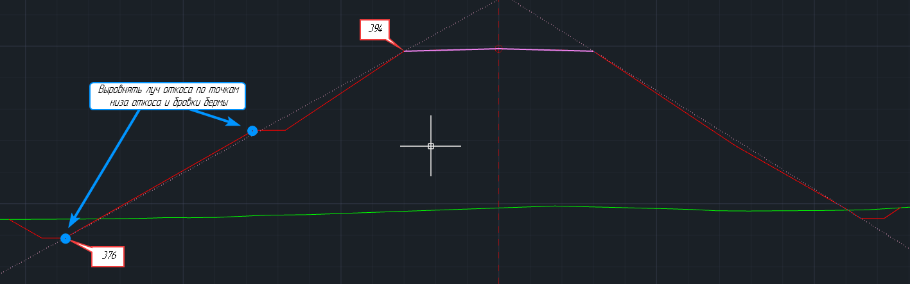

В данном случае лучи призмы откосов автоматически построились по точкам с кодами бровки (394) и низа откоса (376). Для того чтобы учесть берму слева и перелом откоса справа необходимо вручную откорректировать положение луча:

1. В рабочем окне **Труба** левой кнопкой мыши выберите луч призмы откоса слева.
2. Левой кнопкой мыши выберите круглый грип для того, чтобы повернуть луч относительно его точки привязки. В качестве точки для выравнивания луча выберите бровку бермы:

   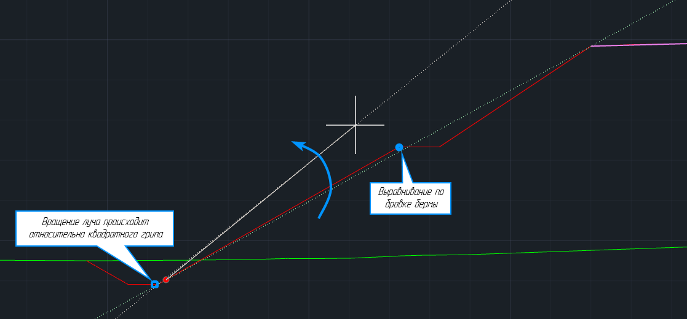

3. Выберите луч призмы откоса справа, а затем выберите круглый грип. В качестве точки для выравнивания луча выберите точку перелома откоса:

   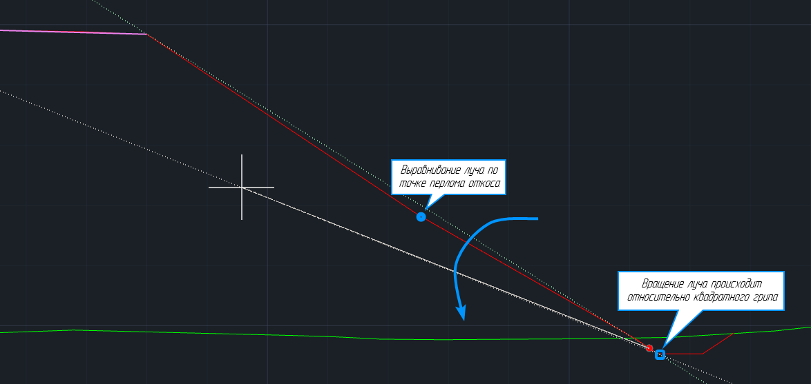

4. В результате лучи призмы откосов будут выровнены по откосам проектного сечения:

   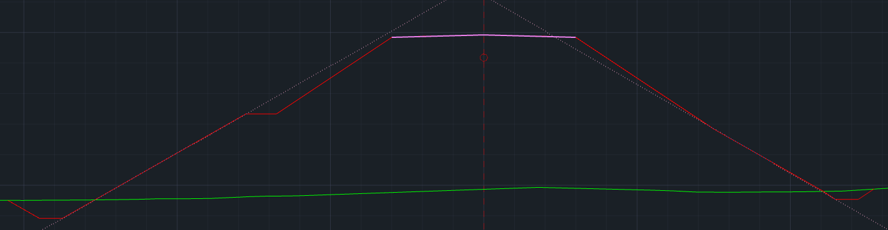

### Пример редактирования положения управляющего элемента Призма откоса №2

Полученное исходное проектное сечение содержит незакодированные точки, из-за чего автоматическая раскладка управляющих элементов не соответствует проектным данным:

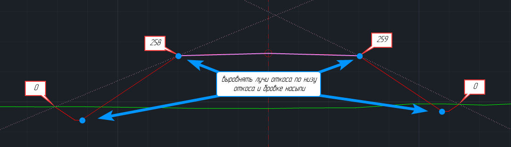

В данном случае луч призмы откоса сначала необходимо переместить к основанию откоса, а затем выровнять по бровке насыпи. Для этого:

1. В рабочем окне **Труба** выберите луч призмы откоса, нажав на него левой кнопкой мыши.
2. Далее выберите квадратный грип, за который осуществляется параллельный перенос луча, и укажите в качестве нового положения низ откоса:

   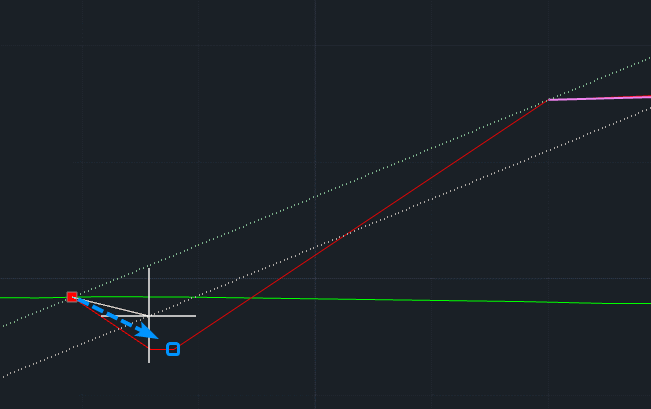

3. Выберите круглый грип для того, чтобы повернуть луч относительно его точки привязки. В качестве точки для выравнивания луча выберите бровку насыпи:

   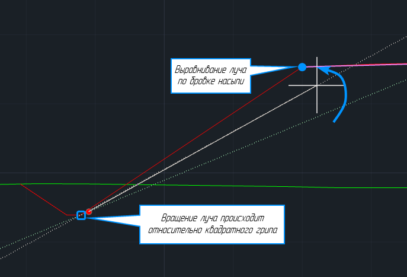

4. Проделайте аналогичные действия и для правой части проектного сечения.
5. В результате лучи призмы откосов будут выровнены по откосам проектного сечения:

   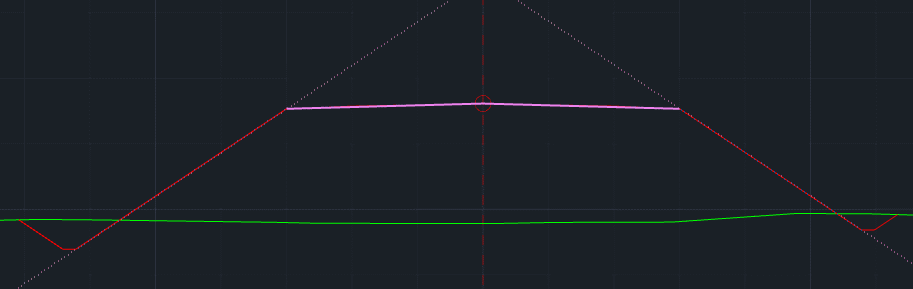





## Положение трубы

Для изменения положения проектируемой конструкции в рабочем окне **Труба** используется управляющий элемент **Положение трубы**. С помощью него настройка производится непосредственно в рабочем окне.

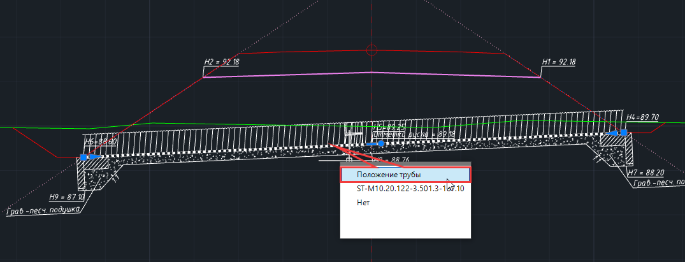

При первичном создании лоток трубы укладывается по точкам проектного сечения с кодами 376 и 377. В случае их отсутствия лоток трубы укладывается по крайней левой и крайней правой точкам проектного сечения (первая и последняя строки таблицы проектного сечения).

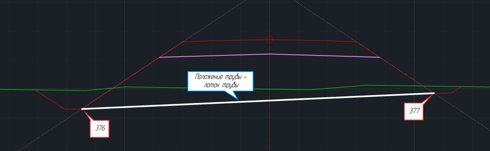

Для отображения всех функциональных грипов положения трубы необходимо включить расширенное отображение вершин в нижней части окна:

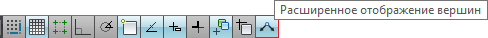

- **квадратные грипы** с левой и правой границы лотка – каждый из грипов вращает лоток трубы относительно грипа с противоположной стороны:

  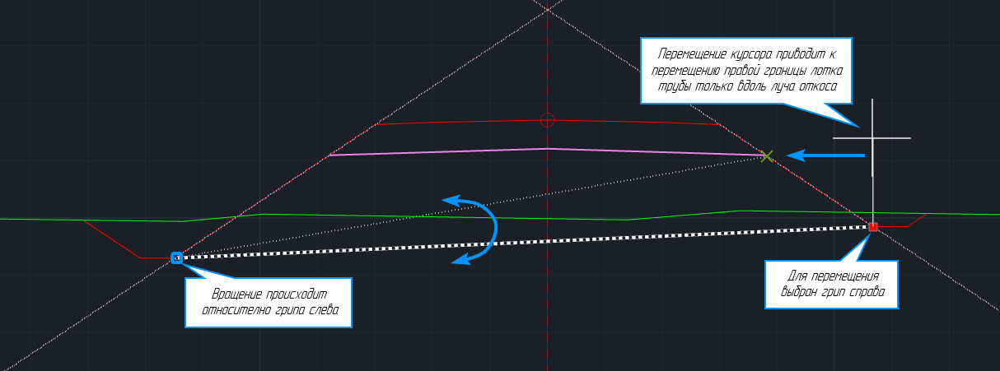



По расстоянию между квадратными грипами управляющего элемента определяется уклон и теоретическая длина трубы.





Квадратные грипы перемещаются только вдоль лучей призмы откосов. Лучи призмы откосов ограничивают перемещение лотка так, что при попытке переместить курсор во внешнюю от сечения сторону, удлинения лотка происходить не будет.



- **круглый грип** – обеспечивает вращение **Положения трубы** трубы относительно середины:

  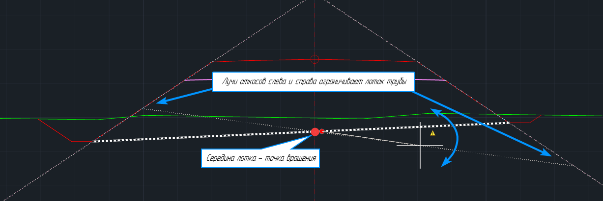

- **прямоугольный грип** – обеспечивает параллельный перенос **Положения трубы**:

  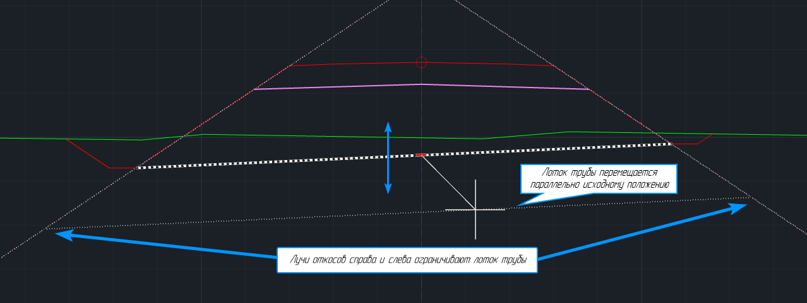

  В контекстном меню прямоугольно грипа есть быстрый доступ к функциям юстировки и раскладки трубы из специальных окон:

  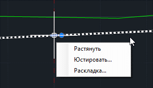

  

  Подробнее см. в разделах [Юстировать положение трубы](adjust.md) и [Раскладка](layout.md)

  

- **треугольные грипы** с левой и правой границы лотка – обеспечивают удлинение трубы (теоретической длины) вдоль своего положения относительно луча призмы откоса. Наведите курсор на треугольный грип и нажмите правую кнопку мыши. Появится контекстное меню:

  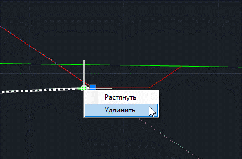

* **Растянуть** – функция позволяет удлинить лоток непосредственно в рабочем окне Труба
* **Удлинить** – функция позволяет указать величину удлинения в поле динамического ввода.



Величина заданного удлинения сохраняется при изменении положения трубы в сечении.



### Пример редактирования положения управляющего элемента Положение трубы:

Полученное исходное проектное сечение содержит незакодированные точки, из-за чего автоматическая раскладка управляющих элементов не соответствует проектным данным. Необходимо переместить **Положение трубы** в проектные кюветы, также дополнительно удлинить трубу слева на 0,2 м:

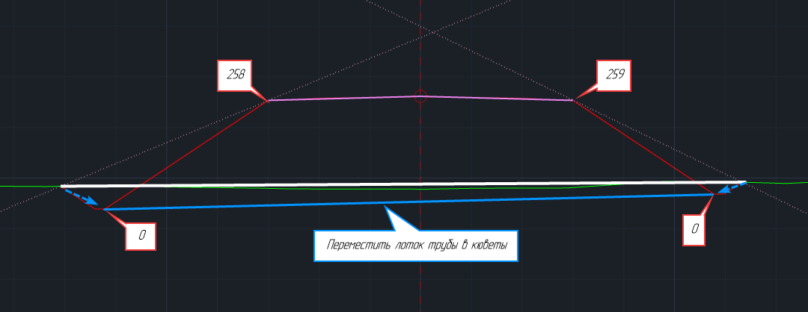

В данном случае сначала необходимо переместить луч призмы откоса к основанию откоса, выровнять его по бровке насыпи, а затем уложить лоток трубы в кюветы.

Первая часть по настройке лучей призмы откосов приведена в разделе **[Управляющий элемент Призма откоса](customization_window_culvert.md#luchi-otkosov-sleva-i-sprava-prizma-otkosa)**.

Далее для настройки **Положения трубы**:

1. Наведите курсор на лоток трубы, нажмите левую кнопку мыши и выберите элемент **Положение трубы**:

   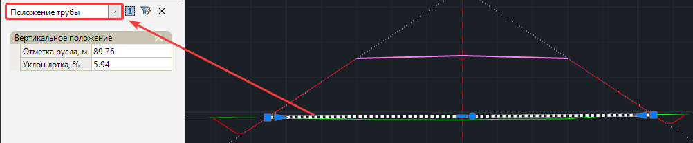

2. Наведите курсор на квадратный грип слева и нажмите левую кнопку мыши.
3. Левая граница лотка будет перемещаться за курсором вдоль луча откоса. В качестве нового положения левой границы выберите низ левого откоса:

   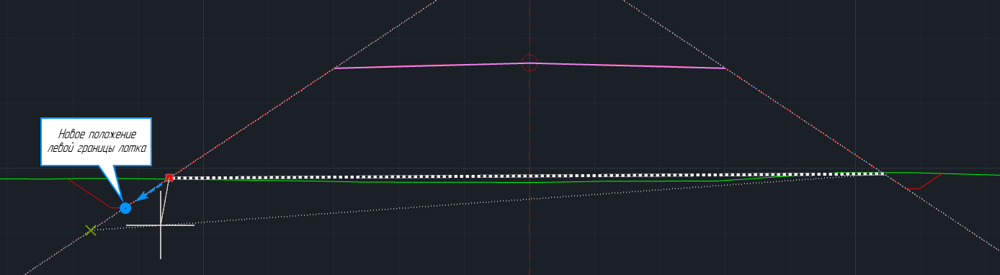

4. Повторите действия 2-3 для правой границы лотка.
5. Наведите курсор на треугольный грип слева и нажмите правую кнопку:
6. Из контекстного меню выберите **Удлинить**:

   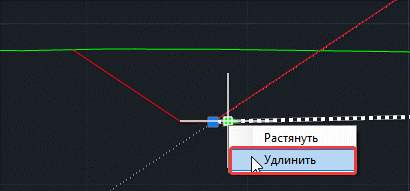

7. В появившемся поле динамического ввода заполните величину удлинения трубы:

   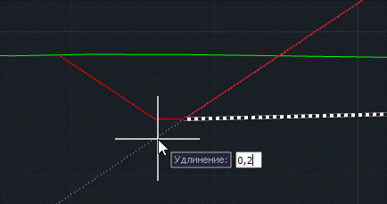

8. В результате лоток трубы будет уложен в проектные кюветы и удлинен слева:

   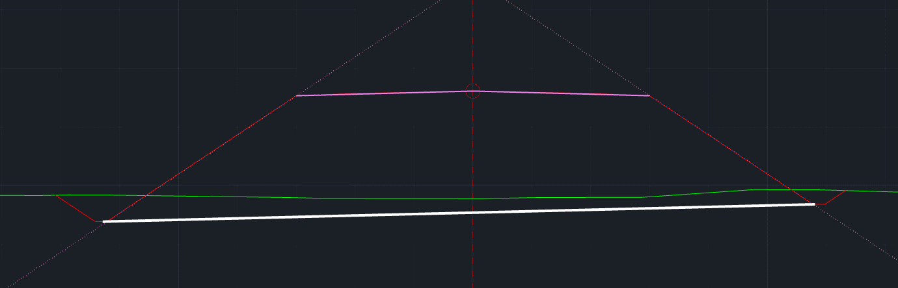
   
   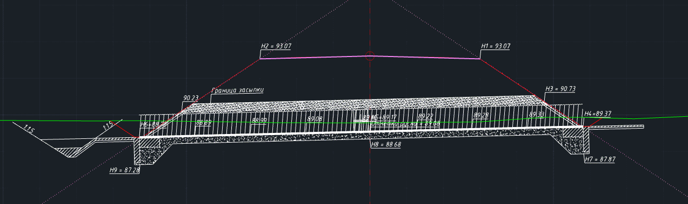



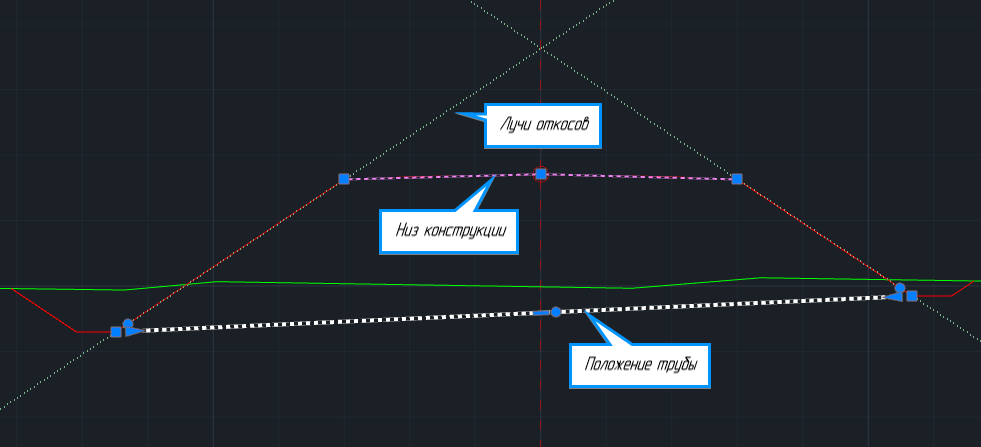

Положение каждого из управляющих элементов определяется автоматически по закодированным точкам проектного сечения. В то же время при необходимости элементы могут быть настроены непосредственно в рабочем окне **Труба** с помощью грипов.