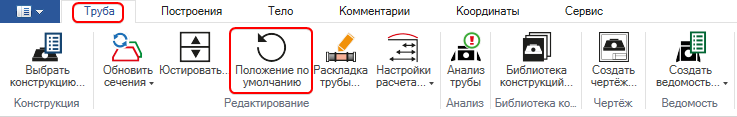
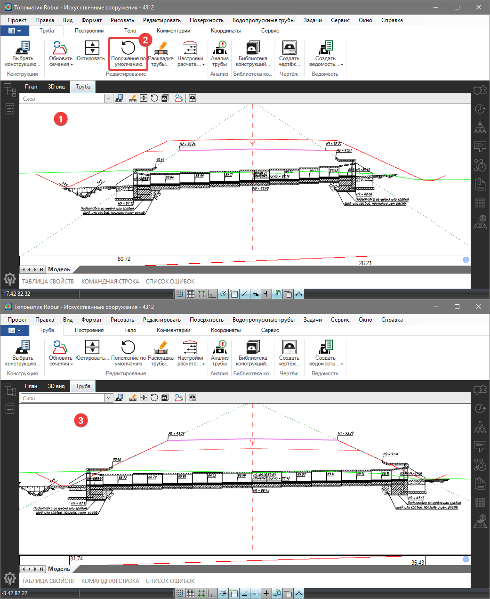

# Положение по умолчанию

Данная функция позволяет сбросить пользовательские изменения элементов рабочего окна **Труба** и вернуть их в исходное положение по закодированным точкам сечения.

Для этого:

1. Находясь в рабочем окне **Труба**, выберите элемент меню **Водопропускные трубы – Положение по умолчанию** или на ленточном меню **Труба – Редактирование – Положение по умолчанию:**

   

В результате такие элементы как **Низ проектной конструкции**, **Лучи откосов** и **Положение трубы** переместятся в свое положение по умолчанию:



Подробнее см. раздел [Настройка управляющих элементов в рабочем окне Труба](customization_window_culvert.md)

