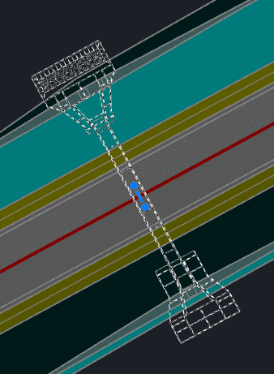
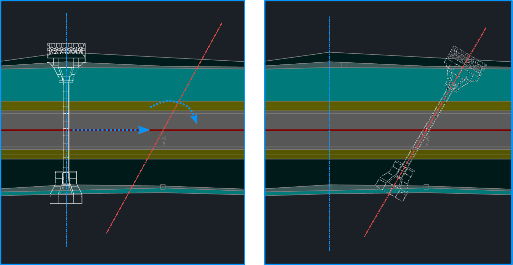

# Редактирование положения трубы в окне План

Положение трубы в окне **План** может быть откорректировано после ее ввода. Для этого:

1. Левой кнопкой мыши выберите конструкцию трубы в окне **План**, после чего отобразятся грипы трубы:

   

* **прямоугольный грип** – с помощью данного грипа происходит параллельный перенос трубы в пространстве окна **План**. Он находится в точке середины сечения, т.е. в точке со смещением 0;
* **круглый грип** – с помощью данного грипа происходит вращение трубы относительно точки середины.

2.1. Выберите прямоугольный грип и укажите новое положение трубы непосредственно курсором в рабочем окне.



Для корректного формирования сечения и расчета трубы новая точка вставки должна находится на оси модели Автомобильной или Железной дороги.



2.2. Выберите круглый грип и укажите направление поворота трубы непосредственно курсором в рабочем окне.

В результате положение трубы в плане будет изменено.

|Положение до (синяя ось) и после (красная ось) редактирования:|
| ----------- |
||



Изменение положения трубы в плане влечет за собой изменение сечения поверхностей и корректировку раскладки трубы. Последовательность действий представлена в следующем разделе.

