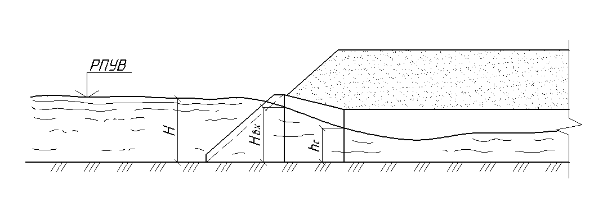

# Гидравлические расчеты.

Гидравлические расчеты водопропускных труб выполнены в соответствии с "Пособием по гидравлическим расчетам малых водопропускных сооружений" (Москва, Транспорт, 1992г.) и «Руководством по гидравлическим расчетам малых искусственных сооружений и русел» (Утверждено "ГИПРОТРАНСТЭИ" МПС 01.01.1967, действующее ) . Для труб из гофрированного металла также использовано ОДМ 218.2.087-2017 «Рекомендации по проектированию и строительству водопропускных сооружений из спиральновитых металлических гофрированных труб» .

Расчетами определяются основные гидравлические характеристики трубы , необходимые для выбора типа конструкции укрепления русел и откосов, а именно:

* Подпор перед трубой $Н$, м
* Скорость на выходе $V_{вых}$, м/cек
* Дополнительно определяются параметры (см.рис.1)
* Критическая глубина $Нк$ ,м (см.рис.1)
* Глубина в сжатом сечении $h_{сж}$ , м (см.рис.1)
* Критический уклон $i_{кр}$

$$i_{кр}=\frac{Q^2}{w^2_кC^3_{кр}R_{кр}}$$

Где:

* $Q$ – расчетный расход воды
* $w_к$ - площадь живого сечения потока
* $C_{кр}$- коэффициент Шези, определяемый по по формуле Н.Н. Павловского

$$C = \frac{1}{n}R^{y}$$

Где:

* n - коэффициент шероховатости
* $R = \frac{w}{\chi}$ -гидравлический радиус
* $\chi$ - смоченный периметр



 Смоченный периметр - периметр живого сечения, по которому жидкость соприкасается со стенками трубы. 



Показатель степени у в формуле Павловского определяется по формуле:

$$y = 2,5 \sqrt{n}-0,13-0,75\sqrt{R}(\sqrt{n}-10)$$

Значения для коэффициента шероховатости n приведены в Приложении 5 «Руководства по гидравлическим расчетам малых искусственных сооружений и русел». (Утверждено "ГИПРОТРАНСТЭИ" МПС 01.01.1967, действующее.)

Для круглых труб при гидравлических расчетах значения наибольших расходов воды, пропускаемых через трубу, ограничены величиной, при которой скорость воды на выходе из трубы не превышает допускаемую для принятого типа укрепления.

Для прямоугольных труб при гидравлических расчетах значения наибольших расходов воды, пропускаемых через трубу, ограничены величиной, при которой скорость воды на выходе из трубы не превышает допускаемую для принятого типа укрепления, увеличенную на 35%.

#|
||||
||Рис.1 Схема протекания потока||
|#

## Круглые трубы

Для круглых труб предусмотрены три режима протекания:

* безнапорный
* полунапорный
* напорный

Пропуск расчетного расхода при безнапорном режиме протекания в соответствии c СП 35.13330.2011 (в замен СНиП 2.05.03-84 \* Мосты и трубы ) предусмотрен с обеспечением нормативного зазора , равного 1/4 высоты трубы между поверхностью потока и высшей точкой внутренней поверхности трубы. Пропуск наибольшего расхода предусмотрен частично по безнапорному, частично по напорному режимам протекания.

Расчет гидравлических параметров производится по следующим формулам:

<u>**Безнапорный режим протекания воды**</u>

1. Критическая глубина определяется из уравнения критического потока:

$$\frac{w^3_к}{b_{к}}=\frac{aQ^2_{p}}{g}$$

2. Подпор перед трубой определяется по формуле:

$$H=(\frac{Q_{p}}{m b_{к}\sqrt{2g}})^{2/3}$$

где

* $m$ - коэффициент расхода, определяемый по табл. 5.2 "Пособия по гидравлическим расчетам малых водопропускных сооружений", $m$ = 0,35 - для круглых труб с раструбными оголовками и коническим входным звеном.
* $b_{к}=\frac{w_к}{h_{к}}$ - средняя ширина потока в сечении с критической глубиной.

1. Глубина потока на выходе из трубы ( $h_{вых}$ ) при безнапорном режиме определяется в зависимости от параметра расхода:

$$П_Q=\frac{Q_{p}}{D^2\sqrt{gD}}$$

а) При $П_Q \le П_{Q(гр)}$

$$\frac{h_{вых}}{h_{К}}=А_Кf(l_Т), f(l_Т)=\frac{1}{1+2\sqrt{i_T}} $$

б) При $П_Q > П_{Q(гр)}$

$$\frac{h_{вых}}{h_{T}}=А_Tf(l_Т)П^{S_T}_Q$$

где

* $П_{Q(гр)}$- 1,2 - граничное значение параметра расхода (см. табл. 5.4 «Пособия по гидравлическим расчетам малых водопропускных сооружений»).
* $А_К$ = 0,93, $A_T$, = 0,80 и $S_T$ = 0,25 - соответственно коэффициенты и показатель степени (см. табл. 5.4 и 5.5 «Пособия по гидравлическим расчетам малых водопропускных сооружений»).

4.Скорость потока на выходе из трубы определяется по формуле:

$$V_{вых}=\frac{Q_{p}}{w_{вых}},м/сек$$

<u>**Полунапорный режим протекания воды**</u>

1. Подпор перед трубой определяется по формуле:

$$H=\frac{Q^2_{p}}{\mu^2_{n}w^2_{coop}2g}+\varepsilon_nD$$

где $\mu_{n}$ и $\varepsilon_n$ коэффициенты, определяемые по табл. 5.2 «Пособия по гидравлическим расчетам малых водопропускных сооружений», $\mu_{n}$ = 0,69, $\varepsilon_n$ = 0,79 - для круглых труб с раструбными оголовками.

2. Глубина потока на выходе из трубы ($h_{вых}$) при полунапорном режиме определяется в зависимости от параметра расхода:

а) При $П_Q \le П_{Q(гр)}$

$$\frac{h_{вых}}{h_{К}}=А_Кf(l_Т), f(l_Т)=\frac{1}{1+2\sqrt{i_T}} $$

б) При $П_Q > П_{Q(гр)}$

$$\frac{h_{вых}}{h_{T}}=А_Tf(l_Т)П^{S_T}_Q$$

где

* $П_{Q(гр)}$ = 1,2 - граничное значение параметра расхода (см. табл. 5.4 «Пособия по гидравлическим расчетам малых водопропускных сооружений»).
* $А_К$ = 0,93, $A_T$ = 0,88 и $S_T$ = 0,25 - соответственно коэффициенты и показатель степени (см. табл. 5.4 и 5.5 «Пособия по гидравлическим расчетам малых водопропускных сооружений»).

3. Скорость потока на выходе из трубы определяется по формуле:

$$V_{вых}=\frac{Q_{p}}{w_{вых}},м/сек$$

<u>**Напорный режим протекания воды**</u>

1. Подпор перед трубой определяется по формуле:

$$H=(\frac{Q_{p}}{3,48\mu_{H}D^2})^2-i_Tl_T+0,85D$$

   где
   
$$\mu_{H}=\sqrt{\frac{1}{1.2+\frac{0,028(l_T-3,6D)}{D^{4/3}}}}$$

* $i_T$ = 0.01 - циклон трубы,
* $l_T$ = 20 м - длина трубы.

2. Глубина потока на выходе из трубы ($h_{вых}$ ) при напорном режиме =

$$
   h_{вых}=
   \begin{cases} 0,85h_T, h_K \le h_T\\
   h_T, h_K \geq h_T \end{cases}
$$

3. Скорость потока на выходе из трубы определяется по формуле:

$$V_{вых}=\frac{Q_{p}}{w_{вых}},м/сек$$

Условные обозначения:

* $Q_{p}$ - расчетный расход воды, $м^3/сек$,
* $H$ - подпор перед трубой, м,
* $h_{вх}$ - глубина потока на входе в сооружение, м,
* $h_{вых}$ - глубина потока на выходе из сооружения, м,
* $h_T$ - высота трубы, м,
* $h_K$ - критическая глубина воды, м,
* $h_K$ - критическая глубина, м ,
* $i_T$ - уклон трубы, м,
* $l_T$ - длина трубы, м,
* $D$ - диаметр трубы, м,
* $g$ = 9,8 $м/сек^2$ - ускорение силы тяжести, при критической глубине потока, $м^2$,
* $a$ = 1,1 - коэффициент кинетической энергии,
* $w_{K}$ - площадь поперечного сечения сооружения,
* $w_{вых}$ - площадь живого сечения потока на выходе из трубы, $м^2$

## Прямоугольные трубы

Для прямоугольных труб предусмотрено два режима протекания:

* безнапорный
* полунапорный

Пропуск расчетного расхода при безнапорном режиме протекания в соответствии c СП 35.13330.2011 (взамен СНиП 2.05.03-84 \* Мосты и трубы) предусмотрен с обеспечением нормативного зазора, равного 1/6 высоты трубы между наивысшей точкой внутренней поверхности трубы и уровнем воды на протяжении всей трубы.

Расчет гидравлических параметров производится по следующим формулам.

<u>**Безнапорный режим протекания**</u>

Подпор перед трубой $Н$ определяется из уравнения критического потока.

$$H=(\frac{Q_{p}}{mb_{к}\sqrt{2g}})^{2/3}$$

где

* $m$ - коэффициент расхода, определяемый по табл. 5.2 «Пособия по гидравлическим расчетам малых водопропускных сооружений», $m$ = 0,36 - для прямоугольных труб с раструбными оголовками.
* $b_{кр}=\frac{w_{кр}}{h_{кр}}$ - средняя ширина потока в сечении с критической глубиной.

<u>**Полунапорный режим протекания**</u>

Подпор перед трубой $Н$, м:

$$H=\frac{Q^2_{p}}{\mu^2_{n}w^2_{coop}2g}+\varepsilon_nh_T$$

где $\mu_{n}$ и $\varepsilon_n$ коэффициенты, определяемые по табл. 5.2 «Пособия по гидравлическим расчетам малых водопропускных сооружений», $\mu_{n}$ = 0,64, $\varepsilon_n$ = 0,78 - для прямоугольных труб с раструбными оголовками.

Скорость на выходе $V_{вых}$ для безнапорного и полунапорного режимов протекания определяется по формуле:

$$V_{вых}=\frac{Q_{p}}{bh_{вых}},м/сек$$

Где $h_{вых}$ – глубина потока на выходе определяется в зависимости от параметра расхода $П_Q$:

$$П_Q=\frac{Q_{p}}{h_Tb\sqrt{gh_{T}}}$$

а) При $П_Q \le 0,8$

$$h_{вых}=0,88\sqrt[3]{\frac{a}{g}}q^{2/3}\frac{1}{1+2\sqrt{i_T}} $$

б) При 0,8 < $П\_Q \le 1,6$

$$h_{вых}=А_Th_{T}\frac{1}{1+2\sqrt{i_T}}П^{\varepsilon}_Q $$

где

* $A_T$ и $\varepsilon$ - соответственно коэффициенты и показатель степени (см табл. 3).
 
Таблица 3 

| Режим протекания | Параметр расхода | Коэффициент $A_T$ | Показатель степени $\varepsilon$ |
| :---: | :---: | :---: | :---: |
| Безнапорный | 0,8 < $П_Q \le 1,6$ | 0,88 | 0,667 |
| Полунапорный | 0,8 < $П_Q \le 1,6$ | 0,83 | 0,75 |

Условные обозначения:

* $b$ - отверстие трубы, м,
* $g$ = 9,8 $м/сек^2$ - ускорение силы тяжести,
* $a$ = 1,1 - коэффициент кинетической энергии,
* $Q_p$ - расчетный расход воды, $м^3/сек$,
* $H$ - подпор перед трубой, м,
* $h_{вх}$ - глубина потока на входе в сооружение, м,
* $h_{T}$ - высота трубы, м
* $h_{C}$ - глубина воды в сжатом сечении, м,
* $h_{K}$ - критическая глубина, м,
* $i_T$ - уклон трубы, м.

## Трубы из гофрированного металла

Для труб из гофрированного металла предусмотрены два режима протекания:

* безнапорный
* полунапорный

Пропуск расчетного расхода для труб под железную дорогу предусматривается только по безнапорному режиму при наибольшей глубине воды во входном сечении трубы, равной 0,75D (D-диаметр отверстия). Пропуск наибольшего расхода предусматривается только по безнапорному режиму при наибольшей глубине воды во входном сечении, равной 0,90.

Пропуск расчетного расхода для труб под автомобильную дорогу предусматривается по безнапорному режиму при наибольшей глубине воды во входном сечении трубы, равной диаметру трубы. Применение полунапорного режима протекания допускается только для труб под автомобильную дорогу для обычных климатических условий.

<u>**Безнапорный режим протекания воды**</u>

1. Критическая глубина определяется из уравнения критического потока:

$$\frac{w^3_{кр}}{b_{кр}}=\frac{aQ^2}{g}$$

где $a$ = 1,1.

$$b_{кр}=\frac{w_{кр}}{h_{кр}},м $$

2. Подпор перед трубой определяется по формуле:

$$H=(\frac{Q_{p}}{mb_{кр}\sqrt{2g}})^{2/3}$$

где $m$ = 0,33 - для труб с вертикально срезанными и труб с торцами, срезанными параллельно откосу насыпи.

3. Скорость потока на выходе из трубы определяется по формуле:

$$V_{вых}=(\frac{Q}{1,5D^2\sqrt{gD}}+0,73)\sqrt{gD}$$

4. Критический уклон:

$$i_{кр}=\frac{Q^2}{w^2_{кр}C^2_{кр}R^2_{кр}}$$

<u>**Полунапорный режим протекания воды**</u>

1. Расход воды,$м^3/сек$, в полунапорных трубах определятся по формуле:

$$Q=\mu_{n}w_{coop}\sqrt{2g(H-\varepsilon_{опр}h_T)}$$

где $h_T=D$

| Обозначения | Трубы с вертикально срезанными торцами | Трубы с торцами, срезанными по откосу насыпи |
| :---: | :---: | :---: |
| $\varepsilon_{опр}$ | 0,63 | 0,59 |
| $\mu_{n}$ | 0,56 | 0,52 |

2. Скорость на выходе, м/сек:

$$V_{вых}=(\frac{Q}{1,5D^2\sqrt{gD}}+0,73)\sqrt{gD}$$

Условные обозначения:

* $Q_{p}$ - расход воды, $м^3/сек$,
* $h_K$ - критическая глубина, м,
* $D$ - диаметр труды, м,
* $g$ - ускорение свободного падения $м/сек^2$,
* $w_{кр}$ - площадь живого сечения трубы при $h\_{кр}$, $м^2$
* $C_{кр}$ - коэффициент Шези, $м^{0.5}/сек$,
* $m$ - коэффициент расхода,
* $R_{кр}$ - гидравлический радиус при $h\_{кр}$, м,
* $b_{кр}$ - ширина свободной поверхности потока при $h\_{кр}$, м,
* $\varepsilon_{опр}$ - коэффициент сжатия в определяющем сечении,
* $\mu_{n}$ - коэффициент расхода при полунапорном режиме,
* $w_{вых}$ - площадь живого сечения трубы, $м^2$.
