# Способы ввода трубы

В зависимости от имеющихся исходных данных водопропускные трубы в проекте могут быть созданы различными способами.

В программе реализованы следующие способы ввода:

* по пикету и углу – данный способ подразумевает наличие в проекте модели автомобильной или железной дороги, вдоль которой будет создаваться водопропускная труба.
* по сечению – в данном случае для создания сечения по проектной и существующей поверхности могут быть использованы различные модели такие как, ЦММ, Автомобильная дорога, Железная дорога, Площадка. Положение трубы указывается на плане пользователем.
* по таблицам – для использования данного способа необходимо иметь сечения проектной линии и линии черной земли в табличном виде.

Подробное описание каждого из способов ввода представлено в разделах:



Для того чтобы создать модель трубы вдоль линейного объекта по пикету и углу:

1. В окне **Структура проекта** создайте новую модель водопропускной трубы, для этого в контекстном меню выберите **Добавить - Водопропускная труба**.

   

   Подробнее см. в разделе [Создание модели Водопропускная труба](create_culvert_model.md).

   

2. Из списка способов ввода, появившихся в пространстве окна **План**, выберите способ **По пикету и углу**:

   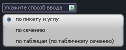

3. Курсор примет форму прицела. Левой кнопкой мыши укажите ось линейной модели (автомобильной, железной дороги, трассы), вдоль которой должна располагаться труба.
4. Вдоль выбранной оси укажите положение трубы. На данном этапе курсор перемещается с отслеживанием положения вдоль линейной модели. Укажите положение курсором в плане или введите значение пикета в поле динамического ввода.
5. Сориентируйте трубу относительно оси. Введите значение угла между трубой и осью в поле динамического ввода или укажите угол на плане. Угол задается относительно направления пикетажа, отсчитывается по часовой стрелке и может быть задан в пределах более 0 и менее 180 гр:

   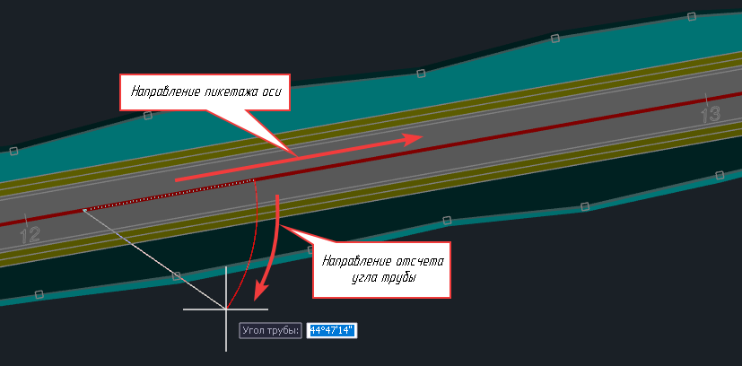

6. Далее откроется окно **Выбор конструкции трубы**, в котором необходимо выбрать типовой альбом и заполнить параметры трубы. Заполните все необходимые поля и нажмите **ОК**.

   

   Описание работы в окне **Выбор конструкции трубы** представлено в разделе [Выбор и настройка конструкции](choose_customization_constructions.md).

   

7. В результате, в структуре проекта будет создана модель типа **Водопропускная труба**, а сама модель будет доступна для дальнейшего редактирования в рабочем окне **Труба**:

   





Для того чтобы создать модель трубы по сечению заданных поверхностей:

1. В окне **Структура проекта** создайте новую модель водопропускной трубы, для этого в контекстном меню выберите **Добавить - Водопропускная труба**.

   

   Подробнее см. в разделе [Создание модели Водопропускная труба](create_culvert_model.md).

   

2. Из списка способов ввода, появившихся в пространстве окна **План**, выберите способ **По сечению**:

   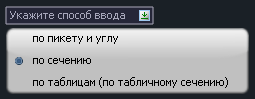

3. В окне **План** последовательно укажите точки положения сечения трубы. Затем, укажите центр трубы:

   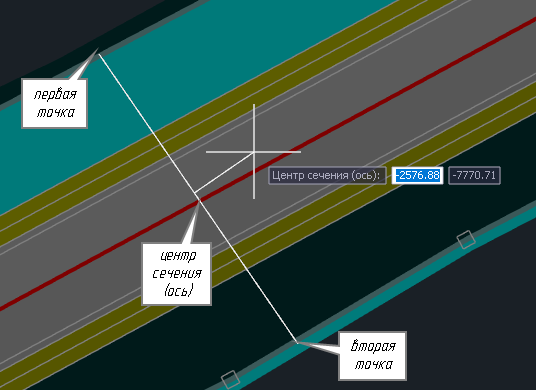

4. В поле динамического ввода запишите название модели водопропускной.
5. На данном этапе ввода параметров необходимо задать угол трубы для расчета геометрической формы и размеров укреплений. Это можно сделать двумя способами:

   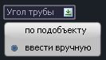

    5.1. **По подобъекту** – необходимо выбрать ось для автоматического расчета угла относительно нее.

    5.2. **Ввести вручную** – необходимо ввести значение угла в поле динамического ввода или указать угол на плане.

6. В открывшемся окне в области **Черная земля** и **Проектная поверхность** выберите соответствующие модели, которые будут формировать сечение трубы и нажмите **ОК**:

   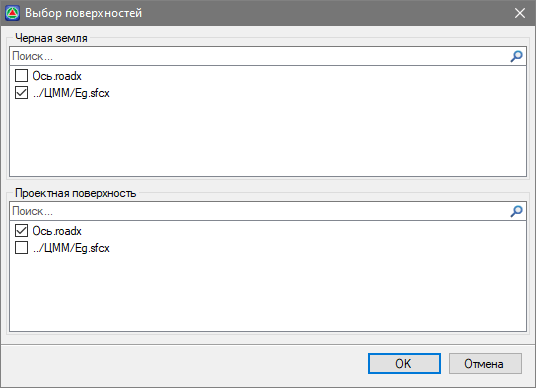

   

   В качестве проектной или существующей поверхности могут быть выбраны одна и более моделей одновременно. Например, это может быть необходимо в случае проектирования трубы в месте примыкания, где сечение поперечного профиля автомобильной дороги формируется двумя моделями четвертей примыкания.

   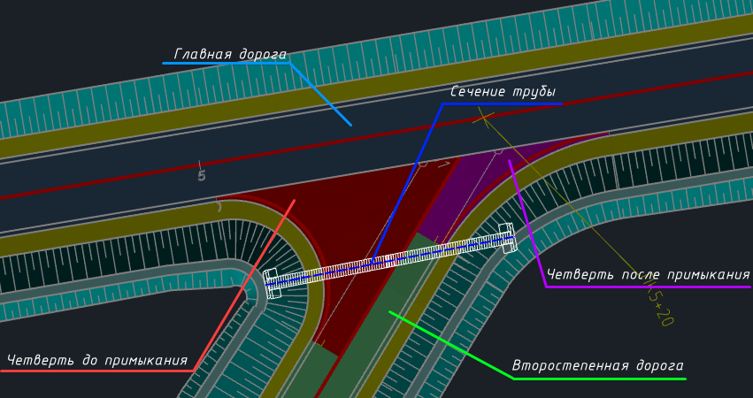 

   

7. Далее откроется окно **Выбор конструкции трубы**, в котором необходимо выбрать типовой альбом и заполнить параметры трубы. Заполните все необходимые поля и нажмите **ОК**.

   

   Описание работы в окне **Выбор конструкции трубы** представлено в разделе [Выбор и настройка конструкции](choose_customization_constructions.md).

   

8. В результате, в структуре проекта будет создана модель типа **Водопропускная труба**, а сама модель будет доступна для дальнейшего редактирования в рабочем окне **Труба**:

   





Данные по сечению существующей и проектной поверхности вводятся в табличном виде или импортируются из файлов определенного формата. Положение трубы в плане задается пользователем, указанием точек входа, выхода и середины трубы.

Для того чтобы создать модель трубы по сечениям в табличном виде:

1. В окне **Структура проекта** создайте новую модель водопропускной трубы, для этого в контекстном меню выберите **Добавить - Водопропускная труба**.

   

   Подробнее см. в разделе [Создание модели Водопропускная труба](create_culvert_model.md).

   

2. Из списка способов ввода, появившихся в пространстве окна **План**, выберите способ **По таблицам (по табличному сечению)**:

   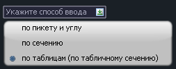

3. В окне **План** последовательно укажите точки положения сечения трубы. Затем, укажите центр трубы:

   

   Первая и вторая точки сечения не означают непосредственное положение крайних точек трубы или сечения. Фактическое положение указывается только для точки центра сечения – это точка со смещением 0:

   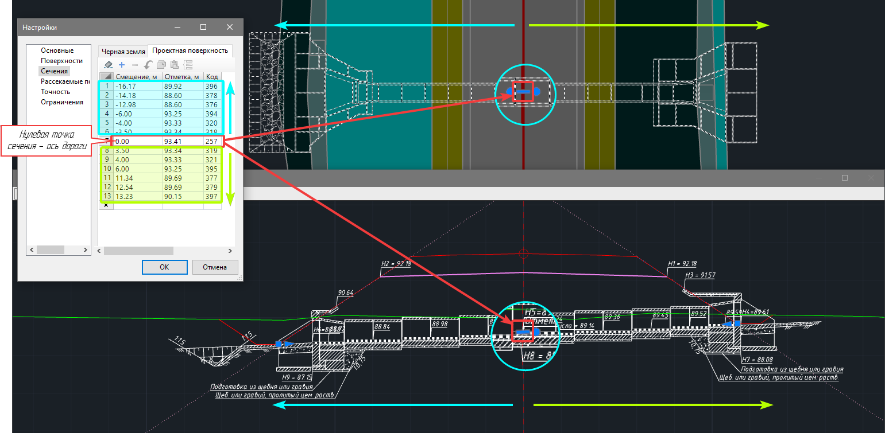

   

   От выбора положения точек зависит каким образом будет ориентировано сечение в окне **Труба**. Для того чтобы соблюсти сторонность сечения и поперечных профилей дороги **первая точка** должна находиться слева от оси по ходу пикетажа, а вторая точка – справа. 

   

4. В поле динамического ввода запишите название модели водопропускной трубы для отображения в структуре проекта.
5. На данном этапе ввода параметров необходимо задать угол трубы для расчета геометрической формы и размеров укреплений. Это можно сделать двумя способами:

   

    5.1. **По подобъекту** – необходимо выбрать ось для автоматического расчета угла относительно нее.

    5.2. **Ввести вручную** – необходимо ввести значение угла в поле динамического ввода или указать угол на плане.

6. Открывшееся окно разделено на 2 области, в которых находятся таблицы **Черной земли** и **Проектной поверхности**:

   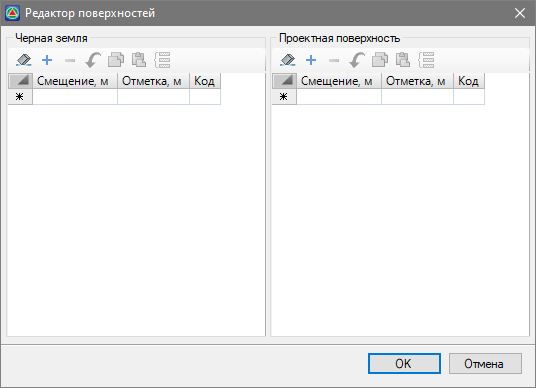

   Каждая таблица представляет собой набор строк, каждая строка – это точка линии сечения, которая описывается следующими параметрами:

  * **Смещение** – расстояние от оси до точки сечения. Для точек, расположенных слева от оси, смещения отрицательные, т.е. записываются со знаком «-». Для точек, расположенных справа от оси, смещения положительные, знак «+» в данном случае не пишется. Для корректного формирования сечения Смещения в таблице должны идти сверху вниз от меньшего к большему значению (условно говоря слева на право).
  * **Отметка** – абсолютная отметка точки линии сечения.
  * **Код** – семантический код точки сечения.

    Для того чтобы программой были корректно определены положение трубы, призмы откосов и низа проектной конструкции, в сечении проектной линии должны быть заданы следующие семантические коды точек:

    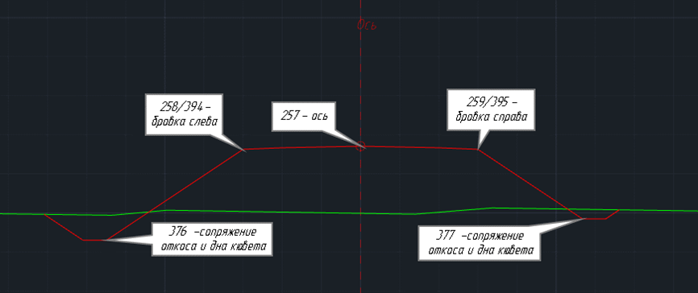

    257 – код точки оси.

    394 и 395 – коды точек начала откоса, т.е. положение бровки.

    376 и 377 – коды точек сопряжения дна кювета и откоса насыпи.

    

    Из-за специфики создания конструкций поперечных профилей, бровки также могут быть заданы парой кодов - 258 и 259.

    

    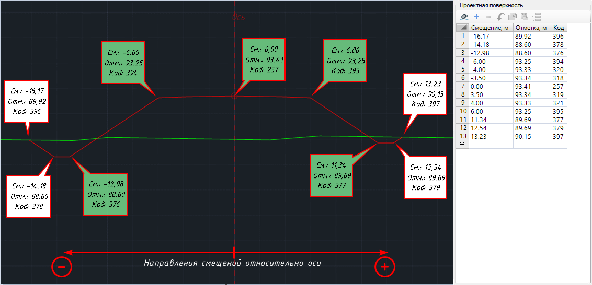

    Заполнение таблицы можно производить как непосредственно в данном окне добавляя строки, так и во внешних редакторах с дальнейшим импортом в программу. Для импорта файла:

    6.1. Добавьте строку в таблицу сечения.

    6.2. Наведите курсор на столбец с нумерацией строк и нажмите правую кнопку мыши.

    6.3. В контекстном меню перейдите в раздел **Импорт** и выберите необходимый формат:

    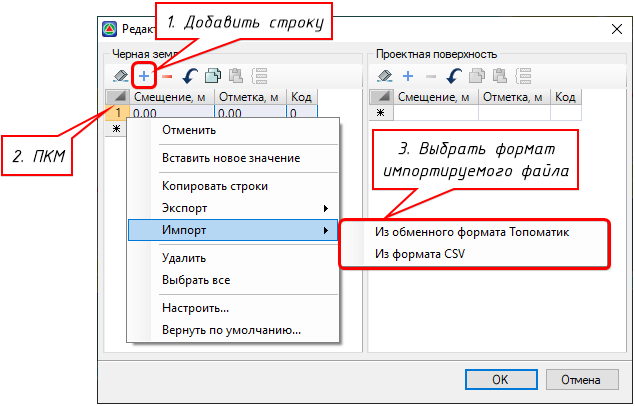

    6.4. Откроется окно Проводник. Перейдите в расположение файла сечения и выберите его.

    6.5. В результате содержимое выбранного файла будет импортировано в таблицу сечения.

    Заполните таблицы **Существующей** и **Проектной** линии и нажмите **ОК**.

7. Далее откроется окно **Выбор конструкции трубы**, в котором необходимо выбрать типовой альбом и заполнить параметры трубы. Заполните все необходимые поля и нажмите **ОК**.

   

   Описание работы в окне **Выбор конструкции трубы** представлено в разделе [Выбор и настройка конструкции](choose_customization_constructions.md).

   

8. В результате, в структуре проекта будет создана модель типа **Водопропускная труба**, а сама модель будет доступна для дальнейшего редактирования в рабочем окне **Труба**:

   

