# Раскладка трубы

По умолчанию раскладка секций трубы происходит по принципу соблюдения минимального отклонения практической длины трубы от теоретической. При этом подбор секций раскладки происходит из всего списка секций, подходящих параметров. В программе предусмотрены различные подходы к способам раскладки секций труб в зависимости от материала изготовления трубы.

## Раскладка железобетонных труб

Для железобетонных труб в программе предусмотрено два варианта раскладки звеньев:

* автоматическая выбранными секциями.
* ручная – составляется последовательность из секций средней части.

Для того, чтобы осуществить настройку раскладки:

1. Выберите элемент меню **Водопропускные трубы – Раскладка трубы** или на ленточном меню **Труба – Редактирование – Раскладка трубы**:

   

   Откроется окно:

   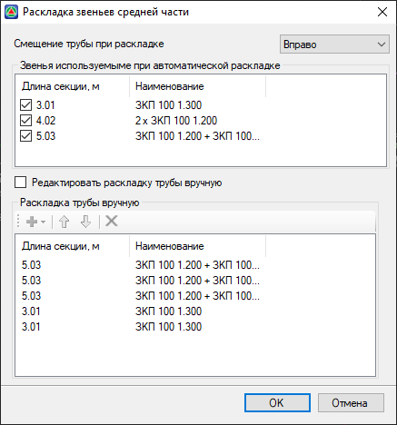

   **Смещение трубы при раскладке** – данная опция, позволяет выровнять трубу относительно проектного сечения. При этом происходит выравнивание трубы практической длины относительно теоретической:

   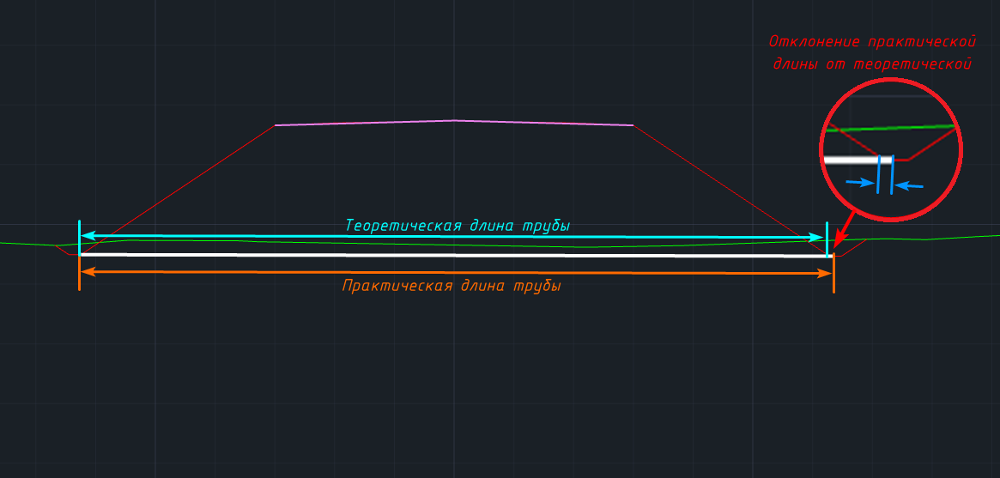

  * **Влево/Вправо** – смещение практической длины относительно теоретической происходит в выбранном направлении.
  * **Посередине** – происходит центрирование практической длины по теоретической.

    #|
    ||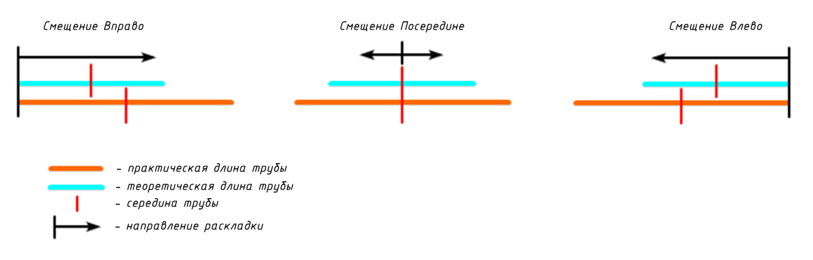||
    ||**Теоретическая длина трубы** – это длина трубы в первом приближении, без учета раскладки секций. Численно равна расстоянию между грипами элемента **Положение трубы**. 
    **Практическая длина трубы** – это длина трубы с учетом конструкции, т.е. после раскладки секций. Определяется как расстояние, измеряемое между ее крайними точками, включая открылки.||
    |#

    В области **Звенья, используемые при автоматической раскладке**, находится список всех доступных секций из библиотеки конструкций, подходящих по заданным параметрам водопропускной трубы. Секции, выбранные в данном поле, учувствуют в автоматической раскладке:

    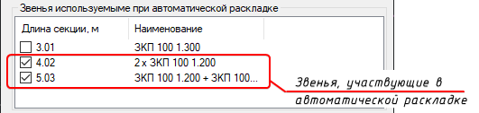

    **Редактировать раскладку трубы вручную** – данная опция включает режим раскладки трубы вручную, которая представляет собой составления списка секций трубы располагаемых последовательно с лева на право в конструкции:

    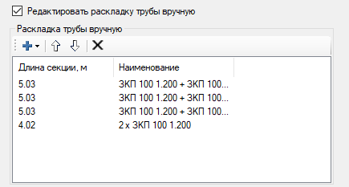

    При активации режима ручной раскладки список секций становиться доступным для редактирования. В верхней части находятся следующие функции, с помощью которых можно работать со списком:

    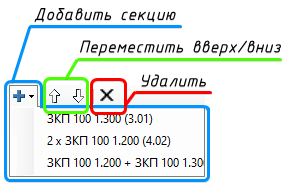

  * **Добавить секцию** – содержит селектор с доступными для добавления в список секциями.
  * **Переместить вверх/вниз** – выбранная из списка секция будет перемещена выше/ниже по списку.
  * **Удалить** – выбранная из списка секция будет удалена.

2. После завершения настройки в окне **Раскладка звеньев средней части** нажмите **ОК**.

В результате, изменения раскладки будут отображены в рабочем окне **Труба**.

## Раскладка металлических гофрированных труб {#raskladka-metallicheskih-gofrirovannyh-trub}

Для металлических гофрированных труб предусмотрены 3 автоматических способа раскладки, настраиваемые в окне **Выбор конструкции трубы**:

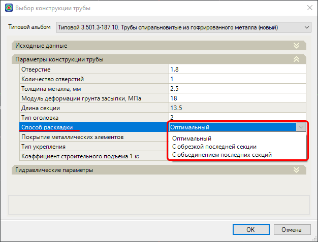



Для металлических гофрированных труб теоретическая длина конструкции равна практической длине.



**Оптимальный** – при данном способе происходит раскладка секций равной длины, при этом:

* размер каждой секции не превышает заданную длину секции в окне **Выбор конструкции**.
* размер последней секции уменьшен за счет округления длин остальных секций кратно 10 см.

#|
||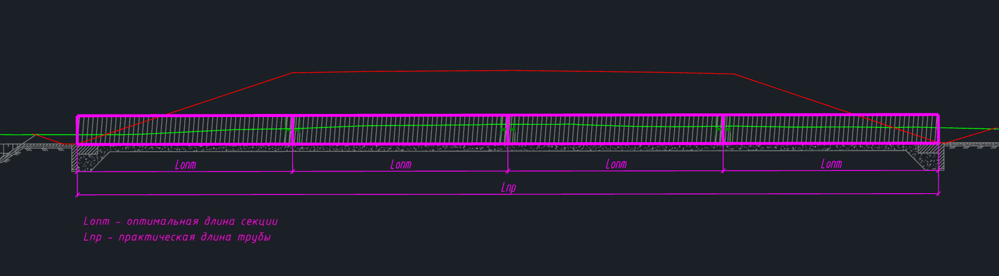||
||Например, **теоретическая длина трубы** 43,38 м
**Количество секций**: 43,38/13,50=3,21...=> 4
**Длина секций трубы**:43,38/4=10,845 => 10,90 м
**Длина последней секции**: 43,38-(10,90*3)=10,68
**Схема раскладки трубы**: 10,90+10,90+10,90+10,68||
|#

**С обрезкой последней секции** – при данном способе происходит раскладка из секций заданной длины (13,50 м), при этом последняя секция будет обрезана до величины теоретической длины трубы.

#|
||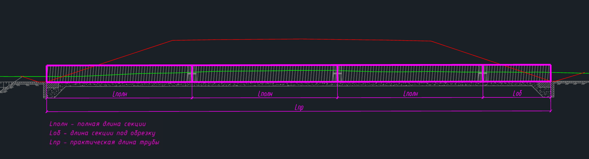||
||Например, **теоретическая длина трубы** 43,38 м 
**Количество секций**: 43,38/13,50=3,21…=> 3 секции заданной длины
**Длина последней секции**: 43,38-(13,50*3)=2,88
**Схема раскладки трубы**: 13,50+13,50+13,50+2,88||
|#

**С объединением последних секций** – частный случай способа с обрезкой. Применяется в случае наличия в конструкции последней секции малой длины, получаемой при раскладке **С обрезкой последней секции**:

* для труб с вертикальным срезом торца – из секции малой (последней в раскладке) и полной длины составляются 2 одинаковые секции:

#|
||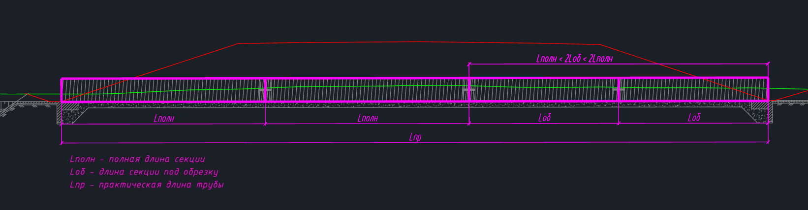||
||Например, **теоретическая длина трубы** 29,88 м
**Количество секций**: 43,38 /13,50=3,21… => всего 4 секции две из которых длинной 13,50 м
**Длина двух подрезанных секции**: (43,38-2*13,50)/2=16,38/2=8,19
**Схема раскладки трубы**: 13,50+ 13,50+8,19+8,19||
|#

* для труб с торцами, срезанными параллельно откосу – из секции малой (последней в раскладке) и полной длины составляются 2 одинаковые секции. При общем количестве секций более трех, секция полной длины будет смещена в оголовок, а две малые секции в сторону середины трубы:

#|
||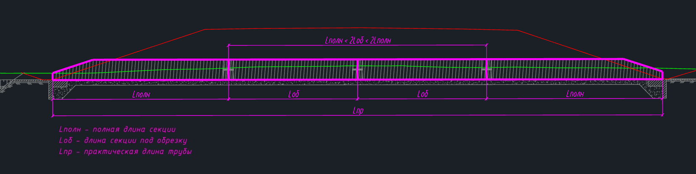||
||Например, **теоретическая длина трубы** 29,88 м
**Количество секций**: 43,38 /13,50=3,21… => всего 4 секции две из которых длинной 13,50 м
**Длина двух подрезанных секции**: (43,38-2*13,50)/2=16,38/2=8,19
**Схема раскладки трубы**: 13,50+8,19+8,19+13,50||
|#



Раскладка металлической гофрированной трубы может быть изменена в любой момент в окне **Выбор конструкции** (меню **Водопропускные трубы – Выбрать конструкцию…)**.

