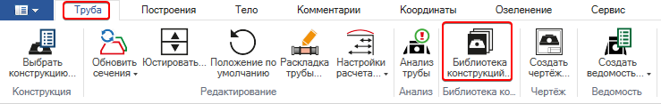
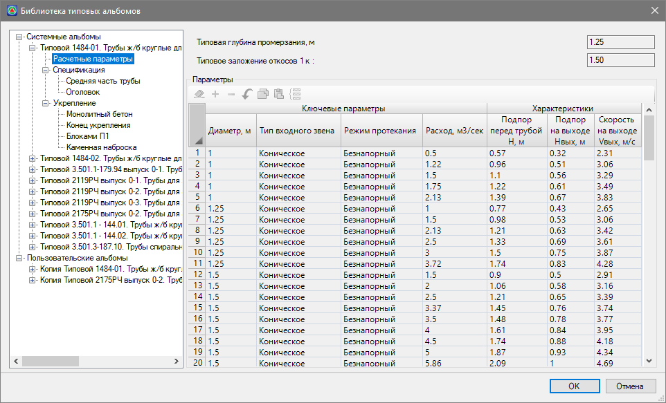
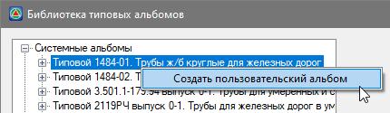
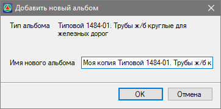
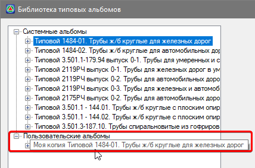
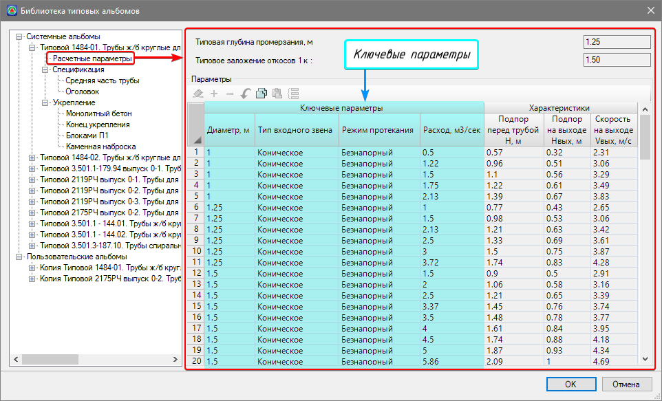
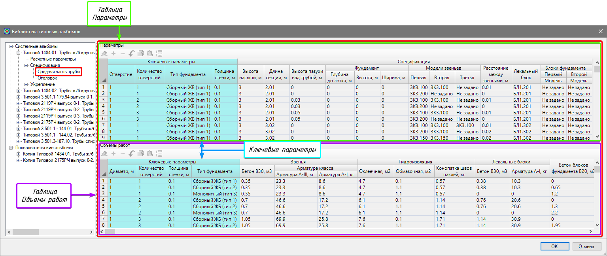
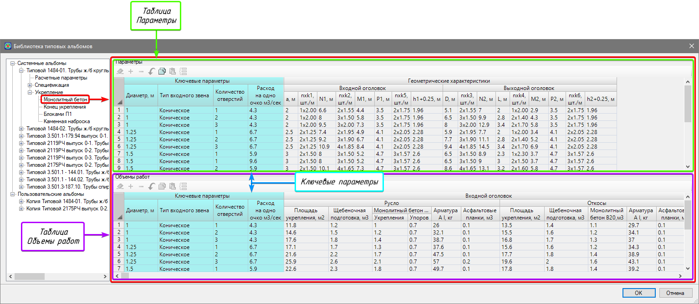

# Библиотека конструкций

В программе хранение альбомов типовых конструкций водопропускных труб реализовано в табличном виде в специальной **Библиотеке конструкций**. На основе параметров из библиотеки, программа производит расчет водопропускной трубы, а так же формирует чертежи и ведомости. Помимо системных альбомов, предусмотренных в программе, также присутствует возможность создания пользовательских альбомов на основе системных.

Для того, чтобы открыть библиотеку выберите меню **Водопропускные трубы - Библиотека конструкций...** или на ленте **Труба - Библиотека конструкций...**:

Откроется окно библиотеки типовых альбомов:

В левой части окна представлен список **системных типовых альбомов**, реализованных в программе. Для того, чтобы просмотреть содержимое того или иного альбом нажмите кнопку  слева от названия. Внутри альбома содержатся различные разделы, каждый из которых представляет из себя набор таблиц, по которым могут быть собраны различные вариации конструкций труб. Таблицы отображаются в правой части окна при выборе раздела.



Системные библиотеки типовых конструкций недоступны для редактирования.



На основе **системных альбомов** в библиотеку также могут быть добавлены и **пользовательские альбомы**, доступные для редактирования. Для этого:

1. Правой кнопкой мыши нажмите на нужный системный типовой альбом и из контекстного меню выбрать **Создать пользовательский альбом**:

   

2. В появившемся окне введите название типового для отображения в списке пользовательских альбомов, для подтверждения нажмите ОК:

   

3. Альбом появиться в списке пользовательских, после чего может быть отредактирован:

   

   **Системные альбомы** хранятся в расположении `C:\ProgramData\Topomatic\Robur Culverts\16.0\Support\Culvert`, **пользовательские** - `C:\Users\User\AppData\Roaming\Topomatic\Robur culverts\16.0\Support\Culvert`.

   Каждый типовой альбом содержит в себе следующие разделы:

  * **Расчетные параметры** – в данном разделе содержатся данные гидравлических расчетов, ключевые параметры водопропускной трубы, а так же данные о типовой глубине промерзания и заложении откосов, принятые в соответствии с типовыми альбомами:

    

  * **Спецификация** – в данном разделе содержатся параметры, спецификация и объемы работ для средней части (раздел **Средняя часть трубы**) и оголовков (раздел **Оголовок**) водопропускной трубы. При выборе, например, раздела **Средняя часть трубы** в таблице **Параметры** имеются столбцы с ключевыми параметрами (Диаметр, Тип входного оголовка, Режим протекании и пр.), а также спецификация с параметрами и номенклатурой блоков водопропускной трубы (Модели звеньев, Лекальный блок, Блоки фундамента и пр.). В таблице **Объемы** так же имеются столбцы с ключевыми параметрами и с объемами работ на 1 п.м. трубы.

    

  * **Укрепление** – в данном разделе хранятся параметры, геометрические характеристики и объемы работ для различных конструкций укреплений (**Монолитный бетон, Конец укрепления, Блоками П1, Каменная наброска**) на входе и выходе водопропускной трубы. При выборе того или иного раздела укреплений, например, **Монолитный бетон** в таблице **Параметры** имеются столбцы с ключевыми параметрами и столбцы с геометрическими характеристиками укреплений у входного/ выходного оголовков. В таблице **Объемы** так же содержатся столбцы с ключевыми параметрами и столбцы с объемами работ, относящиеся к укреплению русла и откосов у входных/ выходных оголовков, а так же имеется колонка с объемами земельных работ для устройства укреплений.

    

    

    При расчете конструкции водопропускной трубы, программа будет проводить сопоставление данных по ключевым параметрам (столбцы **Ключевые параметры**), включая соответствие между спецификацией и объемами работ, а также между средней частью, оголовками и укреплениями водопропускной трубы.

    