# Реконструкция

**Реконструкция**- это режим проектирования конструкции трубы, при котором есть возможность учесть существующую конструкцию, предусмотреть демонтаж или сохранение существующих элементов водопропускной трубы.

Для проектирования **Реконструкции** в окне **Выбор конструкции** должен быть выбран соответствующий **Тип проектирования**. Далее для трубы задаются те же параметры, что и для **Нового строительства**. Положение в плане задается на этапе создания модели любым удобным способом ввода трубы.



Подробнее см. раздел [Выбор и настройка конструкции](choose_customization_constructions.md).



## Определение положения существующей конструкции трубы

Проектирование реконструируемой части трубы ведется исходя из положения существующей трубы. По умолчанию положение существующей трубы определено условно и обозначается штриховкой с контуром голубого цвета:

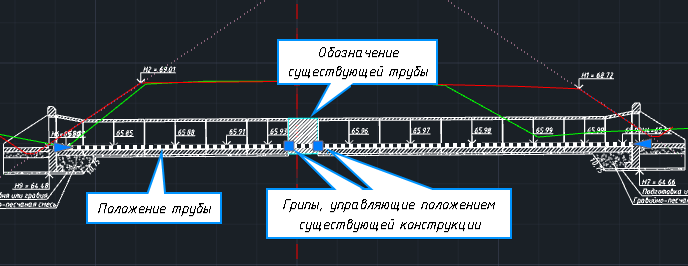

Для настройки положения существующей трубы:

1. Выберите элемент **Положение трубы**.
2. Укажите положение концов существующей трубы слева и справа в сечении одним из способов:

* непосредственно в сечении, при помощи квадратных грипов:

  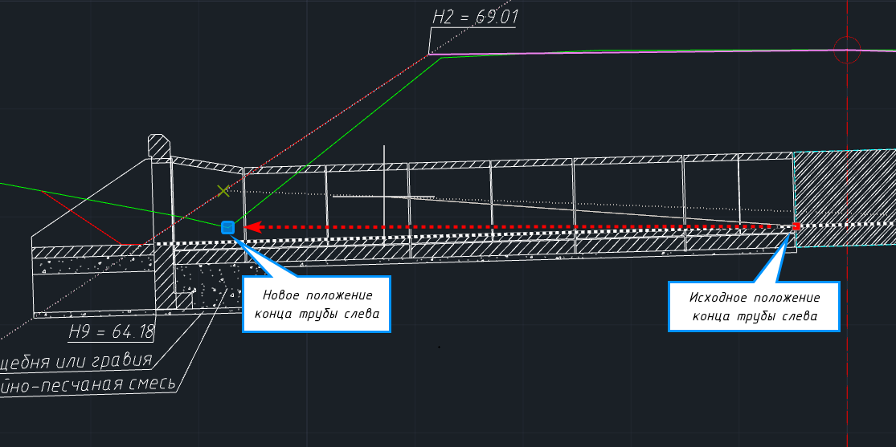

* указанием координат каждого конца трубы в формате **Смещение** и **Отметка**, через контекстное меню грипов:

  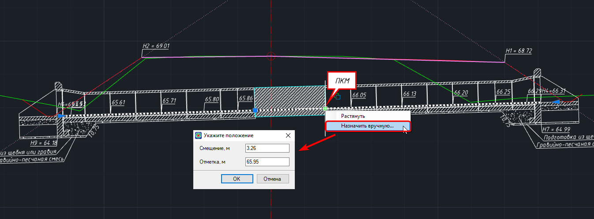

В результате фактическое положение существующей трубы будет задано в сечении:

  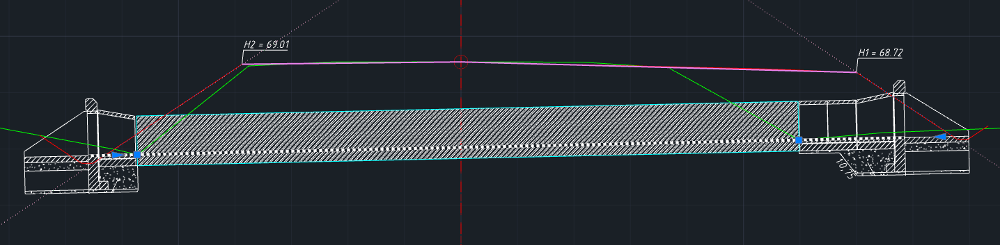

## Демонтаж существующих элементов

В программе предусмотрена возможность учета демонтируемых элементов при режиме проектирования **Реконструкция**. Для этого:

1. Выберите элемент меню **Водопропускные трубы – Демонтаж…** или на ленточном меню **Труба – Редактирование – Демонтаж…**:

   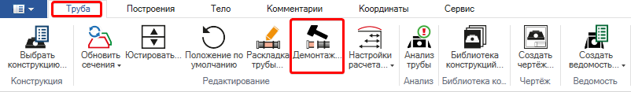

2. Откроется окно **Демонтаж**:

   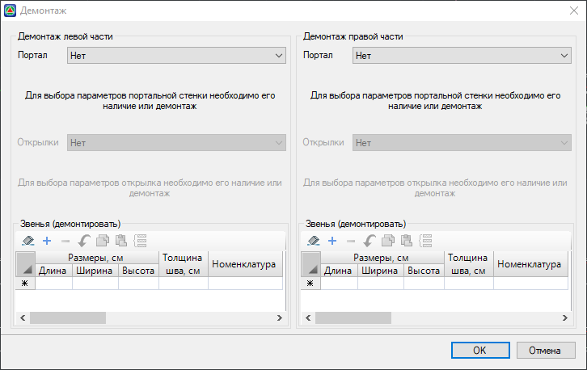

   Окно разделено на две части: набор параметров демонтажа левой части и правой части. Каждая из частей в свою очередь имеет набор элементов, **Портал**, **Открылки** и **Звенья**, для которых пользователем определяется их наличие в конструкции и мероприятие по демонтажу:

   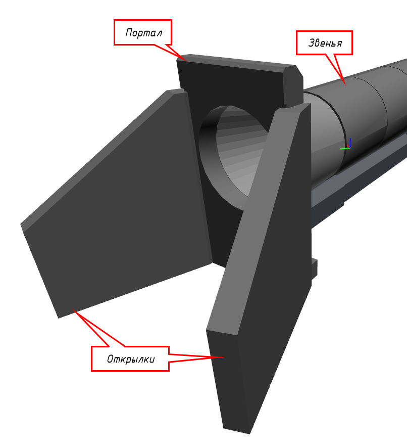



В случае если в существующей конструкции не предусмотрена портальная стенка, а оголовочное звено с кордоном, то для поля **Портал** устанавливается статус **Есть (демонтировать/не демонтировать)** и выбор модели не производится, модель оголовочного звена выбирается в поле **Звенья**.



Напротив наименования элементов, **Портал** и **Открылки**, находится селектор, с помощью которого определяется статус и мероприятие, применяемое к этим элементам:

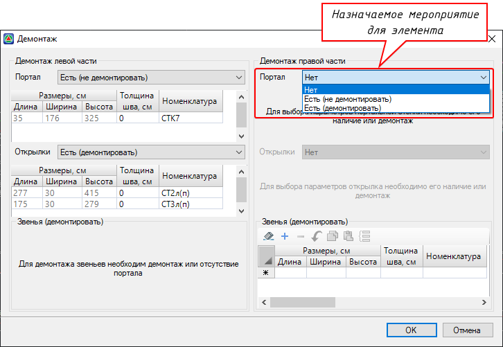

* **Нет** – статус элемента, означающий его отсутствие в существующей конструкции.
* **Есть (не демонтировать)** – статус элемента, означающий его наличие в существующей конструкции и отсутствие мероприятий по его демонтажу, т.е. данный элемент будет сохранен в конструкции в ходе реконструкции водопропускной трубы.
* **Есть (демонтировать)** – статус элемента, означающий его наличие в существующей конструкции и осуществление мероприятий по его демонтажу, т.е. данный элемент будет демонтирован в ходе реконструкции водопропускной трубы.

Для звеньев (область **Звенья(демонтировать)**) в рамках работы в данном окне может быть определено только мероприятие, демонтировать или не демонтировать. Заполнение таблицы области **Звенья** означает демонтаж выбранных звеньев. Не заполнение таблицы означает отсутствие мероприятия по демонтажу звеньев.

Заполнение демонтажа каждой из частей трубы следует производить с верху в низ, поскольку в данном окне реализован гибкий интерфейс, за счет которого происходит адаптация нижней части областей в зависимости от верхней:

* в существующей конструкции отсутствует элемент **Портал**, при этом **Открылки** (откосные стенки) также отсутствуют, а **Звенья** могут быть демонтированы или сохранены в конструкции:

  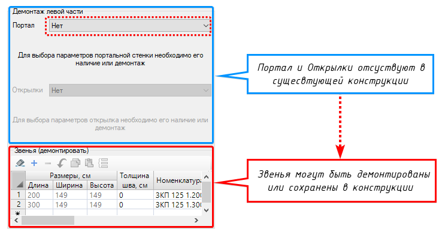

* в существующей конструкции сохраняется элемент **Портал**, при этом **Открылки** (откосные стенки) могут быть также сохранены, демонтированы или вовсе отсутствовать, а демонтаж **Звеньев** невозможен:

  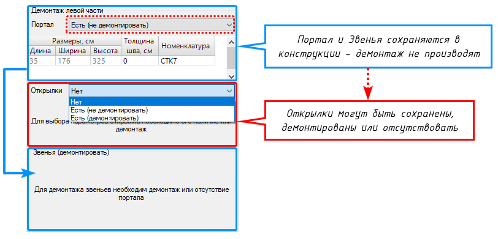

* в существующей конструкции элемент **Портал** демонтируется, при этом **Открылки** (откосные стенки) могут быть также демонтированы или вовсе отсутствовать, а **Звенья** могут быть демонтированы или сохранены в конструкции:

  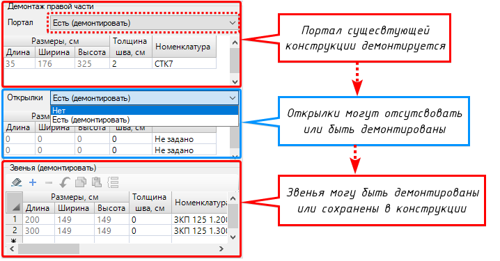

Для того чтобы учесть демонтаж элемента необходимо внести его в таблицу в соответствующей области. Заполнение геометрических размеров происходит автоматически по выбранному из 3D библиотеки элементу, толщина шва заполняется вручную:

  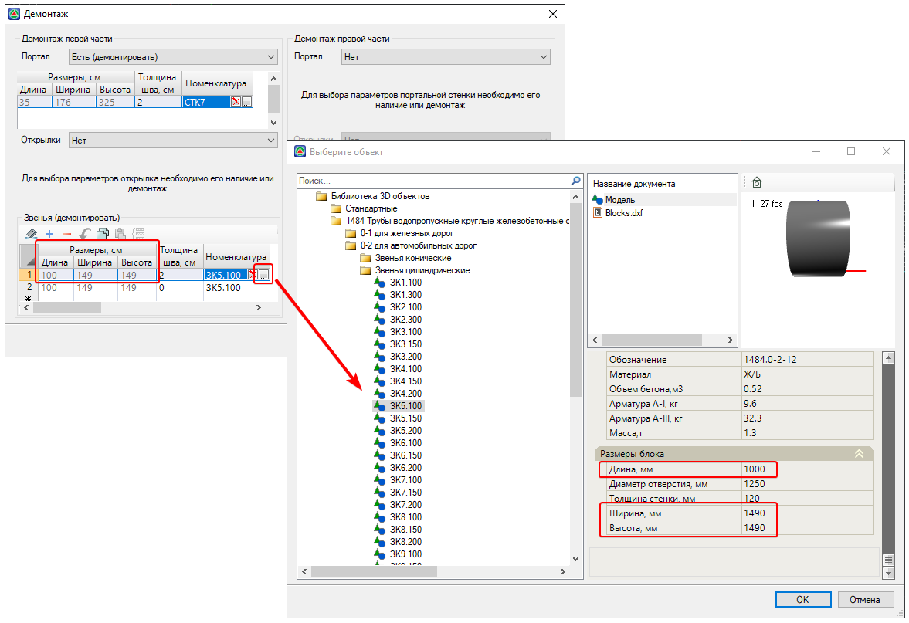

После заполнения всех необходимых параметров в окне **Демонтаж** нажмите **ОК**.

В результате при назначении демонтажа **Портала** и **Звеньев** они будут учтены и исключены из существующей конструкции, так что на их месте будет пристроена новая конструкция:

  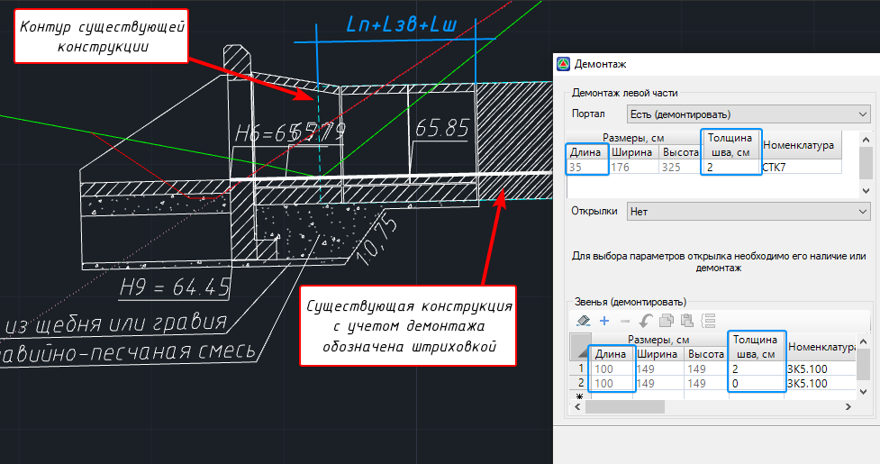