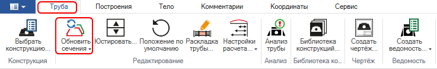
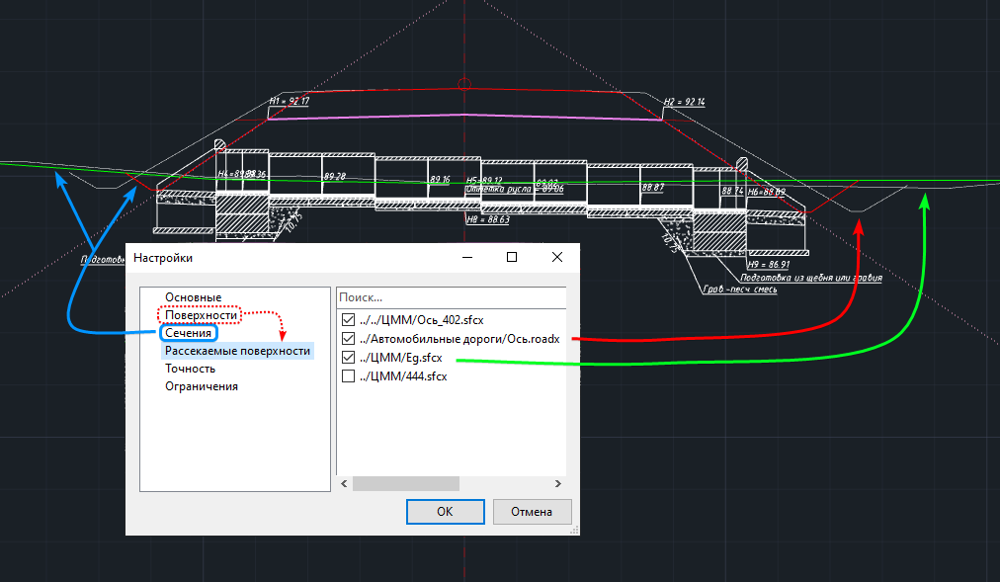
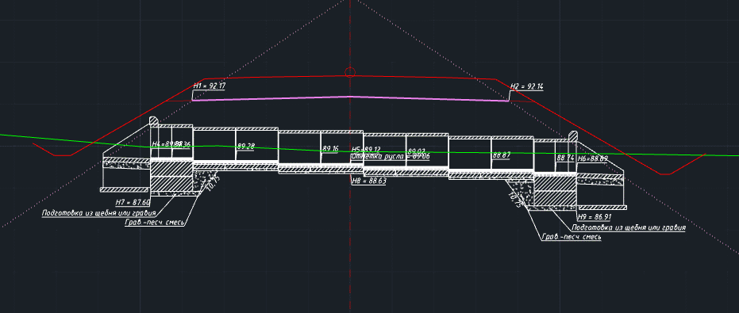

# Обновить сечения

Данная функция позволяет актуализировать линии сечения проектной и существующей поверхности, после внесения изменений в проектную или существующую поверхности или после корректировки положения трубы в плане.

Для того чтобы воспользоваться функцией:

1. Выберите элемент меню **Водопропускные трубы – Обновить сечения** или на ленточном меню **Труба – Редактирование – Обновить сечения:**

   

В результате таблицы сечений в настройках модели и линии сечений в рабочем окне **Труба** будут обновлены.



Таблицы сечений не являются динамическими и требуют принудительного обновления. Контролировать изменения сечений в рабочем окне **Труба** можно с помощью рассекаемых поверхностей, которые в свою очередь является динамическими. Для этого в настройках модели трубы необходимо подключить в качестве рассекаемых те модели, по которым эти сечения созданы. Посмотреть их можно во вкладке Поверхности.

#|
||||
||Сечение (линии красного и зеленого цвета) и рассекаемые поверхности (линии серого цвета) в рабочем окне Труба после поворота конструкции в плане. Рассекаемые поверхности отображают изменение проектной и существующей линий.||
|#

#|
||||
||Сечение в окне Труба после использования функции Обновить сечения. Рассекаемые поверхности по-прежнему включены, но не видны, поскольку линии сечения теперь отрисованы на их месте.||
|#


