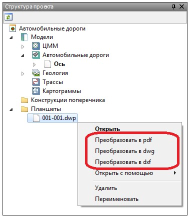

# Изменение формата созданного чертежа

Чертежи сформированные во внутреннем формате программного комплекса можно экспортировать в другие сторонние форматы. Для этого:

1. В **Структуре проекта** нажмите правой кнопкой мыши на предварительно созданном файле чертежа, в контекстном меню выберите пункт **Экспортировать** и укажите необходимый формат пересохранения:

   

В результате новый файл будет сохранен в указанную папку.