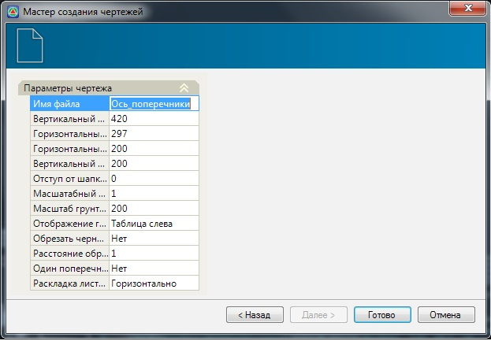

# Создание чертежа поперечных профилей

Для формирования чертежа предварительно помеченных поперечных профилей:

1. Выберите элемент меню **Проект - Создать чертеж - Поперечные профили**. Откроется окно мастера формирования чертежа.
2. На **шаге 1** выберите наименование шаблона согласно которому будет формироваться чертеж и нажмите кнопку **Далее**:

   

3. На **шаге 2** необходимо задать основные настройки формирования чертежа:

   

   В группе полей Параметры чертежа задаются следующие данные:

   * **Имя файла** – наименование создаваемого файла чертежа.
   * **Вертикальный и горизонтальный размер листа** - по умолчанию чертежи поперечников формируются на стандартных листах формата **А3**. При необходимости, в данных полях можно задать размеры листов, на которых будут формироваться поперечные профили.
   * **Горизонтальный и вертикальный масштаб** – в данных полях задаются соответствующие значения масштабов поперечных профилей.
   * **Отступ от шапки** - вертикальный отступ от шапки определяет минимальное расстояние между верхней линией шапки и самой нижней точкой поперечного профиля.
   * **Масштабный коэффициент текста** – размер шрифта, которым подписываются данные в шапке чертежа, задается непосредственно в шаблоне самого чертежа. С помощью данного масштабного коэффициента можно регулировать высоту текста. Задание масштабного коэффициента менее единицы уменьшает высоту текста чертежа, а более единицы, соответственно увеличивает.
   * **Масштаб грунтов** – вертикальный масштаб влияющий на отрисовку геологических данных, таких как скважины и слои грунтов. Он может отличаться от вертикального масштаба линии поперечного профиля.
   * **Обрезать черную землю** - по умолчанию чертежи поперечных профилей формируются на всю их ширину. При наличии линии проектного поперечного профиля, ширина линии черной земли может быть ограничена относительно крайних точек красной линии. Для этого, в данном поле необходимо установить параметр **Да**. После чего, в поле Расстояние от линии обрезки, задайте значение дополнительной ширины формирования линии черной земли.
   * **Один поперечник на лист** - если установлен параметр **Да**, то на каждом листе заданного размера будет размещен только один поперечник. Если установлен параметр **Нет**, то программа будет генерировать поперечники до тех пор, пока они умещаются на листе.
   * **Раскладка листов** – в данном поле из выпадающего списка выбирается тип раскладки листов, при формировании чертежа поперечников. Возможны два варианта – **Вертикальная** или **Горизонтальная** раскладка.