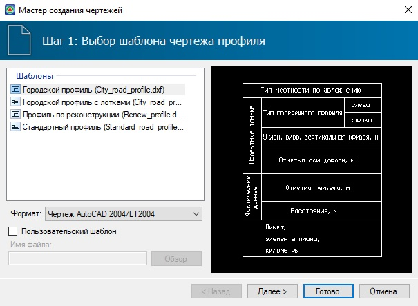
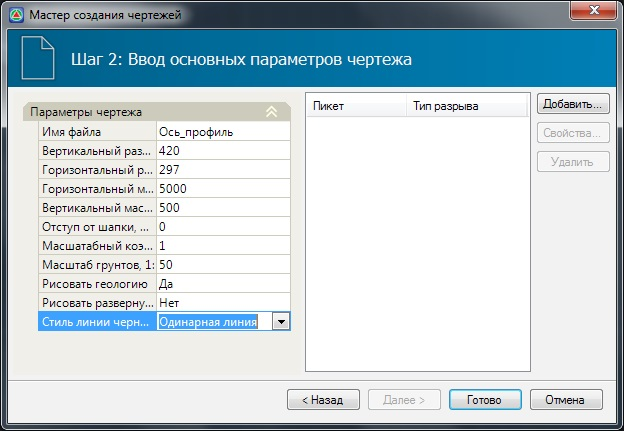
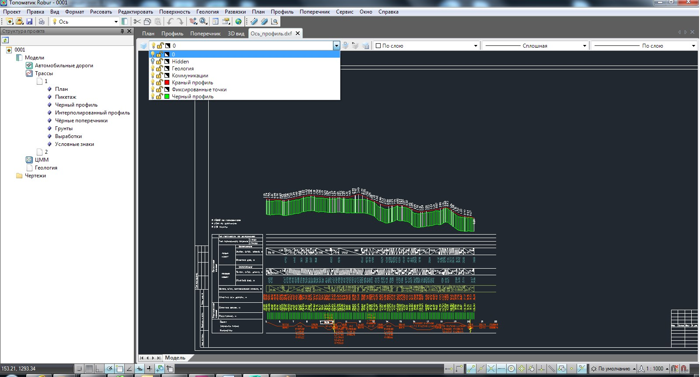

# Создание чертежа продольного профиля

Программа **Топоматик Robur** позволяет создать чертеж продольного профиля по заданному шаблону По умолчанию в программе присутствуют несколько вариантов шаблонов чертежей в зависимости от типа используемого программного продукта и модели на основе которой создается чертеж.

Для того, чтобы создать чертеж продольного профиля выполните следующие действия:

1. Сделайте текущим подобъект, чертеж профиля которого необходимо создать.
2. Выберите элемент меню **Проект – Создать чертеж – Продольный профиль**. Откроется окно мастера формирования чертежа.
3. На **шаге 1** выберите наименование шаблона, согласно которому будет формироваться чертеж и нажмите кнопку **Далее**:

   

4. На **шаге 2** необходимо задать основные настройки формирования чертежа:

   

   В группе полей **Параметры чертежа** задаются следующие данные:

   * **Имя файла** – наименование создаваемого файла чертежа.
   * **Вертикальный и горизонтальный размер листа** - программа автоматически определяет необходимую длину листа, но для того, чтобы он был кратен стандартному формату, следует задать размеры листа, по умолчанию задается формат **А3 420×297**.
   * **Горизонтальный и вертикальный масштаб** – в данных полях задаются соответствующие значения масштабов продольного профиля.
   * **Отступ от шапки** - вертикальный отступ от шапки определяет минимальное расстояние между верхней линией шапки и самой нижней точкой линии профиля.
   * **Масштабный коэффициент текста** – размер шрифта, которым подписываются данные в шапке чертежа, задается непосредственно в шаблоне самого чертежа. С помощью данного масштабного коэффициента можно регулировать высоту текста. Задание масштабного коэффициента менее единицы уменьшает высоту текста чертежа, а более единицы, соответственно увеличивает.
   * **Масштаб грунтов** – вертикальный масштаб, влияющий на отрисовку геологических данных, таких как скважины и слои грунтов. Он может отличаться от вертикального масштаба линии продольного профиля.
   * **Рисовать геологию** – если в данном поле установлен параметр **Да**, то на чертеж будут выносится геологические данные, которые были нанесены на продольный профиль трассы. Процедура нанесения скважин и контуров геологических слоев на продольный профиль была описана в разделе **Обработка геологических данных**.
   * **Рисовать развернутый план** - данная опция позволяет при создании чертежа продольного профиля, отображать его в шапке развернутый план трассы.

     По умолчанию данная опция отключена, т.к. процедура формирования развернутого плана может занимать определенное время. Развернутый план рисуется в масштабе чертежа продольного профиля (горизонтальный масштаб).

   * **Стиль линии черного профиля** – в данном поле из выпадающего списка можно выбрать тип отображения линии черного профиля. По умолчанию в автодорожных шаблонах она рисуется двойной, а в железнодорожных шаблонах – одинарной линией.
    
   В правой части данного окна можно задать пикетажное положение мест разрыва продольного профиля, если он не умещается по высоте или длине листа стандартного размера.

   Если выбрать тип разрыва **Новый участок**, то профиль будет смещен на данном пикете в вертикальном направлении на необходимое расстояние, в пределах данного листа. В случае выбора типа разрыва **Новый лист**, часть профиля будет перенесена на следующий лист.

   Для создания нового разрыва:

   * Нажмите кнопку **Добавить**.
   * В появившимся диалоговом окне выберите тип разрыва и задайте его пикетажное положение:

     

   * Нажмите **ОК**.
    
   В результате разрыв определенного типа будет создан и учтен при формировании чертежа профиля. Все предварительно созданные разрывы отображаются в правой части мастера формирования чертежа:

     

   Для изменения параметров предварительно созданного разрыва выберите его из списка и нажмите кнопку **Свойства**. В окне **Свойства** разрыва измените его тип или пикетажное положение и нажмите **ОК**. Для удаления предварительно созданного разрыва из списка выберите его и нажмите кнопку **Удалить**.

5. Задайте все необходимые настройки формирования чертежа и нажмите кнопку **Готово**.

В результате, чертеж будет создан и автоматически открыт для просмотра или дальнейшего редактирования:

