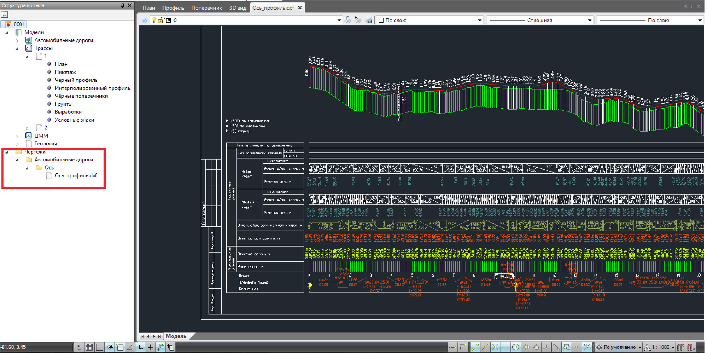

# Создание и открытие чертежей

**Robur** генерирует следующие основные виды чертежей:

* Чертеж ситуационного плана.
* Чертежи планшетов.
* Чертеж продольного профиля.
* Чертежи поперечников.

Рассмотрим, к примеру, последовательность действий по созданию и открытию чертежа продольного профиля в стороннем графическом редакторе. Чтобы загрузить **dxf-файл** в **AutoCAD**:

1. Выберите элемент меню **Проект – Создать чертеж - Продольный профиль**.
2. Задайте в мастере генерации чертежа необходимые настройки его формирования и нажмите кнопку **Готово**.
3. Просмотрите автоматически сгенерированный чертеж в окне просмотра.
4. Запустите **AutoCad** и выберите элемент меню **File-Open**.
5. В поле **Тип файлов** выберите тип **dxf-файлы**.
6. Выберите файл, который необходимо открыть.
7. После окончания загрузки выберите команду показать границы (элемент меню **View-Zoom-Extents**).
8. Выберите элемент меню **File-Save as** и сохраните чертеж в формате **dwg**.

Аналогичным образом, чертеж может быть открыт в собственном графическом редакторе программы.

Чертеж также может быть открыт с помощью окна **Структура проекта**. Для этого раскройте папку его расположения и щелкните дважды левой кнопкой мыши по наименованию чертежа, который необходимо открыть. В результате, чертеж будет открыт в отдельном окне программы:

Если чертеж создавался во внутреннем формате программы (формат dwp), то по умолчанию он является динамическим и может обновляться при внесении изменений в проекте. Работа с динамическими чертежами будет описана далее в соответствующих разделах.