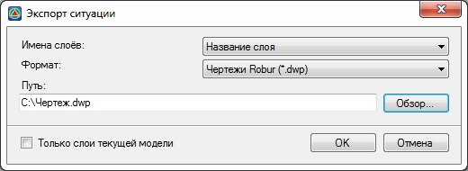

# Создание чертежа ситуационного плана

Данный механизм позволяет сохранять в файл чертежа выбранного формата все элементы моделей отображаемых в окне **План**.

Для сохранения чертежа плана:

1. Воспользуйтесь элементом меню **Проект - Экспортировать – Ситуация**, откроется диалоговое окно:

   

   Выпадающий список **Имена слоев** позволяет выбрать один из вариантов формирования имен слоев чертежа:

   * **Полные** – имя слоя будет формироваться по следующему принципу - **\Модели\Название модели\Имя слоя**. Т.е. например, слой **Горизонтали** находящийся в модели поверхности **Eg** будет иметь следующее имя – **«Модели. ЦММ. Eg. Горизонтали»**.
   * **Название модели** – имя слоя будет формироваться по следующему принципу - **\Название модели\Имя слоя**. Т.е. например, слой Горизонтали находящийся в модели поверхности **Eg** будет иметь следующее имя – **«Eg.Горизонтали»**.
   * **Название слоя** - имя слоя будет формироваться по следующему принципу - **\Имя слоя**. Т.е. например слой Горизонтали находящийся в модели поверхности **Eg** и любой другой **ЦММ** будет иметь следующее имя – **«Горизонтали»**.

   В выпадающем списке **Формат** имеется возможность выбрать формат файла чертежа.

   В поле **Путь** или кнопки **Обзор** имеется возможность указать папку сохранения экспортируемого файла.

   При включенной опции **Только слои текущей модели**, в файл чертежа будут экспортироваться только видимые слои **Текущей модели**. Если же опция выключена, то будут экспортироваться видимые слои, всех моделей проекта.

2. Нажмите кнопку **Сохранить**. В результате, видимые элементы моделей будут сохранены в файл чертежа выбранного формата.
