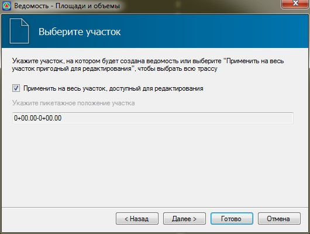

# Создание выходных ведомостей

Программа **Топоматик Robur** позволяет формировать ведомости различных типов.

Их можно разделить на следующие основные группы: результаты геодезических расчетов, результаты обработки геологических данных и ведомости разбивки трассы. Создание ведомостей, аналогично генерации чертежей осуществляется с помощью специального мастера формирования.

По данным трассы могут быть сформированы следующие основные выходные ведомости:

* Ведомость элементов плана.
* Ведомость координат плана с заданным шагом.
* Ведомость разбивки горизонтальных кривых.
* Ведомость разбивки трассы от условного базиса.
* Ведомости обработки результатов исполнительной съемки.
* Ведомости объемов между заданными поверхностями.

В зависимости от используемой конфигурации программы набор формируемых ведомостей может отличаться.

К примеру, для формирования ведомостей разбивки трассы:

1. Проверьте, является ли текущей трасса, на основе которой требуется сформировать ведомости. Процесс выбора текущей модели был описан в разделе **Структура проекта**.
2. Выберите тип создаваемой ведомости с помощью элемента меню **Проект - Создать ведомость…**.
3. В окне мастера формирования ведомости задайте ее общие настройки:

   

   В данном окне, в поле **Тип ведомости** можно выбрать ее формат, в зависимости от редактора, в котором она должна быть открыта. В поле **Путь** отображается адрес папки, в которую по умолчанию сохраняются все создаваемые ведомости. Его можно изменить с помощью кнопки **Обзор**.

4. Нажмите кнопку **Далее**.
5. На следующем шаге задается участок формирования данных:

   

6. На последней странице мастера задаются специфические настройки, зависящие от типа конкретной ведомости. Например, при формировании ведомости координат трассы, в данном окне необходимо задать шаг ее разбивки:
7. Нажмите кнопку **Готово**.

В результате, выбранная ведомость будет сформирована и в зависимости от ее формата автоматически открыта в соответствующем редакторе:

