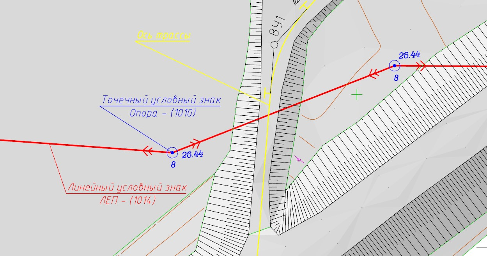
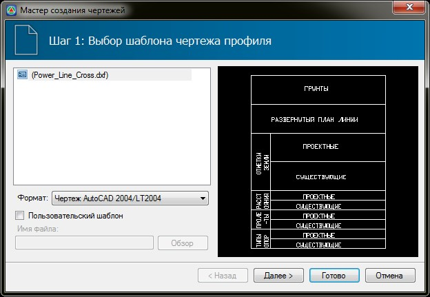
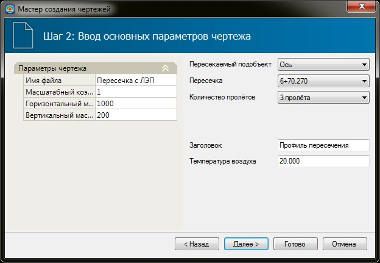
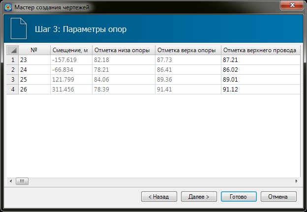
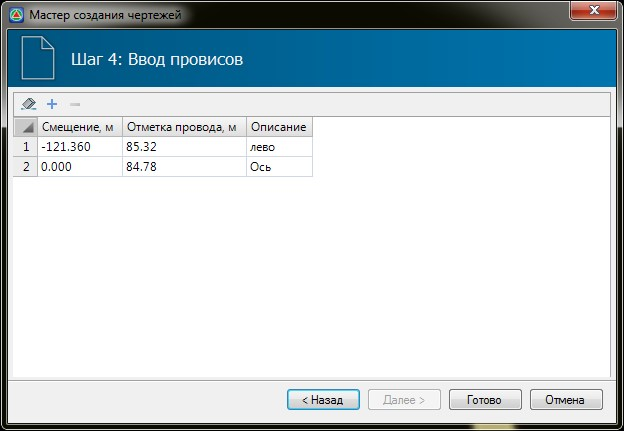
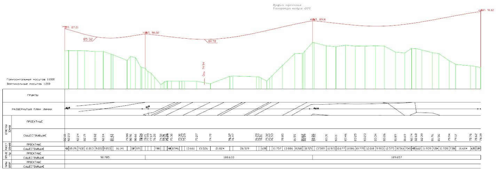

# Создание чертежей пересекаемых коммуникаций

Данная функция позволяет создавать чертеж пересекаемых трассу коммуникаций. В частности, имеется возможность создать чертеж пересечения оси дороги с линейным объектом ЛЭП ( Линия электропередачи).

В узлах коммуникации также могут быть заданы точечные объекты (Опоры ), на основании семантических свойствах которых принимаются отметки верхних и нижних проводов. Таким образом, перед созданием чертежа пересечек, они должны быть нанесены на топографическом плане, в виде соответствующих условных знаков:



 При отсутствии точечных объектов (опор) в узлах коммуникации, а также семантических данных по отметкам проводов, данную информацию можно будет задать непосредственно в мастере создания чертежа.



Для создания чертежа пересечки:

1. Выберете меню **Задачи - Пересечки - Создать чертеж пересеки ЛЭП**, курсор примет форму прицела.
2. Укажите на плане соответствующий линейный объект (объектный код - **1014 Линия электропередачи**). Откроется мастер создания чертежа.
3. Последовательно задайте необходимые данные для создания чертежа:

   * На **шаге 1** выберите шаблон, согласно которому будет формироваться чертеж и нажмите **Далее**.

     

   * На **шаге 2** задайте основные параметры формирования чертежа:

     

     В группе полей **Параметры чертежа** задаются следующие данные:

     * **Имя файла** – наименование создаваемого файла чертежа.
     * **Масштабный коэффициент текста** – размер шрифта, которым подписываются данные в шапке чертежа, задается непосредственно в шаблоне самого чертежа. С помощью данного масштабного коэффициента можно регулировать высоту текста. Задание масштабного коэффициента менее единицы уменьшает высоту текста чертежа, а более единицы, соответственно увеличивает.
     * **Горизонтальный и вертикальный масштаб** – в данных полях задаются соответствующие значения масштабов чертежа.
     * **Пересекаемый подобъект** – в данном поле выбирается подобъект, относительно которого будет создаваться чертеж пересекаемой коммуникации.
     * **Пересечка** – при наличии нескольких пресечений ЛЭП с подобъектом, в данном поле из выпадающего списка выберите необходимый пикет пересечения.
     * **Количество пролетов** – в данном поле из выпадающего списка выбирается количество отображаемых на чертеже пролетов ЛЭП, с обеих сторон относительно трассы.
     * **Заголовок** – информация введенная в данном поле будет отображаться на чертеже в виде заголовка.
     * **Температура воздуха** – информационная характеристика, также отображаемая на создаваемом чертеже.
     * **Фильтровать отметки земли** - включение данной опции позволяет автоматически разрядить отметки земли на чертеже с возможностью задания фактора фильтрации.

   * На **шаге 3** задаются следующие параметры опор:

     

     Параметры в данной таблице могут быть заполнены автоматически исходя из заданных семантических свойств условных знаков в узлах коммуникации (Опор).

     

     1. Изменение параметров в таблице приводит непосредственно к изменению свойств условных знаков.
     2. Если необходимые семантические характеристики (отметки верхнего и нижнего провода) не были заданы у точечных объектов (опор), их можно задать в табличном виде, на данном шаге формирования чертежа. При отсутствии точечных объектов (опор) в узлах коммуникации, информация по отметкам проводов, вводимая на данном этапе создания чертежа, не будет сохранена.
     3. В случае если коммуникация имеет один провод, то задавать отметки необходимо в графу **Отметки верхнего провода**.

     

   * На **шаге 4** задайте смещение и отметку провиса провода над дорогой. Нажмите **Готово**:
  
     

4. В результате, чертеж будет создан и автоматически открыт для просмотра или дальнейшего редактирования:

   
