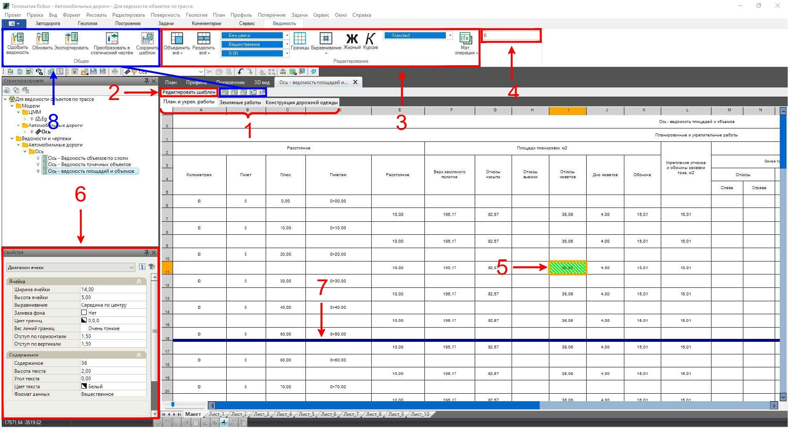
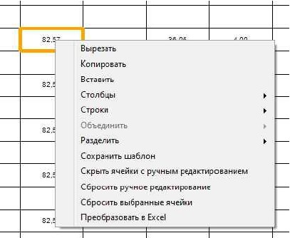

# Редактирование макета ведомости

Рабочее окно ведомости состоит из пространств **Лист** и **Макет**.

В пространстве **Лист** ведомость отображается в том виде, в котором пойдет на печать. Также, при необходимости, в пространстве **Лист** можно редактировать зарамочное оформление.

В пространстве **Макет** представлена вся таблица ведомости без ее деления на листы.

**Макет** предназначен для внесения локальных корректировок данных или наименований в таблице ведомости, настройки разрывов листов. Ячейки, отредактированные вручную, отмечаются штриховкой.



Если в макет таблицы ведомости внесены крупные изменения, такие как добавление/удаление столбцов, строк и др., то после обновления ведомости эти изменения не сохранятся.



На рисунке ниже показаны основные элементы навигации в пространстве **Макет**.

#|
||||
||1. Вкладки с таблицами ведомости.

2. Кнопка вызова **Редактора шаблона** активной таблицы ведомости (см. [Редактор шаблона](review_edit.md)).
3. Инструменты редактирования таблицы ведомости.

4. Количество строк заголовка таблицы ведомости, которое будет отображаться на следующих после начального листах (в пространстве **Лист**).

5. Ячейка, отредактированная вручную.

   

   Данное выделение не отображается при выводе ведомости на печать.

   

6. Окно свойств ячейки.

7. Линия разрыва листов.

   

   Линия разрыва предназначена для обозначения границы, после которой таблица ведомости переносится на следующий лист. Чтобы изменить положение линии разрыва, потяните её, зажав ЛКМ.

   

8. Функционал взаимодействия с динамическими данными (см. [Общие функции по взаимодействию с динамическими данными (в разработке)]()).||
|#

Нажав ПКМ по ячейке таблицы в пространстве **Макет**, откроется контекстное меню с часто используемыми и дополнительными функциями, такими как:

#|
||
|**Скрыть/показать ячейки с ручным редактированием** – скрывает/показывает выделение всех отредактированных вручную ячеек.

**Сбросить ручное редактирование** – возвращает исходное состояние всем ячейкам, в которые были внесены изменения вручную.

**Сбросить выбранные ячейки** – возвращает исходное состояние только предварительно выбранным ячейкам, в которые были внесены изменения вручную.||
|#
