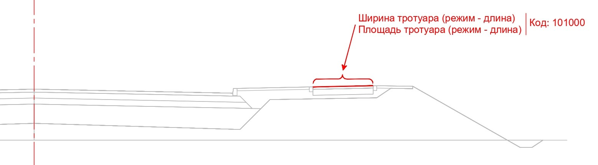
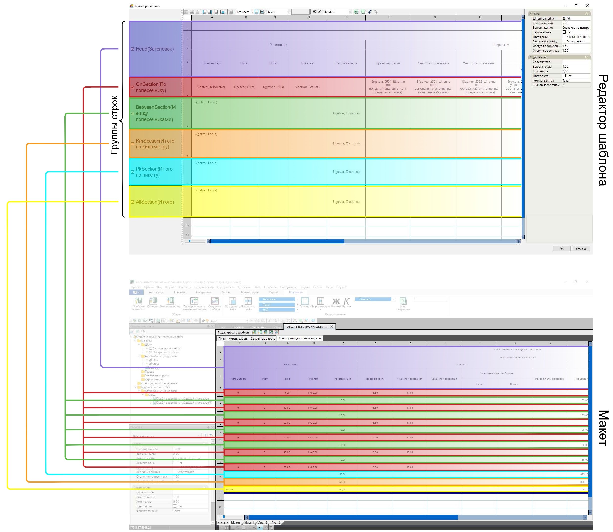
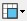
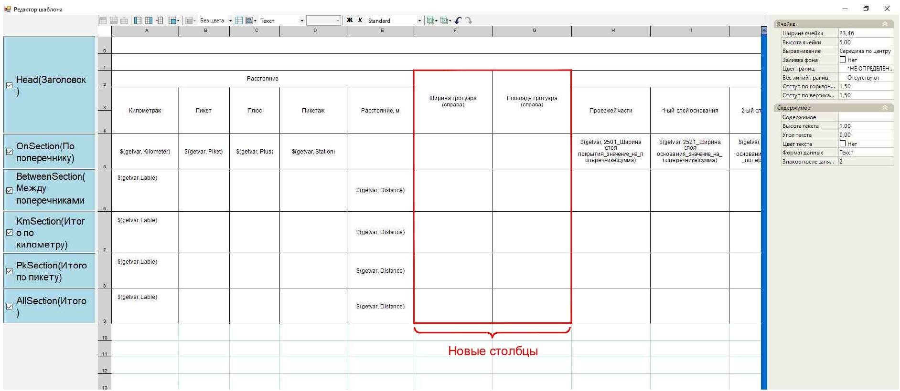
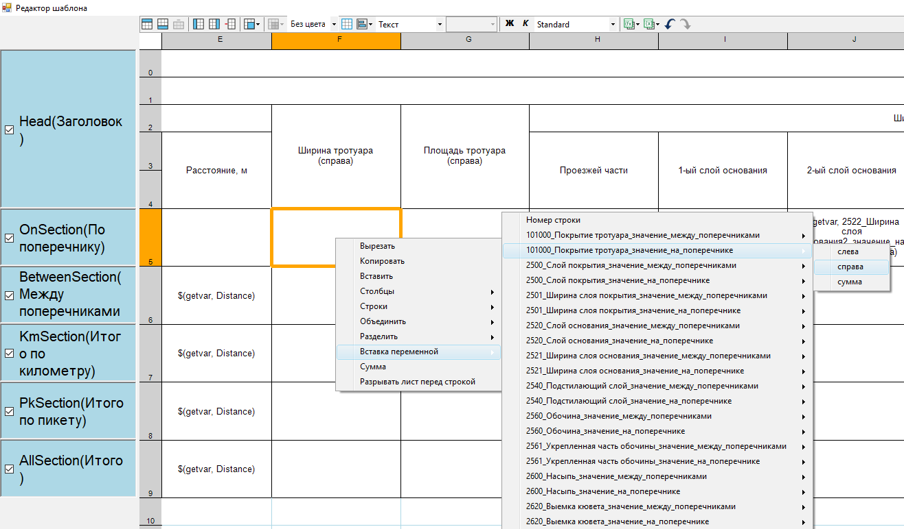
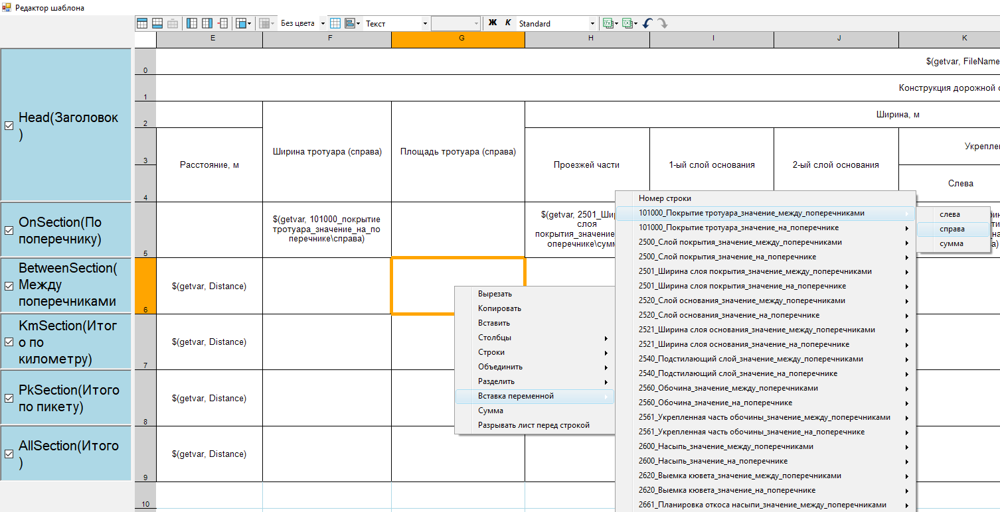
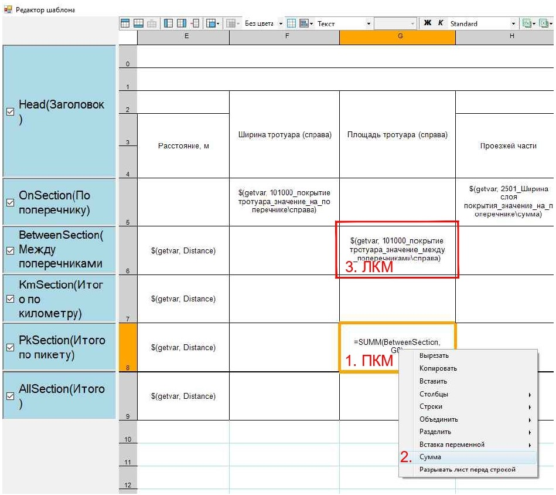
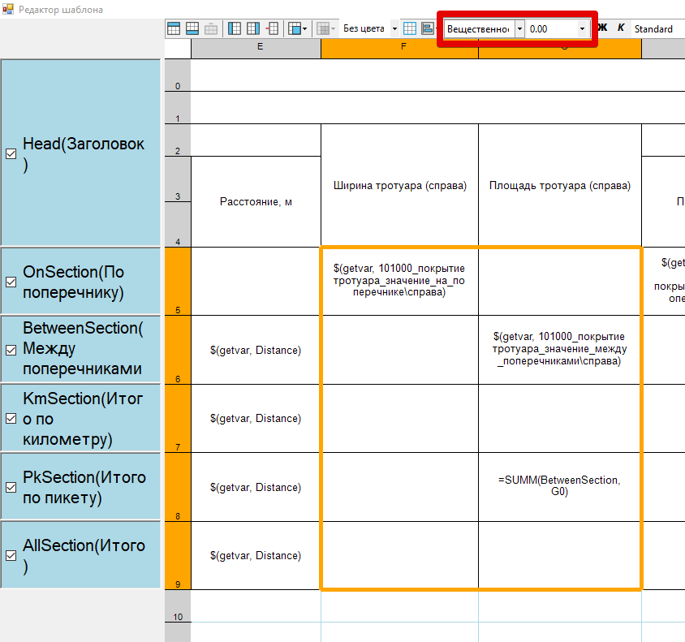
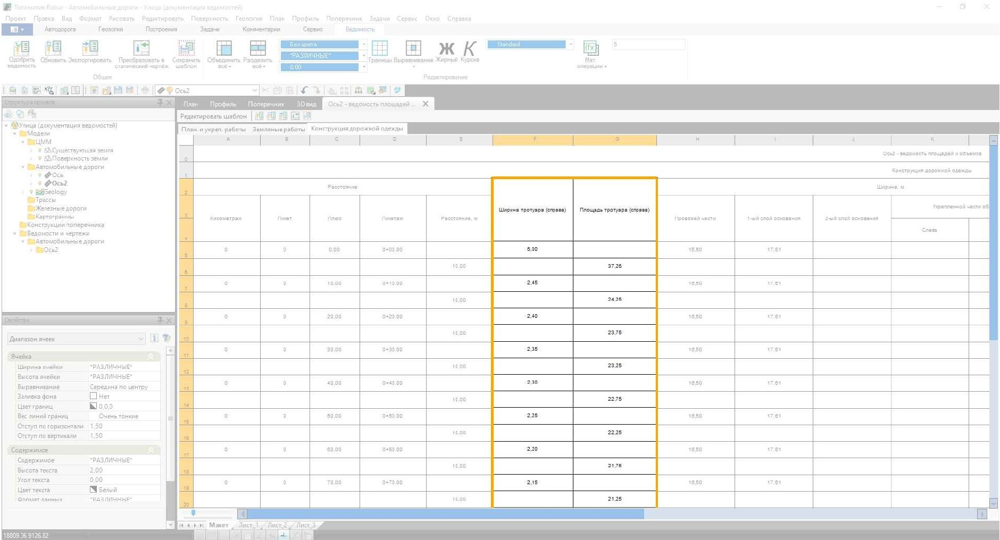

# Пример редактирования шаблона ведомости

В данном разделе рассматривается пример редактирования шаблона ведомости Площадей и объемов.

<u>*Задача*</u>

Вывести данные по *ширине тротуара справа* и по *площади планировки тротуара справа* (пользовательские объемы с кодом *101000* и шифром *Покрытие тротуара*) в таблице Конструкция дорожной одежды.

Чтобы приступить к редактированию шаблона ведомости Площадей и объемов, перейдите в пространство **Макет**, далее на таблицу Конструкция дорожной одежды и нажмите **Редактировать шаблон**.

Все строки из пространства **Макет** таблицы данной ведомости объединены в окне **Редактор шаблона** в следующие группы строк: **Заголовок**, **По поперечнику**, **Между поперечниками**, **Итого по километру**, **Итого по пикету**, **Итого**.

* Группа строк **Заголовок** используется для создания внешнего вида шапки ведомости и наименований в ней.
* Группа строк **По поперечнику** используется для записи значений с поперечника, например ширина покрытия.
* Группа строк **Между поперечниками** используется для записи результатов вычисления: *((площадь контура или его длина на поперечнике + площадь контура или его длина на следующем поперечнике)/2)\*расстояние между поперечниками*.
* Группы строк **Итого по километру**, **Итого по пикету**, **Итого** используются для записи значений сумм.

<u>*Решение*</u>

Добавим данные по *ширине тротуара справа* и *площади планировки тротуара справа* (пользовательские объемы с кодом *101000* и шифром *Покрытие тротуара*):

1. Вставьте два новых столбца  или , объедините ячейки  и впишите названия столбцов в группе строк **Заголовок**.

   

2. Значение *ширины тротуара* будем считывать *по поперечнику*. В соответствующем столбце нажмите ПКМ по ячейке в группе строк **По поперечнику**. В открывшемся контекстном меню выберите **Вставка переменной** – *101000\_Покрытие тротуара\_значение\_на\_поперечнике* – *справа*.

   

3. Значение *площади планировки тротуара* будем считывать *между поперечниками*. В соответствующем столбце нажмите ПКМ по ячейке в группе строк **Между поперечниками**. В открывшемся контекстном меню выберите **Вставка переменной** – *101000\_Покрытие тротуара\_значение\_между\_поперечниками* – *справа*.

   

   

   В случае, если объем, на который ссылается переменная, будет отсутствовать на тех или иных поперечниках, то в ячейках ведомости, для которых вставлена эта переменная (в т. ч. в составе выражений), будет пусто. В таком случае, чтобы заполнить пустую ячейку значением 0, в конце переменной через ***запятую*** напишите ***0***.

   Было:

   `$(getvar, 101000_покрытие тротуара_значение_между_поперечниками\справа)`

   Стало:

   `$(getvar, 101000_покрытие тротуара_значение_между_поперечниками\справа, 0)`

   

4. Теперь просуммируем значения *площади планировки тротуара*. В соответствующем столбце нажмите ПКМ по ячейке в группе строк **Итого по пикету**. В открывшемся контекстном меню выберите **Сумма** и нажмите ЛКМ по ячейке с *переменной* в группе строк **Между поперечниками**. Таким образом просуммируются все значения *площади планировки тротуара* в рамках каждого пикета и запишутся в виде *переменной* суммы.

   

   Проделайте аналогичную последовательность действий с ячейками в группах строк **Итого по километру** и **Итого**, если необходимо.

5. Задайте новым ячейкам с *переменными* необходимый **Формат** данных.

   

6. Нажмите ОК. Результатом будет выход из **Редактора шаблона** и применение всех внесенных изменений в данную таблицу шаблона ведомости.

   



После добавления в ведомость новых столбцов может образоваться ситуация, когда ведомость не влезет на лист. Для того чтобы формат листа соответствовал размерам ведомости, сохраните шаблон ведомости и снова создайте данную ведомость, используя уже этот шаблон. Сохранение шаблона ведомости и формирование ведомости по пользовательскому шаблону см. [Общие функции по взаимодействию с динамическими данными (в разработке)]().

