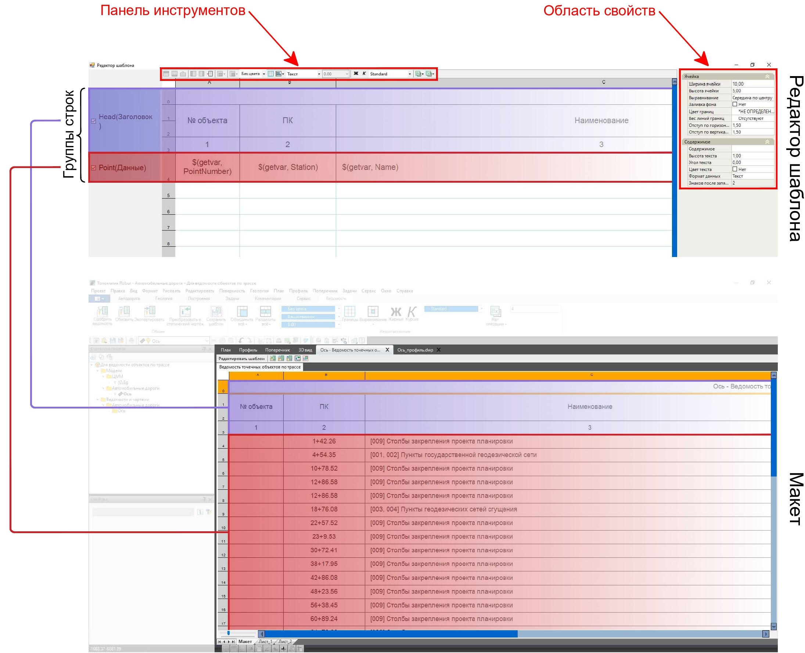
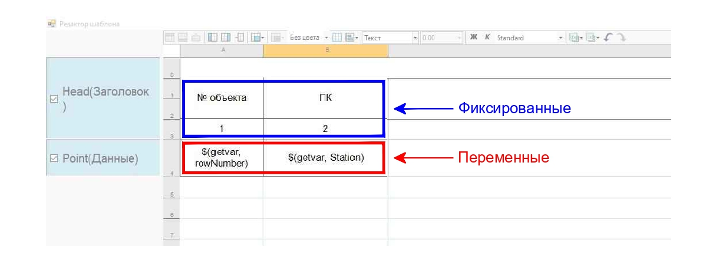

# Редактор шаблона

В окне **Редактор шаблона** все строки таблицы ведомости из пространства **Макет** объединены в группы по своему назначению. Например, таблица ведомости Объектов по трассе в **Редакторе шаблона** и ее связь с **Макетом** выглядят так:



От типа ведомости зависит количество и назначение групп, в которые собраны строки ее таблицы. При необходимости в **Редакторе шаблона** можно исключать те или иные группы строк из ведомости.



В ячейках группы строк **Заголовок** записываются названия столбцов, то есть *фиксированные* значения.

В ячейках остальных групп строк записываются *переменные*. Каждая переменная отвечает за то, какие данные и откуда будут взяты при формировании ведомости.

В верхней части окна **Редактор шаблона** находятся основные инструменты редактирования, которые позволяют объединять и разделять ячейки различным образом, настраивать отображение границ ячеек, выравнивать данные внутри ячейки. Также ячейкам можно задать заливку цветом, настроить стиль, формат и точность данных в ней.

В правой части окна **Редактор шаблона** расположена область свойств, позволяющая изменять параметры и наполнение выделенной ячейки. Также при нажатии ПКМ в области таблицы, открывается контекстное меню, в котором представлены часто используемые инструменты редактирования и некоторые другие.