# Инструменты Редактора шаблона

## Панель инструментов

На панели инструментов в окне **Редактор шаблона** находятся все необходимые инструменты редактирования таблицы.

<u>*Редактирование вида таблицы*</u>

*  - добавляет строку над выбранной ячейкой.
* 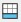 - добавляет строку под выбранной ячейкой.
*  - удаляет строку, в которой выбрана ячейка.
*  - добавляет столбец слева от выбранной ячейки.
*  - добавляет столбец справа от выбранной ячейки.
*  - удаляет столбец, в котором выбрана ячейка.
*  - объединяет выбранную область ячеек: не оставляя внутренних границ ; оставляя деление только по строкам 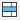; оставляя деление только по столбцам .
* 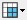 - разделяет объединенную группу ячеек: возвращая все недостающие границы 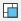; возвращая границы только строк ; возвращая границы только столбцов .
*  - позволяет настроить отображение границ ячеек.
* 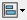 - позволяет настроить выравнивание внутри ячейки: по центру нижней границы ; по левому нижнему краю ; по правому нижнему краю ; по центру  и т. д.

<u>*Редактирование формата и стиля данных*</u>

**Формат** данных в ячейках таблицы бывает *текстовым* и *числовым*. В свою очередь *числовые* данные делятся на *целые* и *вещественные*.

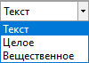

**Целое** – это число, дробная часть которого округлена до целочисленного значения.

**Вещественное** – это число, дробная часть которого округляется в зависимости от заданного количества знаков после запятой.

Чтобы настроить *текстовый стиль*, необходимо выделить ячейку или область ячеек, в которых *текстовый стиль* планируется изменить, нажать на **Стиль текста на чертеже** и выбрать нужный *текстовый стиль*.

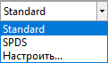
   
**Стиль текста** – визуальное отображение текста в ведомости.

Если выбрать **Настроить…**, откроется окно **Текстовые стили**, в котором можно задать свойства имеющимся *текстовым стилям*, а также создать новые.



Как отображается текст ведомости с выбранным *текстовым стилем*, можно увидеть в пространстве **Лист**.



<u>*Взаимодействие с данными*</u>

Функция **Математическая операция** 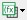 представляет собой набор из заранее заготовленных формул суммы, разности, умножения и деления. Чтобы воспользоваться данной функцией необходимо:

* Выделить ячейку, в которую планируется записать результат.
* Выбрать нужную *математическую операцию* .
* Выделить первую и затем вторую ячейки, с которыми нужно выполнить расчет.
* Как итог будет записан результат вычисления в выбранную на первом шаге ячейку.

**Переменные шаблона** 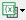 позволяют заполнять ячейки таблицы ведомости данными модели, по которой построена эта ведомость.

**Переменные** – это специальные команды, которые направлены на считывание тех или иных данных с модели.



Список доступных *переменных* в **Редакторе шаблона** различается в зависимости от типа ведомости и группы строк, в которой находится активная в данный момент ячейка.



## Область свойств и контекстное меню

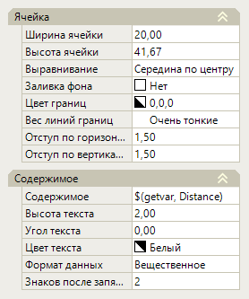

Область свойств, расположенная в правой части окна **Редактор шаблона**, отражает параметры внешнего вида ячейки и ее содержимого. В разделе свойств **Ячейка** можно изменять ширину и высоту ячейки, выравнивание текста в ней, заливку фона, цвет границ и т. д. В разделе свойств **Содержимое** можно править наполнение ячейки, изменять высоту текста, угол поворота текста в ячейке, формат данных ячейки и т. д.

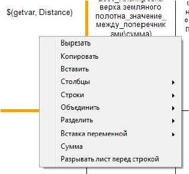

Нажав ПКМ по ячейке, откроется контекстное меню, в котором содержаться часто используемые функции редактирования вида таблицы, функции копирования и вставки, список *переменных*. Также в контекстном меню ячейки присутствует функция **Сумма**. Ее назначение – суммирование данных, считанных с модели при помощи *переменной* (см. [Пример редактирования шаблона ведомости.](example_pattern.md)).

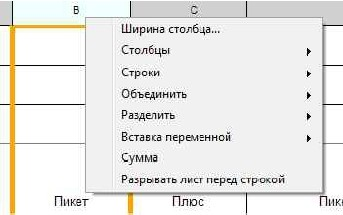

Кроме того, нажав ПКМ в области алфавитного оглавления таблицы или в области нумерации строк, раскроется контекстное меню с функцией изменения ширины столбца или высоты строки.