# Теги шаблона чертежа поперечного профиля

В данном подразделе представлено описание тегов чертежа поперечного профиля и их параметры.



Теги с геологическими данными представлены в разделе [Теги данных Геологии.](tags_data_geology.md)



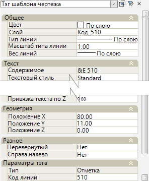

Параметры тегов редактируются в окне **Свойства**, которое содержит в себе как группы параметров оформления тега, так и группу с уникальными параметрами. 

К оформлению относятся параметры из групп **Общее**, **Текст**, **Геометрия** и **Разное**, для всех типов тегов эти параметры предоставляют одинаковые функциональные возможности, если таковые доступны. Поэтому далее рассматривается группа **Параметры тега**, которая содержит в себе уникальные параметры для каждого конкретного типа тега.  

<u>**Тег:**</u>

**Линия**  - автоматическое формирование горизонтальной линии необходимой длины (равная длине линии черной земли на профиле).

#|
|| {.cell-align-center}||
||Пример отображения тега **Линия** в шаблоне||
|#

==============================

<u>**Теги:**</u>

**Отметка**  - вывод отметок по линии с заданным кодом.

#|
|| {.cell-align-center}||
||Пример отображения тега **Отметка** в шаблоне||
|#

**Смещение**  - вывод значений смещения каждой точки линии с заданным кодом, относительно оси трассы.

#|
||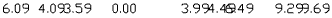 {.cell-align-center}||
||Пример отображения тега **Смещение** в шаблоне||
|#

**Ординаты** 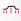 - отрисовка ординат от линии с заданным кодом по характерным точкам.

#|
||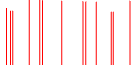 {.cell-align-center}||
||Пример отображения тега **Ординаты** в шаблоне||
|#

<u>**Параметры тегов:**</u>

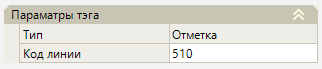

**Код линии** – в данном поле укажите код линии, по которой будут выведены данные (в зависимости от выбранного тега).

==============================

<u>**Теги:**</u>

**Расстояние**  - вывод расстояний между точками перелома по линии с заданным кодом.

#|
||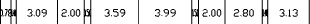 {.cell-align-center}||
||Пример отображения тега **Расстояние** в шаблоне||
|#

**Уклон/ длина** 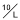 - вывод данных уклона и длины по линии с заданным кодом

#|
||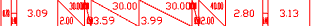 {.cell-align-center}||
||Пример отображения тега **Уклон/ длина** в шаблоне||
|#

<u>**Параметры тегов:**</u>

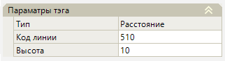

**Код линии** – в данном поле укажите код линии, по которой будут выведены данные (расстояния или уклон / длина) между точками перелома.

**Высота** - поле для назначения высоты (вертикального размера) засечек.

==============================

<u>**Теги:**</u>

**Ось** 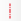 - отрисовка штрихпунктирной линией оси линейного объекта, данных по оси, заданных в настройках модели (отметки и пикета), а так же наименования модели.

#|
||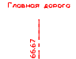 {.cell-align-center}||
||Пример отображения тега **Ось** в шаблоне||
|#

**Линия фактической земли** 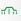 - отрисовка линии существующего (черного) профиля с ординатами.

#|
||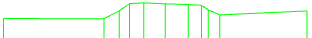 {.cell-align-center}||
||Пример отображения тега **Линия фактической земли** в шаблоне||
|#

**Проектные линии** 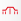 - отрисовка заштрихованных контуров проектного поперечника.

#|
|| {.cell-align-center}||
||Пример отображения тега **Проектные линии** в шаблоне||
|#

**Интерполированная земля**  - отрисовка линии интерполированного профиля

#|
||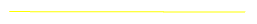 {.cell-align-center}||
||Пример отображения тега **Интерполированная земля** в шаблоне||
|#

**Слои фрезерования/ выравнивания** (для модели АД) - отрисовка слоев фрезерования\ выравнивания с ординатами и наименованиями типов поверхности проектного покрытия.

#|
||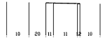 {.cell-align-center}||
||Пример отображения тега **Слои фрезерования/ выравнивания** в шаблоне||
|#

**Типы фрезерования/ выравнивания** (для модели АД)

#|
||||
||Пример отображения тега **Типы фрезерования/ выравнивания** в шаблоне||
|#

==============================

<u>**Тег:**</u>

**Уклон/ заложение линии** 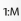 - вывод значений уклонов и заложений по линии с заданным кодом.

#|
||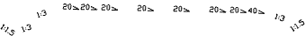 {.cell-align-center}||
||Пример отображения тега **Уклон/ заложение линии** в шаблоне||
|#

<u>**Параметры тега:**</u>

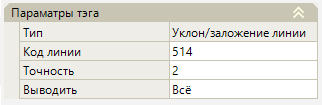

**Код линии** – в этом поле укажите код линии, по которой будут выведены уклоны и значения заложений.

**Точность** - в данном поле задаётся максимальное количество знаков после запятой.

**Выводить** – поле, в котором из списка можно выбрать какие значения необходимо отобразить. При выборе опции **Всё** будут выведены значения заложений и уклонов, при выборе опции **Уклоны** или **Заложения** будут выведены только соответствующие значения.

==============================

<u>**Тег:**</u>

**Рабочие отметки**  - вывод рабочих отметок по границам и элементам проектной линии поперечника.

#|
||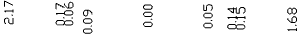 {.cell-align-center}||
||Пример отображения тега **Рабочие отметки** в шаблоне||
|#

==============================

<u>**Тег:**</u>

**Разница отметок**  - вывод разности отметок в характерных точках между выбранными контурами.

#|
||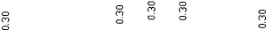 {.cell-align-center}||
||Пример отображения тега **Разница отметок** в шаблоне||
|#

<u>**Параметры тега:**</u>

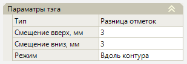

**Смещение вверх, мм/ Смещение вниз, мм** – смещение отметки по вертикали относительно характерной точки, где отображаются данные.

**Режим** - в данном поле выбирается способ отображения отметок. **Вдоль контура** – отметки будут отображаться вдоль контура, **Горизонтально** – отметки будут отображаться горизонтально, например, этот способ можно выбрать когда необходимо вставить отметки в графы поперечного профиля. 

==============================

<u>**Тег:**</u>

**Отметки линии на выноске** (для модели АД) - вывод отметок на выноске в характерных точках по линии с заданным кодом.

#|
||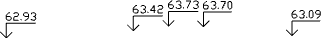 {.cell-align-center}||
||Пример отображения тега **Отметки линии на выноске** в шаблоне||
|#

<u>**Параметры тега:**</u>

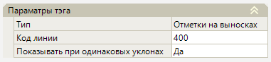

**Код линии** – в этом поле укажите код линии, по которой будут выведены отметки в характерных точках.

**Показывать при одинаковых уклонах** – при выборе в данном поле значения **Нет** промежуточные отметки на одинаковых уклонах будут скрыты.

==============================

<u>**Тег:**</u>

**Заголовок шаблона**  - имя шаблона, которое будет отражено в поле **Шаблон** на первом шаге **Мастера создания чертежей**. Тег в рабочем поле отображается в виде точки. Для работы тега, файл пользовательского шаблона должен находиться в каталоге хранения системных шаблонов. 

<u>**Параметры тега:**</u>

**Имя шаблона** – поле для ввода наименования шаблона, которое будет отображаться в поле **Шаблон** на первом шаге **Мастера создания чертежей**. 

==============================

<u>**Теги:**</u>

**Горизонтальный масштаб**  - вывод подписи масштаба по горизонтали, определяемый по умолчанию на шаге 2 **Мастера создания чертежей**.

#|
||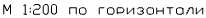 {.cell-align-center}||
||Пример отображения тега **Горизонтальный масштаб** в шаблоне||
|#

**Вертикальный масштаб**  - вывод подписи масштаба по вертикали, определяемый по умолчанию на шаге 2 **Мастера создания чертежей**.

#|
||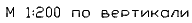 {.cell-align-center}||
||Пример отображения тега **Вертикальный масштаб** в шаблоне||
|#

**Подпись пикета**  - вывод пикета текущего поперечника.

#|
|| {.cell-align-center}||
||Пример отображения тега **Подпись пикета** в шаблоне||
|#

==============================

<u>**Тег:**</u>

**Объем** 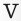 - тег формирует и выводит данные (объемы) по элементам конструкции текущего поперечника по заданному коду объема.

#|
||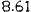 {.cell-align-center}||
||Пример отображения тега **Объем** в шаблоне||
|#

<u>**Параметры тега:**</u>

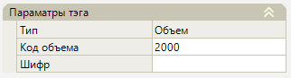

**Код объема** – в данном поле задайте код объема с поперечника, по которому будет выведен объем.

**Шифр** – в этом поле можно указать наименование (шифр) объема.

==============================

<u>**Тег:**</u>

**Таблица объемов**  - отрисовка таблицы с объемами текущего поперечника.

#|
||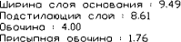 {.cell-align-center}||
||Пример отображения тега **Таблица объемов** в шаблоне||
|#

<u>**Параметры тега:**</u>

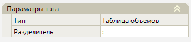

**Разделитель** – в данном поле выбирается символ, который будет вставляться между наименованием объема и его значением.

==============================

<u>**Тег:**</u>

**Коммуникации**  - отрисовка подсечений и их данных, например отрисовка коммуникаций.

#|
||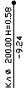 {.cell-align-center}||
||Пример отображения тега **Коммуникации** в шаблоне||
|#

==============================

<u>**Тег:**</u>

**Междупутье**  (для модели ЖД) - отрисовка размера со значением расстояния между назначенными путями в **Структуре проекта** в **Таблице междупутий**.

#|
||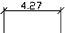 {.cell-align-center}||
||Пример отображения тега **Междупутье** в шаблоне||
|#

<u>**Параметры тега:**</u>

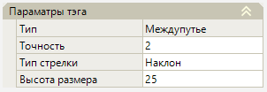

**Точность** - в данном поле задаётся максимальное количество знаков после запятой в значении расстояния.

**Стрелка** – поле для выбора из списка типа стрелки размерной линии.

**Высота размера** – в данном поле можно изменить высоту выносной линии размера.

==============================

<u>**Тег:**</u>

**УВВ**  - отрисовка линии и выноски со значениями уровня высоких вод.

#|
||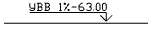 {.cell-align-center}||
||Пример отображения тега **УВВ** в шаблоне||
|#

<u>**Параметры тега:**</u>

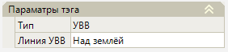

**Линия УВВ** – в этом поле можно выбрать местоположение линии УВВ на поперечнике. Если выбран вариант **Над землёй**, то линия будет проведена выше фактической земли, пока не пересечет ее. Если выбран вариант **Под землёй**, то будет нарисована только та часть линии, которая находится под фактической землей.

==============================

<u>**Тег:**</u>

**Подложка** 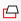 - отрисовка векторной подложки.

#|
||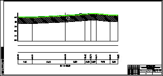 {.cell-align-center}||
||Пример отображения тега **Подложка** в шаблоне||
|#

==============================

<u>**Теги Отвод земель:**</u>

**Существующий** 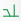 - отрисовка границ и подписи существующего отвода земель.

**Временный**  - отрисовка границ и подписи временного отвода земель.

**Проектный** 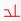 - отрисовка границ и подписи проектного отвода земель.

#|
|| {.cell-align-center}|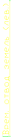 {.cell-align-center}|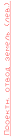 {.cell-align-center}||
||Пример отображения тега **Существующий** в шаблоне|Пример отображения тега **Временный** в шаблоне|Пример отображения тега **Проектный** в шаблоне||
|#

==============================

<u>**Тег Оформление:**</u>

**Отметка узла на выноске** 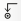 - вывод отметки на выноске выбранного узла поперечного профиля.

#|
||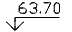 {.cell-align-center}||
||Пример отображения тега **Отметка узла на выноске** в шаблоне||
|#

<u>**Параметры тега:**</u>

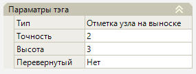

**Точность** - в данном поле задаётся максимальное количество знаков после запятой.

**Высота** – в этом поле можно задать размер линии выноски.

**Перевернутый** – если в этом поле выбрано значение **Да**, полка выноски и подпись примут зеркальное положение.

==============================

<u>**Тег Оформление:**</u>

**Выноска**  - отрисовка выноски от выбранного узла с заданным текстом.

#|
||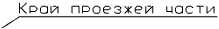 {.cell-align-center}||
||Пример отображения тега **Выноска** в шаблоне||
|#

<u>**Параметры тега:**</u>

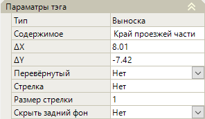

**Содержимое** – отображение подписи, заданной при вставке тега, подпись можно изменить.

**ΔX/ ΔY** – координаты полки выноски с подписью относительно точки вставки тега.

**Перевернутый** – если в этом поле выбрано значение **Да**, полка выноски и подпись примут зеркальное положение.

**Стрелка** – поле для выбора из списка типа стрелки линии выноски.

**Размер стрелки** – в этом поле можно изменить размер стрелки линии выноски.

**Скрыть задний фон** - если в этом поле выбрано значение **Да**, вокруг текста образуется «маска» в форме прямоугольника, текст размещен на непрозрачном фоне. 

==============================

<u>**Тег - Оформление:**</u>

**Контур** 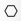 - отрисовка контура по выбранному контуру.

#|
||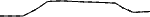 {.cell-align-center}||
||Пример отображения тега **Контур** в шаблоне||
|#

==============================

<u>**Тег - Оформление:**</u>

**Штриховка** 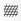 - отрисовка заливки (штриховки) выбранного замкнутого контура (например, контура объема).

#|
|| {.cell-align-center}||
||Пример отображения тега **Штриховка** в шаблоне||
|#

<u>**Параметры тега:**</u>

**Штриховка** - в этом поле можно из списка можно выбрать тип штриховки.

**Угол** - в это поле задается значение угла наклона линий штриховки, в градусах, к горизонтальной оси.

**Масштаб** - в этом поле задается масштабный коэффициент штриховки относительно ее исходного размера.

==============================

<u>**Тег - Оформление:**</u>

**Уклон/ заложение линии**  - отрисовка уклонов и их значений по выбранному контуру.

#|
|| {.cell-align-center}||
||Пример отображения тега **Уклон/ заложение линии** в шаблоне||
|#

<u>**Параметры тега:**</u>

**Код линии** – отображение наименования выбранного контура.

**Точность** - в данном поле задаётся максимальное количество знаков после запятой.

**Выводить** – поле, в котором из списка можно выбрать какие значения необходимо отобразить. При выборе опции **Всё** будут выведены значения заложений и уклонов, при выборе опции **Уклоны** или **Заложения** будут выведены только соответствующие значения.

==============================

<u>**Теги - Оформление:**</u>

**Линейный размер**/ **Параллельный размер**  - отрисовка размерной линии с расстоянием между выбранными узлами.

#|
|| {.cell-align-center}| {.cell-align-center}||
||Пример отображения тега **Линейный размер** в шаблоне | Пример отображения тега **Параллельный размер** в шаблоне||
|#

<u>**Параметры тегов:**</u>

**Смещение размерной линии, мм** - в данном поле можно задать значение смещения размерной линии относительно указанных узлов.



При изменении параметра тега меняется его содержимое. Например, тег **Отметка** в **Параметрах тега** в поле **Код линии** по умолчанию имеет значение - **510**, в этом случае содержимое тега будет - **&E 510**, если изменить код линии на - **514**, то содержимое тега так же изменится на - **&E 514**.

