# Теги данных Геологии

В данном подразделе представлено описание тегов данных **Геологии** для чертежей поперечного и продольного профилей их параметры.

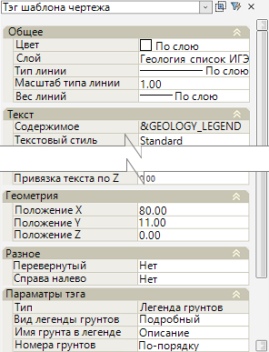

Параметры тегов редактируются в окне **Свойства**, которое содержит в себе как группы параметров оформления тега, так и группу с уникальными параметрами. 

К оформлению относятся параметры из групп **Общее**, **Текст**, **Геометрия** и **Разное**, для всех типов тегов эти параметры предоставляют одинаковые функциональные возможности, если таковые доступны. Поэтому далее рассматривается группа **Параметры тега**, которая содержит в себе уникальные параметры для каждого конкретного типа тега.  
 
<u>**Тег:**</u>

**Масштаб грунтов** 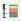 - вывод подписи масштаба геологии, определяемый на шаге 2 **Мастера создания чертежей**.

#|
||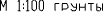 {.cell-align-center}||
||Пример отображения тега **Масштаб грунтов** в шаблоне||
|#

==============================

<u>**Тег:**</u>

**Легенда грунтов** 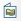 - отрисовка таблицы с геологическими данными грунтов присутствующих на чертеже.

#|
||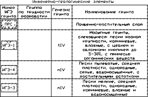 {.cell-align-center}||
||Пример отображения тега **Легенда грунтов** в шаблоне||
|#

<u>**Параметры тега**:</u>

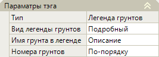

**Вид легенды грунтов** – в данном поле из списка можно выбрать вид таблицы с данными по грунтам чертежа (Подробный, Сокращенный, Альтернативный).

**Имя грунта в легенде** – в этом поле можно выбрать, какое наименование грунта из **Таблицы грунтов** будет отображаться в столбце **Наименование грунта** выводимой таблицы. При выборе значения **Описание** данные будут приняты из столбца **Описание**, при выборе значения **Наименование** данные будут приняты из столбца **Наименование**. 

**Номера грунтов** – в данном поле определяется последовательность расположения грунтов в таблице. При выборе значения **По-порядку** грунты будут располагаться в порядке наименований геологических слоев чертежа. При выборе значения **Из таблицы грунтов** порядок грунтов будет принят из **Таблицы грунтов**.

==============================

<u>**Тег:**</u>

**Шкала абсолютных отметок**  - отрисовка линейки абсолютных высот.

#|
||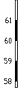 {.cell-align-center}||
||Пример отображения тега **Шкала абсолютных отметок** в шаблоне||
|#

==============================

<u>**Тег:**</u>

**Выработки** 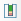 - отрисовка геологических выработок с параметрами.

#|
||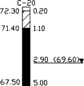 {.cell-align-center}||
||Пример отображения тега **Выработки** в шаблоне||
|#

<u>**Параметры тега**:</u>

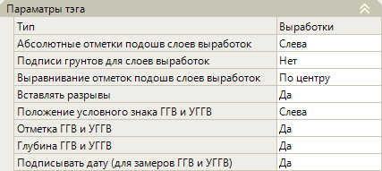

**Абсолютные отметки подошв слоев выработок** - в данном поле можно настроить отображение отметок подошв слоев выработок. Если выбрать значение **Нет**, то отметки не будут отображаться. При выборе значений **Слева** или **Справа**, отметки будут отображаться на соответствующей стороне выработки.

**Подписи грунтов для слоев выработок** - поле предназначено для настройки видимости подписей грунтов возле выработки. При выборе значения **Нет** подписи будут скрыты, при выборе значения **Да** подписи отобразятся возле выработки.

**Выравнивание отметок подошв слоев выработок** - поле предназначено для определения положения отметок выработок относительно подошв выработок (По центру, Вверх, Вниз).

**Вставлять разрывы** - данный параметр используют в случаях, например, когда размер обычных выработок превышает размеры профиля на чертеже. Если в данном поле выбрано значение **Да**, то выработки, превышающие размеры профиля, будут уменьшены в размере до границы сетки продольного профиля, а в наиболее глубоких слоях выработок будут добавлены разрывы. Ниже показан пример, вставленного разрыва в выработку:

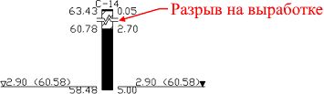

**Положение условного знака ГГВ и УГГВ** - поле, где можно указать положение условного знака (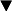) горизонта грунтовых вод (ГГВ) и установившегося горизонта грунтовых вод (УГГВ) на выработках. Доступны три варианта размещения знака: Слева, Справа и В стволе.

**Отметка ГГВ и УГГВ/ Глубина ГГВ и УГГВ/ Подписывать дату (для замеров ГГВ и УГГВ)** – эти поля можно использовать, чтобы настроить отображение соответствующих данных на выработках. Если в поле выбрано значение **Да**, то эти данные будут видны на выработках.

==============================

<u>**Тег:**</u>

**Слои** 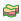 - отрисовка геологических контуров слоев грунтов.

#|
||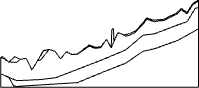 {.cell-align-center}||
||Пример отображения тега **Слои** в шаблоне||
|#

<u>**Параметры тега**:</u>

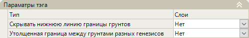

**Скрывать нижнюю линию границы грунтов** – при выборе в данном поле значения **Да** контур нижней границы нижнего слоя будет скрыт.

**Утолщенная граница между грунтами разных генезисов** - при выборе в данном значения **Да** контур границ между грунтами с разными генезисами будет утолщен. Ниже на рисунке показан пример утолщенной границы между грунтами разных генезисов.



Чтобы увидеть утолщение контуров переключитесь в режим **Редактирование макета**.



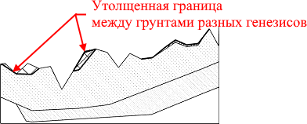

==============================

<u>**Тег:**</u>

**Штриховка слоев** 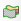 - отрисовка заливки\ штриховки геологических контуров.

#|
||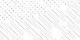 {.cell-align-center}||
||Пример отображения тега **Штриховка слоев** в шаблоне||
|#

<u>**Параметры тега**:</u>

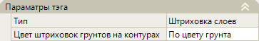

**Цвет штриховок грунтов на контурах** – по умолчанию в поле цвет штриховки грунтов стоит **По цвету грунта**, это значит, что цвет штриховки грунта соответствует цвету грунта в **Таблице грунтов**. Так же цвет штриховки грунта можно назначить как в слое тега, для этого выберите значение **По слою**.



Чтобы увидеть цвет штриховок грунтов переключитесь в режим **Редактирование макета**.



==============================

<u>**Тег:**</u>

**Подписи слоев**  - отрисовка номеров слоев грунтов.

#|
||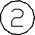 {.cell-align-center}||
||Пример отображения тега **Подписи слоев** в шаблоне||
|#

<u>**Параметры тега**:</u>

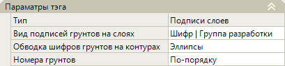

**Вид подписей грунтов на слоях** – в данном поле можно выбрать, какой вид подписи грунтов будет отображен на чертеже. В соответствии с выбранным значением в данном поле, подписи будут иметь следующий вид:

#|
||**Шифр** – подпись грунтов будет отображаться шифром (ИГЭ) грунтов в обводке, выбранной в поле **Обводка шифров грунтов на контурах** (Эллипс или кружки)|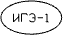 {.cell-align-center}||
||**Шифр / Группа разработки** – к подписи с шифром грунтов добавится группа разработки грунтов|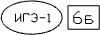 {.cell-align-center}||
||**Генезис / Шифр / Группа разработки** – к подписи с шифром и категорией разработки грунтов добавится генезис грунтов|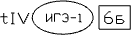 {.cell-align-center}||
||**Наименование / Группа разработки** – подпись отобразиться с названием и категорией разработки грунтов|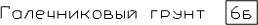 {.cell-align-center}||
||**Порядковый номер (в кружке)** – отображение подписи номера грунта в кружке, который зависит от выбранного значения в поле **Номера грунтов**. При выборе значения **По-порядку** номера грунтов будут присваиваться в порядке наименований геологических слоев чертежа. При выборе значения **Из таблицы грунтов** порядок номеров грунтов будет принят из **Таблицы грунтов**|>||
|#

==============================

<u>**Теги:**</u>

**Линия вечной мерзлоты**  - отрисовка линии вечной мерзлоты соответствующим условным обозначением.

**Линия уровня грунтовых вод**  - отрисовка линии УГВ.

#|
||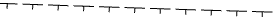 {.cell-align-center}|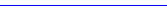 {.cell-align-center}||
||Пример отображения тега **Линия вечной мерзлоты** в шаблоне|Пример отображения тега **Линия уровня грунтовых вод** в шаблоне||
|#

==============================

<u>**Тег:**</u>

**Опробование** 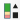 - отрисовка значков типов проб и их подписей рядом с выработкой.

#|
||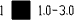 {.cell-align-center}||
||Пример отображения тега **Опробование** в шаблоне||
|#

<u>**Параметры тега**:</u>

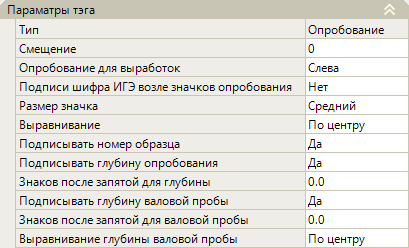

В поле **Смещение** задается расстояние от выработки до подписи опробования.

В поле **Опробование для выработок** можно изменить сторону расположения значков опробований и их подписей относительно выработки (Слева или Справа).

**Подписи шифра ИГЭ возле значков опробования** – при выборе в данном поле значения **Да**, номер шифра ИГЭ отобразится возле значков опробования.

**Размер значка** – в данном поле можно изменить размер значка опробования (Маленький, Средний, Большой).

**Выравнивание** - поле для определения положения значков опробований и их подписей относительно подошвы слоев выработок (Вверх, По центру, Вниз).

**Подписать номер образца** - при выборе в данном поле значения **Да** возле значков опробований появятся подписи из таблицы **Лаборатории** из столбца **№ пробы**. При выборе значения **Нет**, эти подписи будут скрыты. 

**Подписывать глубину опробования** – при выборе в данном поле значения **Да** возле значков опробований появятся подписи из таблицы **Лаборатории** из столбцов **Глубина взятия пробы, м** и **Глубина взятия пробы (конечная), м**. При выборе значения **Нет**, эти подписи будут скрыты.

**Знаков после запятой для глубины** – в данном поле из списка можно выбрать количество знаков после запятой для значений глубин опробований.

**Подписывать глубину валовой пробы** - при выборе в данном поле параметра **Да**, значения глубины валовой пробы отобразятся возле значков опробования.

**Знаков после запятой для валовой пробы** – в данном поле из списка можно выбрать количество знаков после запятой для значений глубин валовой пробы.

**Выравнивание глубины валовой пробы** – поле предназначено для выравнивания подписей значений глубины валовой пробы значка опробования. При выборе параметра **По центру**, значения глубин валовой пробы будут располагаться по центру значка опробования, при выборе значения **По краям** значения глубин валовой пробы будут располагаться по краям подошвы слоев выработок.

==============================

<u>**Тег:**</u>

**Испытание крыльчаткой**  - отрисовка условного обозначения с данными испытаний крыльчаткой.

#|
||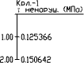 {.cell-align-center}||
||Пример отображения тега **Испытание крыльчаткой** в шаблоне||
|#

<u>**Параметры тега**:</u>

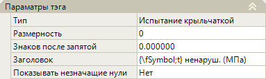

**Размерность** - если необходимо изменить единицы измерения значений испытаний крыльчаткой, например, перевести 0,000632 МПа в КПа, то в данном поле можно указать степень, в которую необходимо возвести число 10 (например, степень 3), чтобы получить значение в новых единицах измерения. Значение испытаний крыльчаткой будет рассчитано следующим образом:

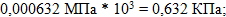

**Знаков после запятой** – в данном поле из списка можно выбрать количество знаков после запятой.

**Заголовок** – в данном поле можно изменить наименование подписи в условном обозначении испытания крыльчаткой.

**Показывать незначащие нули** – в данном поле можно отключать/ включать видимость конечных (незначащих) нулей в дробной части числа. 

==============================

<u>**Теги:**</u>

**Номер выработки** 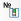 - вывод номера и типа выработки, а также испытаний крыльчаткой.

**Отметка выработки** 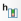 - вывод отметок устья выработок.

**Расстояние между выработками** 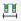 - вывод значений расстояний между выработками.

#|
||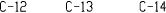 {.cell-align-center}|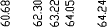 {.cell-align-center}|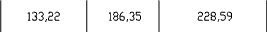 {.cell-align-center}||
||Пример отображения тега **Номер выработки** в шаблоне|Пример отображения тега **Отметка выработки** в шаблоне|Пример отображения тега **Расстояние между выработками** в шаблоне||
|#

==============================

<u>**Теги:**</u>

**Выработки на плане** 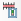 - отрисовка на развернутом плане условных обозначений геологических выработок с подписями.

**Испытание крыльчаткой на плане** 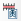 - отрисовка на развернутом плане условных обозначений испытаний крыльчаткой с подписями.



Чтобы данные теги отобразились, при создании чертежа на втором шаге **Мастер создания чертежа** в поле **Рисовать развернутый план** выберите значения **Да**.



#|
||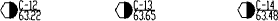 {.cell-align-center}|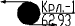 {.cell-align-center}||
||Пример отображения тега **Выработки на плане** в шаблоне|Пример отображения тега **Испытание крыльчаткой на плане** в шаблоне||
|#

==============================

<u>**Тег:**</u>

**Точки статического зондирования** - отрисовка условного обозначения точек статического зондирования (ТСЗ), а так же графика, построенного по данным этих точек.

#|
||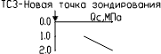 {.cell-align-center}||
||Пример отображения тега **Точки статического зондирования** в шаблоне||
|#

<u>**Параметры тега**:</u>

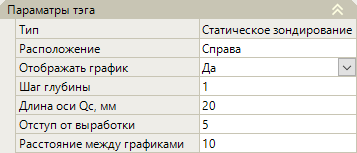

**Расположение** – в данном поле можно выбрать положение (Справа или Слева) условного обозначения ТСЗ относительно выработки, к которой ТСЗ привязана.

**Отображать график** – поле, предназначенное для управления видимостью графика ТСЗ на чертеже.

**Шаг глубины** – в данном поле можно задать интервал по глубине погружения зонда, отображаемый на графике (например, глубина каждые 0,2 м).

**Длина оси Qс, мм** – в данном поле можно изменить длину оси **Qс**, по умолчанию длина оси принята 20 мм.

**Отступ от выработки** – в данном поле можно изменить промежуток между условными обозначениями ТСЗ и выработками.

**Расстояние между графиками** - в данном поле можно задать расстояние между графиками в случае если несколько ТСЗ привязаны к одной скважине. Это позволит расставить графики на чертеже с нужным промежутком между ними. 

==============================



При изменении параметра тега меняется его содержимое. Например, тег **Подписи слоев** в **Параметрах тега** в поле **Вид подписей грунтов на слоях** имеет значение - **Шифр** и в поле **Обводка шифров грунтов** имеет значение **Кружки**. В этом случае содержимое тега будет - **&GEOLOGY\_NOTES 0 Cipher Circles Increment**. Если изменить обводку шифров грунтов на параметр **Эллипсы**, то содержимое тега так же изменится на - **&GEOLOGY\_NOTES 0 Cipher Ellipses Increment**.

