# Теги шаблона чертежа продольного профиля

В данном подразделе представлено описание тегов чертежа продольного профиля и их параметры.



Теги с геологическими данными представлены в разделе [Теги данных Геологии.](tags_data_geology.md)



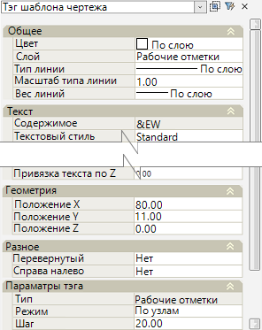

Параметры тегов редактируются в окне **Свойства**, которое содержит в себе как группы параметров оформления тега, так и группу с уникальными параметрами.

К оформлению относятся параметры из групп **Общее**, **Текст**, **Геометрия** и **Разное**, для всех типов тегов эти параметры предоставляют одинаковые функциональные возможности, если таковые доступны. Поэтому далее рассматривается группа <u>**Параметры тега:**</u>, которая содержит в себе уникальные параметры для каждого конкретного типа тега.

<u>**Тег:**</u>

**Линия**  - автоматическое формирование горизонтальной линии необходимой длины (равная длине линии черной земли на профиле).

#|
||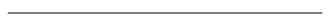 {.cell-align-center}||
||Пример отображения тега **Линия** в шаблоне||
|#

==============================

<u>**Тег:**</u>

**Отметка**  - вывод отметок по выбранной линии текущего профиля (по проектному, фактическому (черному) и интерполированному профилю), а также профилям смещений, кюветам (для модели АД) и выбранному пути (для модели ЖД).

#|
||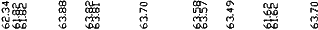 {.cell-align-center}||
||Пример отображения тега **Отметка** в шаблоне||
|#

<u>**Параметры тега:**</u> (для модели АД):

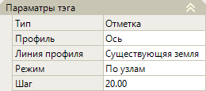

**Профиль** – в данном поле из списка назначается профиль (Ось, 1-й левый, 1-й правый, Правый кювет и т.д.), по которому будут сформированы отметки.

**Линия профиля** – в данном поле из списка назначается линия профиля (Существующая земля, Интерполированная земля, Проектная линия), по которой будут выведены отметки.

**Режим** – поле, предназначенное для переключения режима вывода отметок. При выборе значения **По узлам** – отметки будут выведены по переломным (характерным) точкам профиля. При выборе значения **С шагом** – отметки будут сформированы с заданным интервалом в поле **Шаг**.

<u>**Параметры тега:**</u> (для модели ЖД):

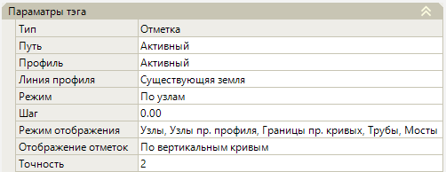

**Путь** - в этом поле из списка можно выбрать путь, по которому будут формироваться данные. Список содержит **Активный** (текущий) путь, а так же и пути, которые назначены в ссылочных подобъектах, если таковые имеются.

**Профиль** - поле для выбора профиля (Активный, Ось, профиля смещений), по которому будут сформированы отметки.

**Линия профиля** - поле для выбора линии профиля (Существующая земля, Интерполированная земля, Проектная линия) по которой будут выведены отметки.

**Режим** – поле, предназначенное для переключения режима отображения отметок. При выборе значения **С шагом** - отметки будут выведены с заданным интервалом в поле **Шаг**. При выборе значения**По узлам** – отметки будут выведены по характерным точкам, назначенным в поле **Режим отображения**. в котором нажмите кнопку , откроется окно, включите необходимые опции и нажмите **ОК**:

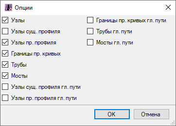

**Отображение отметок** – в данном поле можно выбрать выбрать, каким образом будут выведены отметки - **По вертикальным кривым** или **По тангенсам**.

**Точность** – в данном поле задается максимальное количество знаков после запятой в значениях отметок.

==============================

<u>**Тег:**</u>

**Расстояние**  - вывод расстояний по выбранной линии текущего профиля (по проектному, фактическому (черному) и интерполированному профилю), также профилям смещений, кюветам (для модели АД) и выбранному пути (для модели ЖД).

#|
||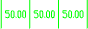 {.cell-align-center}||
||Пример отображения тега **Расстояние** в шаблоне||
|#

<u>**Параметры тега:**</u> (для модели АД):

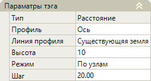

**Профиль** – в данном поле из списка назначается профиль (Ось, 1-й левый, 1-й правый, Правый кювет и т.д.), по которому будут сформированы данные.

**Линия профиля** – в данном поле из списка назначается линия профиля (Существующая земля, Интерполированная земля, Проектная линия), по которой будут выведены данные. 

**Высота** – в данном поле можно изменить высоту (вертикальный размер) засечек в теге.

**Режим** – в данном поле выбирается режим разбиения выводимых данных. При выборе значения **По узлам** – данные будут формироваться между переломными (характерными) точками профиля. При выборе значения **С шагом** – данные будут сформированы с интервалом заданным в поле **Шаг**. 

<u>**Параметры тега:**</u> (для модели ЖД):

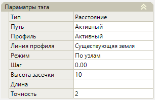

**Путь** - в этом поле из списка можно выбрать путь, по которому будут формироваться данные расстояний. Список содержит **Активный** (текущий) путь, а так же и пути, которые назначены в ссылочных подобъектах, если таковые имеются. 

**Профиль** - поле для выбора профиля (Активный, Ось, профиля смещений), по которому будут сформированы данные.

**Линия профиля** - поле для выбора линии профиля (Существующая земля, Интерполированная земля, Проектная линия) по которой будут выведены значения расстояний.

Поле **Режим** предназначено для переключения режима разбиения расстояний и засечек между ними. При выборе значения **С шагом** - отметки будут выведены с заданным интервалом в поле **Шаг**. При выборе значения **По узлам** - данные будут формироваться между переломными (характерными) точками профиля. 

**Высота засечки** – в данном поле можно изменить высоту (вертикальный размер) засечек в теге.

**Длина** – в данном поле может принята расстояние по главному пикетажу, для этого в поле нажмите кнопку , откроется окно, в котором включите соответствующую опцию и нажмите **ОК**: 

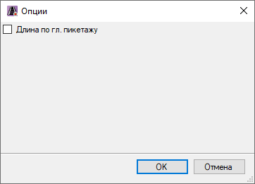

**Точность** - в данном поле задается максимальное количество знаков после запятой в значениях расстояний.

==============================

<u>**Теги:**</u>

**Уклон/ вертикальная кривая** (для модели АД)  - вывод данных уклонов, длины, вертикальной кривой по выбранной линии текущего профиля (по проектному, фактическому (черному) и интерполированному профилю), также профилям смещений и кюветам.

**Уклон/ длина/ вертикальная кривая** (для модели ЖД) - вывод данных уклонов, длины, вертикальной кривой, плюсовок по выбранной линии текущего профиля (по проектному, фактическому (черному) и интерполированному профилю), также профилям смещений и выбранному пути (для моделей ЖД).

#|
||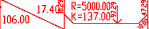 {.cell-align-center}|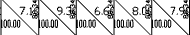 {.cell-align-center}||
||Пример отображения тега **Уклон/ вертикальная кривая** в шаблоне (для модели АД)|Пример отображения тега **Уклон/ длина/ вертикальная кривая** в шаблоне (для модели ЖД)||
|#

<u>**Параметры тега:**</u> (для модели АД):

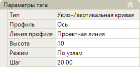

**Профиль** – в данном поле из списка назначается профиль (Ось, 1-й левый, 1-й правый, Правый кювет и т.д.), по которому будут сформированы данные.

**Линия профиля** – в данном поле из списка назначается линия профиля (Существующая земля, Интерполированная земля, Проектная линия), по которой будут выведены данные.

**Высота** – в данном поле можно изменить высоту (вертикальный размер) засечек в теге.

**Режим** – в данном поле выбирается режим разбиения выводимых данных. При выборе значения **По узлам** – данные будут формироваться между переломными (характерными) точками профиля. При выборе значения **С шагом** – данные будут сформированы с интервалом заданным в поле **Шаг**.

<u>**Параметры тега:**</u> (для модели ЖД):

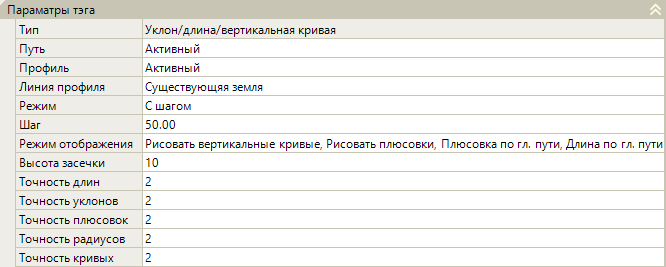

**Путь** - в этом поле из списка можно выбрать путь, по которому будут формироваться данные. Список содержит **Активный** (текущий) путь, а так же и пути, которые назначены в ссылочных подобъектах, если таковые имеются.

Поля **Профиль** и **Линия профиля** аналогичны таким же полям в параметрах тега **Уклон/ вертикальная кривая** (для модели АД) (см. описание выше).

**Режим** – поле, предназначенное для переключения режима отображения данных. При выборе значения **С шагом** - данные будут выведены с заданным интервалом в поле **Шаг**. При выборе значения **По узлам** – данные будут выведены по характерным точкам.

В поле **Режим отображения** есть опции, которые можно включать или отключать, чтобы настроить, какие данные будут отображаться. Для этого в поле нажмите кнопку , откроется окно, включите/ отключите необходимые опции и нажмите **ОК**:

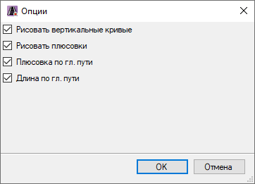

**Высота засечки** – в данном поле можно изменить высоту (вертикальный размер) засечек в теге.

В полях **Точность длин, Точность уклонов, Точность плюсовок, Точность радиусов, Точность кривых** можно задать максимальное количество знаков после запятой, которое будет отображаться в значениях тега.

==============================

<u>**Тег:**</u>

**Границы перелома профиля** 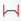 (для модели ЖД) - отрисовка засечек по границам кривых и переломам или с заданным шагом по линии текущего профиля (по проектному, фактическому (черному) и интерполированному профилю), а также профилям смещений.

#|
||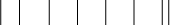 {.cell-align-center}||
||Пример отображения тега **Границы перелома профиля** в шаблоне||
|#

<u>**Параметры тега:**</u>:

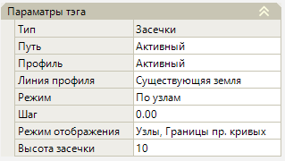

**Путь** – в этом поле из списка можно выбрать путь, по которому будут отрисованы границы перелома. Список содержит **Активный** (текущий) путь, а так же и пути, которые назначены в ссылочных подобъектах, если таковые имеются.

**Профиль** – поле для выбора профиля (Активный, Ось, профиля смещений), по которому будут сформированы границы перелома.

**Линия профиля** - поле для выбора линии профиля (Существующая земля, Интерполированная земля, Проектная линия) по которой будут сформированы границы перелома.

**Режим** – поле, предназначенное для переключения режима отображения засечек. При выборе значения **С шагом** - засечки будут отрисованы с заданным интервалом в поле **Шаг**. При выборе значения **По узлам** – засечки будут отрисованы по характерным точкам, назначенным в поле **Режим отображения**, в котором есть опции, которые можно включать или отключать, чтобы настроить, какие данные будут отображаться. Для этого в поле нажмите кнопку , откроется окно, включите/ отключите необходимые опции и нажмите **ОК**:

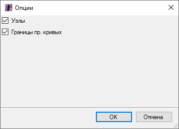

**Высота засечки** – в данном поле можно изменить высоту (вертикальный размер) засечек в теге.

==============================

<u>**Теги:**</u>

**Отметка кювета** 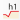 (для модели АД) - формирует отметки по профилю водоотводного сооружения (кюветам, канавам), отфильтровывая участки с рабочими отметками более или равные нулю.

**Уклон/ длина кювета** 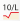 (для модели АД) - формирует уклоны и расстояния по профилю водоотводного сооружения (кюветам, канавам), отфильтровывая участки с рабочими отметками более или равные нулю.

#|
||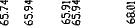 {.cell-align-center}|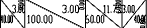 {.cell-align-center}||
||Пример отображения тега **Отметка кювета** в шаблоне|Пример отображения тега **Уклон/ длина кювета** в шаблоне||
|#

<u>**Параметры тегов:**</u>:

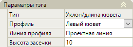

**Профиль** - в данном поле из списка выбирается профиль кювета (Левый кювет, Правый кювет) по которому будут сформированы отметки/ уклон и длина кювета.

**Линия профиля** - в данном поле из списка назначается линия профиля (Существующая земля, Интерполированная земля, Проектная линия), по которой будут выведены отметки/ уклон и длина кювета.

**Высота засечки** - в данном поле можно изменить высоту (вертикальный размер) засечек в теге.

==============================

<u>**Тег:**</u>

**Укрепление кювета** 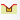 (для модели АД) - вывод данных по типу укрепления кюветов.

#|
||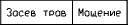 {.cell-align-center}||
||Пример отображения тега **Укрепление кювета** в шаблоне||
|#

<u>**Параметры тега:**</u>:

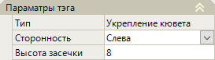

**Сторонность** – поле для выбора стороны расположения кювета, по которому будут выведены данные об укреплении.

**Высота засечки** - в данном поле можно изменить высоту (вертикальный размер) засечек в теге.

==============================

<u>**Теги:**</u>

**Отметка лотка** 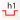 (для модели АД) - вывод отметок лотка по линии текущего профиля (по проектному, фактическому (черному) и интерполированному профилю), как левого, так и правого лотка.

**Уклон/ длина лотка** 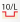 (для модели АД) - вывод уклонов и расстояний лотка по линии текущего профиля (по проектному, фактическому (черному) и интерполированному профилю), как левого, так и правого лотка.

#|
||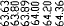 {.cell-align-center}|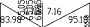 {.cell-align-center}||
||Пример отображения тега **Отметка лотка** в шаблоне|Пример отображения тега **Уклон/ длина лотка** в шаблоне||
|#

<u>**Параметры тегов:**</u>:

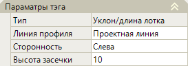

**Линия профиля** – поле для назначения линии профиля (Существующая земля, Интерполированная земля, Проектная линия), по которой будут выведены отметки, уклон и длина лотка.

**Сторонность** - поле для назначения стороны расположения лотка, по которому будут выведены отметки, уклон и длина лотка.

**Высота засечки** - в данном поле можно изменить высоту (вертикальный размер) засечек в теге.

==============================

<u>**Тег:**</u>

**Переменная** 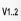 (для моделей АД и ЖД) - вывод значений некоторых переменных (в том числе и дополнительных переменных) конструкции поперечного профиля.

#|
||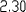 {.cell-align-center}||
||Пример отображения тега **Переменная** в шаблоне||
|#

<u>**Параметры тега:**</u> (для моделей АД и ЖД):

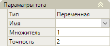

**Имя** – в данном поле из списка выбирается переменная, данные, которой необходимо вывести. Список содержит перечень элементов с переменными, находящимися в **Структуре проекта – модель АД или ЖД - Дополнительные переменные**, а так же некоторые переменные участвующие в построении.

**Множитель** – поле предназначено для введения числа (множителя) на которое будет умножаться значение переменной, например исходное значение переменной = 5, множитель = 3, тег сгенерирует значение равное 15.

**Точность** – в данном поле задается максимальное количество знаков после запятой.

<u>**Параметры тега:**</u> (для модели ЖД):

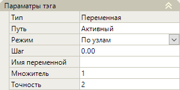

**Путь** - в этом поле из списка можно выбрать путь, по которому будут формироваться значения переменной. Список содержит **Активный** (текущий) путь, а так же и пути, которые назначены в ссылочных подобъектах, если таковые имеются.

**Режим** – поле, предназначенное для переключения режима отображения значений. При выборе значения **С шагом** - отметки будут выведены с заданным интервалом в поле **Шаг**. При выборе значения **По узлам** – будут выведены значения выбранной переменной.

Поля **Имя переменной, Множитель и Точность** аналогичны соответствующим полям, описанным в <u>**Параметры тега:**</u> (для моделей АД и ЖД), см. описание выше.

==============================

<u>**Теги:**</u>

**Разница отметок со ссылочным профилем** 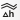 - вывод разности отметок между текущим и ссылочным профилем.

**Поперечный уклон между текущим и ссылочным профилем** 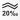 - вывод поперечных уклонов между текущим и ссылочным профилем.

**Ссылочный профиль**  - отрисовка линии ссылочного профиля.

#|
||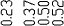 {.cell-align-center}|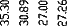 {.cell-align-center}|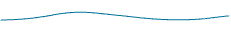 {.cell-align-center}||
||Пример отображения тега **Разница отметок со ссылочным профилем** в шаблоне|Пример отображения тега **Поперечный уклон между текущим и ссылочным профилем** в шаблоне|Пример отображения тега **Ссылочный профиль**||
|#

<u>**Параметры тегов:**</u>:

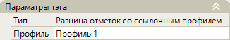

В поле **Профиль** из списка можно выбрать ссылочный профиль (Профиль 1, Профиль 2), по которому будут сформированы данные.

==============================

<u>**Теги:**</u>

**Фактический (Черный) профиль**  - отрисовка линии существующего (черного) профиля и линии грунтового профиля (для модели АД).

**Рабочие отметки** 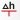 - вывод рабочих отметок в местах переломов черного профиля, по границам и элементам линии проектного профиля.

#|
||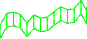 {.cell-align-center}|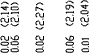 {.cell-align-center}||
||Пример отображения тега **Фактический (Черный) профиль** в шаблоне|Пример отображения тега **Рабочие отметки** в шаблоне||
|#

<u>**Параметры тега:**</u>:

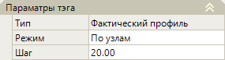

**Режим** – поле, предназначенное для переключения режима вывода данных тега. При выборе значения **По узлам** – данные будут выведены по переломным (характерным) точкам профиля. При выборе значения **С шагом** – отметки будут сформированы по заданному интервалу в поле **Шаг**.

==============================

<u>**Тег:**</u>

**Проектный профиль** 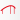 (для модели АД) - отрисовка линии проектного профиля и линий ординат по границам элементов проектного профиля.

#|
||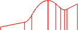 {.cell-align-center}||
||Пример отображения тега **Проектный профиль** в шаблоне||
|#

==============================

<u>**Теги:**</u>

**Проектный профиль**  (для модели ЖД) - отрисовка линии проектного профиля по границам элементов проектного профиля.

**Вертикальные кривые жд** 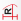 (для модели ЖД) - отрисовка линий ординат и условных обозначений вертикальных кривых проектного профиля.

#|
||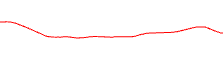 {.cell-align-center}| {.cell-align-center}||
||Пример отображения тега **Проектный профиль** в шаблоне|Пример отображения тега **Вертикальные кривые жд** в шаблоне||
|#

<u>**Параметры тегов:**</u>:

**Вертикальные кривые** - данное поле содержит список опций для выбора способа отображения вертикальных кривых профиля на чертеже:

* **По стилю чертежа** - вертикальные кривые и ее параметры будут отрисованы согласно настройкам продольного железнодорожного профиля (описание настройки продольного профиля см. раздел [Настройка продольного профиля](../../../rail/rail_profile/setup_profile.md)).
* **В шапке** - при выборе данной опции на продольном профиле вертикальные кривые рисуются без линий тангенса. При выборе данной опции в теге **Вертикальные кривые жд** линии ординат будут соответствовать границам перелома профиля.
* **Над шапкой** - при выборе данной опции на продольном профиле вертикальные кривые рисуются с линиями тангенса. При выборе данной опции в теге **Вертикальные кривые жд** параметры вертикальных кривых подписываются над шапкой чертежа, пример отображения параметров вертикальной кривой показан выше, см. Пример отображения тега **Вертикальные кривые жд в шаблоне**.
* **Не отображать** - вертикальные кривые не отображаются на продольном профиле, а при выборе данной опции в теге **Вертикальные кривые жд** в шапке не подписываются их параметры.

==============================

<u>**Тег:**</u>

**Интерполированный профиль**  - отрисовка линии интерполированного профиля.

#|
|| {.cell-align-center}||
||Пример отображения тега **Интерполированный профиль** в шаблоне||
|#

==============================

<u>**Тег:**</u>

**Дополнительный профиль**  - отрисовка линии дополнительного профиля.

#|
|| {.cell-align-center}||
||Пример отображения тега **Дополнительный профиль** в шаблоне||
|#

<u>**Параметры тега:**</u>:

**Имя дополнительного профиля** – для отображения линии дополнительного профиля в данное поле необходимо ввести наименование, соответствующее названию дополнительного профиля в **Структуре проекта**.

==============================

<u>**Теги:**</u>

**Коммуникации**  - отрисовка подсечений и их данных, например отрисовка коммуникаций.

**Колодцы**  (для модели АД) - отрисовка положения колодцев (из таблицы **Фиксированные точки** профилей смещений), относительно осевого профиля.

**УВВ**  - отрисовка линии и значений на выноске уровня высоких вод.

#|
|| {.cell-align-center}| {.cell-align-center}| {.cell-align-center}||
||Пример отображения тега **Коммуникации** в шаблоне|Пример отображения тега **Колодцы** в шаблоне|Пример отображения тега **УВВ** в шаблоне||
|#

==============================

<u>**Тег:**</u>

**Пикетаж**  - отрисовка пикетажа.

#|
|| {.cell-align-center}||
||Пример отображения тега **Пикетаж** в шаблоне||
|#

==============================

<u>**Тег:**</u>

**Расстояния**  - вывод значений расстояний между пикетами с шагом.

#|
|| {.cell-align-center}||
||Пример отображения тега **Расстояния** в шаблоне||
|#

<u>**Параметры тега:**</u>:

В поле **Шаг** задаётся интервал вывода значений расстояний между целыми пикетами.

В поле **Точность** задается максимальное количество знаков после запятой.

==============================

<u>**Тег:**</u>

**Километраж**  - отрисовка километража.

#|
|| {.cell-align-center}||
||Пример отображения тега **Километраж** в шаблоне||
|#

<u>**Параметры тега:**</u>:

**Точность** – в данном поле задается максимальное количество знаков после запятой для значений «плюсовок» километража.

**Радиус круга** – в данном поле можно изменить радиус круга условного знака.

**Длина линии** – в данном поле можно изменить длину линии условного знака.

**Штриховка** – поле предназначено для изменения заливки (штриховки) круга условного знака.

**Угол** – в данном поле можно задать угол наклона штриховки круга условного знака.

**Масштаб** - в данном поле задается масштабный коэффициент штриховки круга условного знака относительно ее исходного размера.

==============================

<u>**Тег:**</u>

**Элементы плана**  (для модели АД)- отрисовка элементов плана трассы (прямые и кривые).

#|
|| {.cell-align-center}||
||Пример отображения тега **Элементы плана** в шаблоне||
|#

<u>**Параметры тега:**</u>:

**Высота** – поле для назначения высоты линиям кривых элементов плана относительно базовой точки вставки тега, по оси Y.

**Точность радиусов/ Точность кривых/ Точность плюсовок** – в данных полях задается максимальное количество знаков после запятой для радиусов, кривых и «плюсовок» пикета.

**Подписи от оси** - если выбрано значение **Да** в данном поле, то подписи элементов плана будут размещаться от оси. Если же выбрано значение **Нет**, то подписи будут располагаться наоборот.

**Формат подписи кривой** - в данном поле можно настроить формат отображения подписей кривых элементов плана. Для этого в этом поле нажмите кнопку , откроется окно:

По умолчанию формат принят **У0R0L0T2K2**, что означает:

* **У, R, L, T, K** – обозначение параметров Угол, Радиус, Переходная кривая, Тангенс, Кривая.

* **0, 2** – максимальное количество знаков после запятой у значений кривой.

Чтобы изменить последовательность отображения подписей кривой воспользуйтесь кнопками  и .
Чтобы настроить видимость и точность параметра кривой, выберите параметр и нажмите кнопку , откроется окно:

* **Видимость** – опция включения/ отключения видимости параметра кривых. Значение **Да** видимость включена, значение **Нет** видимость отключена.

* **Точность** – в данном поле из списка можно выбрать необходимое количество знаков после запятой в значениях параметра кривой.

==============================

♦ <u>**Тег:**</u>

**Прямые и кривые в плане**  (для модели ЖД) - отрисовка элементов плана пути.

#|
|| {.cell-align-center}||
||Пример отображения тега **Прямые и кривые в плане** в шаблоне||
|#

<u>**Параметры тега:**</u>:

**Путь** – в этом поле из списка можно выбрать путь, по которому будут формироваться данные. Список содержит **Активный** (текущий) путь, а так же и пути, которые назначены в ссылочных подобъектах, если таковые имеются.

**Высота** – поле для назначения высоты линиям кривых элементов плана относительно базовой точки вставки тега, по оси Y.

**Условный знак кривой** – данное поле содержит список, в котором можно выбрать стиль отображения радиуса кривой (**Стандартный** или **Сжатый**).

**Режим отображения** – поле для настройки отображения подписей элементов плана. Для этого в поле нажмите кнопку , откроется окно, в котором включите/ отключите параметры отображения подписей и нажмите **ОК**:

**Формат подписи кривой** - в данном поле можно настроить формат отображение подписей кривых плана. Для этого в этом поле нажмите кнопку , откроется окно:

* Описание опций данного окна см. в описании выше тега **Элементы плана** (для модели АД).

**Точность плюсовок/ Точность длин** – в данных полях задается максимальное количество знаков после запятой для «плюсовок» пикета и длин прямых участков плана.

==============================

<u>**Тег:**</u>

**Развернутый план**  - отрисовка развернутого плана.

#|
|| {.cell-align-center}||
||Пример отображения тега **Развернутый план** в шаблоне
||
|#

<u>**Параметры тега:**</u>:

**Высота графы** – в данном поле можно изменить высоту (вертикальный размер) развернутого плана.

==============================

<u>**Тег:**</u>

**Возвышения наружного рельса**  (для модели ЖД) - вывод значений возвышения рельса, заданных в **Таблице уширений и возвышений**.

#|
|| {.cell-align-center}||
||Пример отображения тега **Возвышения наружного рельса** в шаблоне||
|#

<u>**Параметры тега:**</u>:

**Высота** - поле для назначения высоты расположения значений тега относительно базовой точки вставки.

**Точность** – в данном поле задаётся максимальное количество знаков после запятой для значений возвышения рельса.

==============================

<u>**Тег:**</u>

**Угол поворота в плане**  (для модели ЖД) - вывод значений углов поворота трассы в плане.

#|
|| {.cell-align-center}||
||Пример отображения тега **Угол поворота в плане** в шаблоне||
|#

==============================

<u>**Тег:**</u>

**Радиус кривой в плане**  (для модели ЖД) - вывод значений радиусов кривой в плане.

#|
|| {.cell-align-center}||
||Пример отображения тега **Радиус кривой в плане** в шаблоне||
|#

<u>**Параметры тега:**</u>:

**Точность** – в данном поле задаётся максимальное количество знаков после запятой для значений радиусов кривой в плане.

==============================

<u>**Тег:**</u>

**Схема раскладки плетей**  (для модели ЖД) - отрисовка схемы проектного положения рельсовых плетей (левая и правая нить).

#|
|| {.cell-align-center}||
||Пример отображения тега **Схема раскладки плетей** в шаблоне||
|#

<u>**Параметры тега:**</u>:

**Высота** – в данном поле можно задать расстояние от базовой точки вставки тега до центра рельсовой плети.

**Смещение подписи пикета** - в данном поле задается расстояние от базовой точки вставки тега до подписи пикета.

==============================

<u>**Тег:**</u>

**Тип поперечного профиля**  - вывод номера (кода) назначенного типа поперечного профиля земляного полотна.

#|
|| {.cell-align-center}||
||Пример отображения тега **Тип поперечного профиля** в шаблоне||
|#

<u>**Параметры тега:**</u> (для модели АД):

**Сторонность** – поле для выбора из списка стороны (Справа/ Слева) поперечного профиля, по которой нужно вывести номера (коды) соответствующих типов поперечных профилей.

**Высота засечки** – поле для назначения высоты (вертикального размера) засечек отображаемых в теге.

==============================

<u>**Тег:**</u>

**Заголовок шаблона**  - имя шаблона, которое будет отражено в поле **Шаблон** на первом шаге **Мастера создания чертежей** продольного профиля. Тег в рабочем поле отображается в виде точки. Для работы тега, файл пользовательского шаблона должен находиться в каталоге хранения системных шаблонов.

**Параметры тега:**

**Имя шаблона** – поле для ввода наименования шаблона, которое будет отображаться в поле **Шаблон** на первом шаге **Мастера создания чертежей**.

==============================

<u>**Теги:**</u>

**Горизонтальный масштаб**  - вывод подписи масштаба по горизонтали, определяемый по умолчанию на шаге 2 **Мастера создания чертежей**.

#|
|| {.cell-align-center}||
||Пример отображения тега **Горизонтальный масштаб** в шаблоне||
|#

**Вертикальный масштаб**  - вывод подписи масштаба по вертикали, определяемый по умолчанию на шаге 2 **Мастера создания чертежей**.

#|
|| {.cell-align-center}||
||Пример отображения тега **Вертикальный масштаб** в шаблоне||
|#

==============================

<u>**Теги - Ремонт/ реконструкция**</u>:

**Сдвижка пути (рихтовка)**  (для модели ЖД) - вывод данных (величин рихтовки) в метрах по сдвижкам оси пути слева или справа.

**График рихтовки**  (для модели ЖД) - отрисовка графика рихтовки.

#|
|| {.cell-align-center}| {.cell-align-center}||
||Пример отображения тега **Сдвижка пути (рихтовка)** в шаблоне|Пример отображения тега **График рихтовки** в шаблоне||
|#

**Параметры тегов:**

**Сторонность** - поле для назначения стороны рихтовки, по которой будут приняты величины рихтовок.



Данное поле не содержится в параметрах тега **График рихтовки**. Вместо этого имеется поле **Высота**, которое позволяет изменять расстояние от базовой точки вставки тега до верхней точки амплитуды. Это приводит к изменению амплитуды графика. Остальные поля у тегов **Сдвижка пути (рихтовка)** и **График рихтовки** идентичны.



Если в поле **С шагом** выбрано значение **Да**, то будут сформированы дополнительные точки на отрихтованной трассе с заданным шагом, указанным в полях **Шаг на прямой** и **Шаг на кривой**. 

**От целых пикетов** – при включенной опции (выбрано значение **Да**) заданный шаг в полях **Шаг на прямой/ Шаг на кривой** будет принят от целых пикетов. 

**По точкам сущ. пути** – величины рихтовок будут выведены по точкам существующего пути с учетом заданных выше настроек. 

**Интерполировать значения** – при выборе значения **Нет** в данном поле величины рихтовок промежуточных значений будут вычисляться по факту - как расстояние от оси рихтуемого подобъекта до оси существующего пути в точке интерполяции. Если данная опция включена (выбрано значение **Да**), то величина рихтовки промежуточных значений будет вычисляться пропорционально, в зависимости от расстояния и величин рихтовок соседних значений. 

**Путь** – в этом поле из списка можно выбрать путь, по которому будут формироваться данные. Список содержит **Активный** (текущий) путь, а так же и пути, которые назначены в ссылочных подобъектах, если таковые имеются 

==============================

<u>**Тег - Ремонт/ реконструкция**:</u>

**Исправление продольного профиля**  (для модели ЖД) - формирование данных (значений рабочих отметок в см между отметкой земли и проектным профилем) по исправлению продольного профиля.

#|
|| {.cell-align-center}||
||Пример отображения тега **Исправление продольного профиля** в шаблоне||
|#

**Параметры тега:**

**Направление** – при выборе в данном поле значения **Повышение** рабочие отметки будут выводиться в насыпи, при выборе значения **Понижение** рабочие отметки будут выводиться в выемке.

==============================

<u>**Тег - Ремонт/ реконструкция**:</u>

**График исправления продольного профиля**  (для модели ЖД) - отображение исправлений продольного профиля в виде графика.

#|
|| {.cell-align-center}||
||Пример отображения тега **График исправления продольного профиля** в шаблоне||
|#

**Параметры тега:**

**Высота** - в данном поле можно изменить расстояние от базовой точки вставки тега до верхней точки амплитуды. Это приводит к изменению амплитуды графика.

==============================

<u>**Теги - Ремонт/ реконструкция**</u>:

**Толщина существующего балласта**  (для модели ЖД) - вывод значений толщин существующего балластного слоя, которые заданы в **Структуре проекта** в таблице **Толщина существующего балласта**. Значения толщин выводятся в сантиметрах.

**Толщина проектного балласта**  (для модели ЖД) - вывод значений толщин проектного балластного слоя, которые заданы в **Структуре проекта** в таблице **Толщина проектного балласта**. Значения толщин выводятся в сантиметрах.

#|
|| {.cell-align-center}| {.cell-align-center}||
||Пример отображения тега **Толщина существующего балласта** в шаблоне|Пример отображения тега **Толщина проектного балласта** в шаблоне||
|#

**Параметры тегов:**

**Точность** - в данном поле задаётся максимальное количество знаков после запятой.

**Множитель** – в данном поле задается множитель, на который будут умножаться значения столбца **Толщина балласта, м** в таблице **Толщина существующего балласта** для тега **Толщина существующего балласта**, и в таблице **Толщина проектного балласта** для тега **Толщина проектного балласта**. 

==============================

<u>**Тег - Ремонт/ реконструкция**:</u>

**Разность отметок**  (для модели ЖД) - вывод разности отметок между выбранными путями, профилями и линиями профилей.

#|
|| {.cell-align-center}||
||Пример отображения тега **Разность отметок** в шаблоне||
|#

**Параметры тега:**

**Путь 1/ Путь 2** - поля для выбора из списка путей, по которым будут формироваться значения разности отметок. Список содержит Активный (текущий) путь, а так же и пути, которые назначены в ссылочных подобъектах, если таковые имеются.

**Профиль 1/ Профиль 2** - поля для выбора из списка профилей (Активный, Ось, профиля смещений), между которыми будут сформированы значения разности отметок.

**Линия 1/ Линия 2** - поля для выбора из списка линий профилей (Существующая земля, Интерполированная земля, Проектная линия), между которыми будут сформированы значения разности отметок. 

**Режим** – поле, предназначено для переключения режима вывода отметок. При выборе значения **С шагом** - отметки будут выведены с заданным интервалом в поле **Шаг**. При выборе значения **По узлам** – отметки будут выведены по характерным точкам, назначенным в поле **Режим отображения**, в котором нажмите кнопку , откроется окно, включите необходимые опции и нажмите **ОК**: 

**Единицы измерения** – в данном поле из списка можно выбрать единицы измерения для отображения значений отметок (Метры или Сантиметры). 

**Точность** - в данном поле задаётся максимальное количество знаков после запятой.

==============================

<u>**Тег - Ремонт/ реконструкция**:</u>

**Точечные объекты**  (для модели ЖД) - вывод данных (выбранных в свойствах тега) по точечному объекту, например, вывод номеров опор.

#|
|| {.cell-align-center}||
||Пример отображения тега **Точечные объекты** в шаблоне||
|#

**Параметры тега:**

**Путь** – поле для выбора из списка пути, назначенного в ссылочных подобъектах, относительно которого будут выведены данные точечного объекта.

**Код** – чтобы выбрать точечный объект, по которому будут выведены данные, в поле нажмите кнопку , откроется окно, в котором выберите объект и нажмите **ОК**:

**Свойство** – в этом поле из списка выберите свойство точечного объекта, которое необходимо отобразить.

**Сторонность** – выбор стороны расположения точечных знаков относительно назначенного пути (Слева или Справа).

В поле **Ширина полосы** можно задать значение ширины полосы, в пределах которой находятся точечные объекты. 

**Точность** - в данном поле задаётся максимальное количество знаков после запятой.

==============================

<u>**Теги - Ремонт/ реконструкция**</u>:

**Линия низа существующего балласта**  (для модели ЖД) - отрисовка линии низа существующего балласта.

**РГР**  (для модели ЖД) - отрисовка линии расчетной головки рельса (РГР).

#|
|| {.cell-align-center}| {.cell-align-center}||
||Пример отображения тега **Линия низа существующего балласта** в шаблоне|Пример отображения тега **РГР** в шаблоне||
|#

==============================

<u>**Тег - Вторые пути**:</u>

**Пикет неправильный**  (для модели ЖД) - отрисовка на текущем чертеже значений "плюсовок" неправильного пикета другого (смежного) пути, выбранного в **Свойствах** тега.

#|
|| {.cell-align-center}||
||Пример отображения тега **Пикет неправильный** в шаблоне||
|#

**Параметры тега:**

**Путь** – поле для выбора из списка смежного пути назначенного в ссылочных подобъектах, по которому будут выведены данные "плюсовок" пикетов.

**Режим отображения** – чтобы не отображать "плюсовки" пикетов смежного пути, совпадающие с "плюсовками" главного пути, в данном поле нажмите кнопку , откроется окно, в котором отключите соответствующую опцию и нажмите **ОК**: 

**Точность плюсовок** (для модели ЖД) - в данном поле задается максимальное количество знаков после запятой для «плюсовок» пикетов второго пути.

==============================

<u>**Тег - Вторые пути**:</u>

**Междупутье**  (для модели ЖД) - Вывод значений расстояний между выбранными в свойствах тега путями (Путь1 и Путь2) с заданным шагом.

#|
|| {.cell-align-center}||
||Пример отображения тега **Междупутье** в шаблоне||
|#

**Параметры тега:**

**Путь 1/ Путь 2** - поля для выбора из списка путей, между которыми будут сформированы значения расстояний.

**Шаг** – в данном поле можно задать интервал вывода значений.

**Точность** - в данном поле задаётся максимальное количество знаков после запятой.

==============================

<u>**Тег - Вторые пути**:</u>



Данный тег использовался в шаблонах чертежа в предыдущих версиях программы и оставлен для совместимости версий программ.



**Уклон/ длина** (для модели ЖД) - вывод данных второго пути: уклонов, длины, вертикальной кривой по линии текущего профиля (по проектному, фактическому (черному) и интерполированному профилю), также профилям смещений.

#|
|| {.cell-align-center}||
||Пример отображения тега **Уклон/ длина** в шаблоне||
|#

==============================

<u>**Тег - Вторые пути**:</u>



Данный тег использовался в шаблонах чертежа в предыдущих версиях программы (тег работает в версии 4.4) и оставлен для совместимости версий программ.



**Интерполированная отметка земли**  (для модели ЖД) - вывод значений отметок интерполированной земли по второму пути.

Для работы тега:

* Интерполированная земля на поперечниках первого пути должна пересекать ось второго пути.
* Необходимо создать чертеж или макет чертежа по шаблону Второго пути, в окне **Мастер создания чертежа/ макета** на **шаге 2** (Ввод параметров чертежа/ макета) в разделе **Параметры второго пути** необходимо указать модель второго пути.

#|
|| {.cell-align-center}||
||Пример отображения тега **Интерполированная отметка земли** в шаблоне||
|#

==============================

<u>**Тег**:</u>

**Развернутый план ЖД**  (для модели ЖД) - отрисовка развернутого плана путей, а именно оси путей, стрелки и необходимые точечные объекты.

#|
|| {.cell-align-center}||
||Пример отображения тега **Развернутый план ЖД** в шаблоне||
|#

**Параметры тега:**

**Пути** – чтобы выбрать пути, по которым будет отрисован развернутый план, в поле нажмите кнопку , откроется окно, в котором отображаются пути, назначенные как ссылочные подобъекты. Выберите необходимые пути и нажмите **ОК**: 

**Верт. масштаб** – в данном поле можно изменить вертикальный масштаб элементов плана, задав соответствующий коэффициент. 

==============================

<u>**Тег**:</u>

**Точечный условный знак на развернутом плане ЖД**  (для модели ЖД) - отрисовка точечных условных знаков ЦММ.

#|
|| {.cell-align-center}||
||Пример отображения тега **Точечный условный знак на развернутом плане ЖД** в шаблоне||
|#

**Параметры тега:**

**Пути** – поле для назначения пути, относительно которого будет отрисован точечный условный знак. Чтобы выбрать путь нажмите в поле кнопку , откроется окно, в котором выберите необходимые пути и нажмите **ОК**:

**Объект** - в данном поле выбирается семантический объект, который необходимо отрисовать. Для этого в поле нажмите кнопку , откроется окно, в котором выберите объект и нажмите **ОК**:

**Масштаб УЗ** – в данном поле можно изменить масштабный коэффициент, влияющий на масштабирование условного знака.

==============================

<u>**Тег**:</u>

**Сигналы, стыки и упоры**  (для модели ЖД) - отрисовка элементов путевого развития, стоков, упоров и т.д.

#|
|| {.cell-align-center}||
||Пример отображения тега **Сигналы, стыки и упоры** в шаблоне||
|#

**Параметры тега:**

**Пути** – поле для назначения пути, по которому будут отрисованы элементы. Чтобы выбрать путь нажмите в поле кнопку , откроется окно, в котором выберите необходимые пути и нажмите **ОК**:

**Масштаб УЗ** – в данном поле можно изменить масштабный коэффициент, влияющий на масштабирование условного знака.

==============================



При изменении параметра тега меняется его содержимое. Например, тег **Отметка** в **Параметрах тега** в поле **Линия профиля** по умолчанию имеет значение - **Существующая земля**, в этом случае содержимое тега будет - **&E CHZ 0 0 20**, если изменить линию профиля на - **Проектная линия**, то содержимое тега так же изменится на - **&E PRF 0 0 20**.

