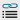
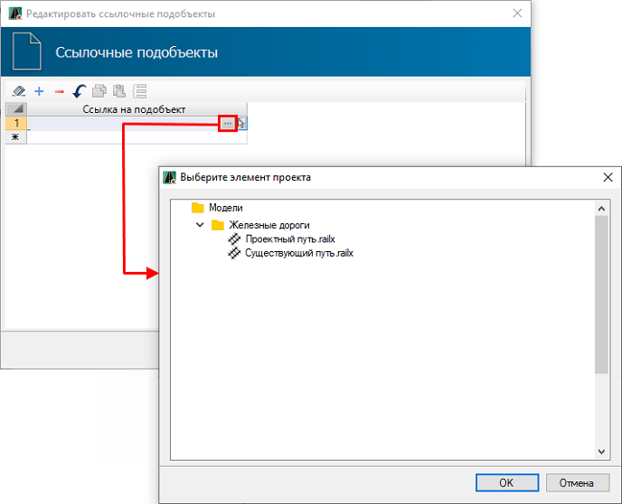
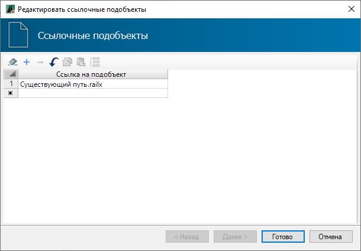

# Редактирование ссылочных подобъектов

Данная функция предназначена для назначения модели, из которой будут брать информацию некоторые теги в шаблоне продольного профиля железной дороги (версия **Топоматик Robur — Железные дороги**). Эту опцию можно применить, например, когда на выходном чертеже проектного продольного профиля необходимо показать значения расстояний между проектными и существующими путями. 

Чтобы назначить модель:

1. На панели инструментов ЛКМ нажмите  (**Редактировать ссылочные подобъекты**).
2. Откроется окно, в котором в столбце **Ссылка на подобъект** выделите строку и нажмите кнопку , откроется окно с моделями проекта, выберите модель и нажмите **Ок**:

   

3. Наименование модели добавиться в столбец **Ссылка на подобъект**. Для завершения команды нажмите **Готово**:

   

В результате будет назначена ссылочная модель.