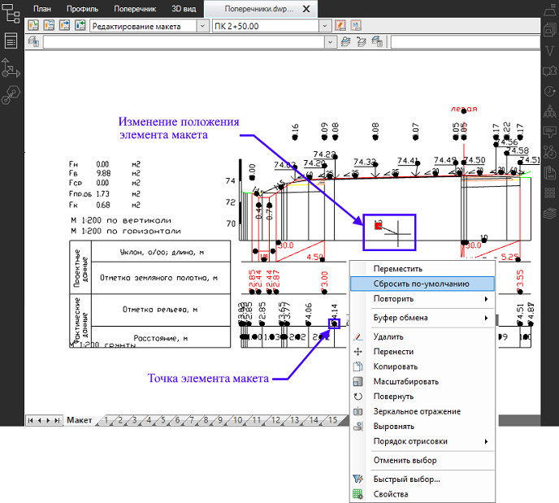
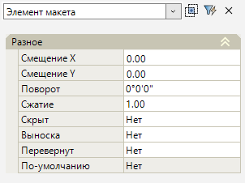
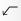
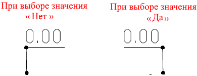

# Режим Редактирование макета

В режиме **Редактирование макета** можно переместить/ вернуть по умолчанию элементы макета (например, разнести накладывающие друг на друга элементы макета), редактировать параметры элемента макета (скрыть элемент, изменить угол поворота, сжатие и т.д.), а так же дооформить чертеж, используя любые примитивы (например, отрисовать дополнительную выноску с подписью).

Чтобы изменить положение отдельного элемента макета ЛКМ нажмите на точку элемента, появится грипп, за который можно перетащить элемент в нужном направлении. Чтобы вернуть обратно положение макета нажмите ПКМ и из контекстного меню выберите **Сбросить по – умолчанию**. 

Чтобы доработать чертеж стандартными инструментами, используя примитивы (*текст, отрезки, полилинии и т.д.*) воспользуйтесь лентой **Построения**.

Чтобы редактировать параметры элемента выделите его и откройте окно **Свойства**:

<u>**Разное**</u>

* В полях **Смещение Х** и **Смещение Y** отображается смещение по оси Х и Y выбранной точки элемента относительно текущего положения.
* В поле **Поворот** можно задать угол поворота элемента макета.
* В поле **Сжатие** можно сжать/ расширить элемент, например, для его размещения в ограниченной области.
* Поле **Скрыт** предназначено для управления отображением элемента на чертеже. При выборе значения **Да**, элемент будет скрыт.

  

  Так же удалить выделенный (-ые) элемент (-ы) можно нажав клавишу **Delete**.

  

* В поле **Выноска** при выборе значения **Да** появится выноска от исходной точки элемента (точки 0.00 по оси X и Y) до точки элемента.
* При выборе значения **Да** в поле **Перевернут** некоторые теги отобразятся в зеркальном виде, например тег (**Выноска**):

  
