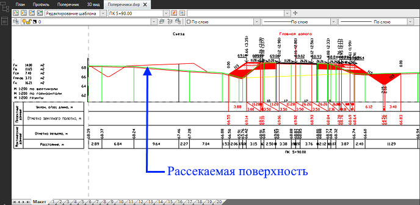
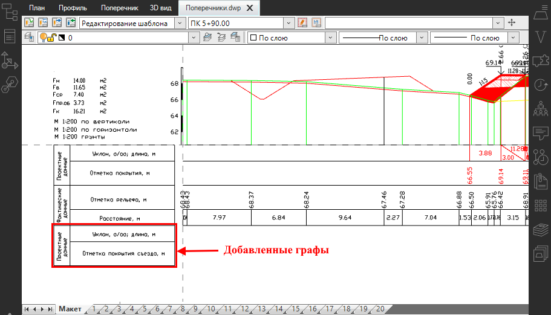
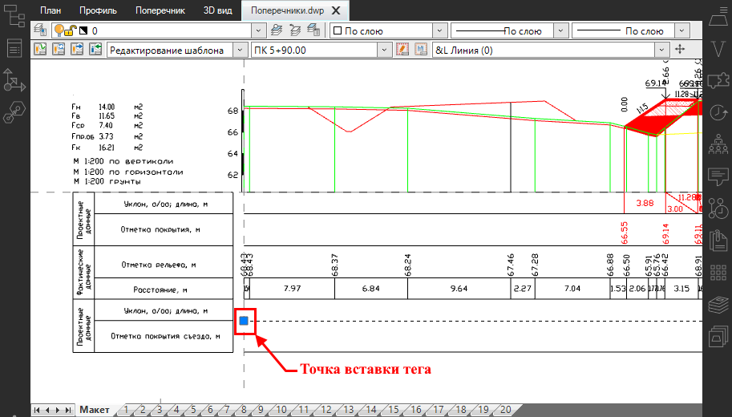
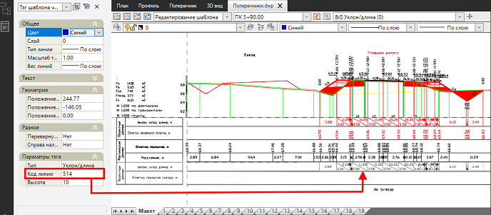
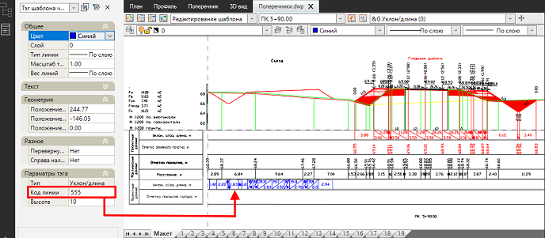
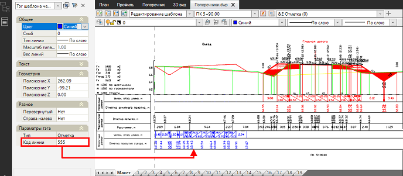
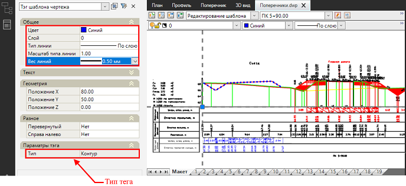
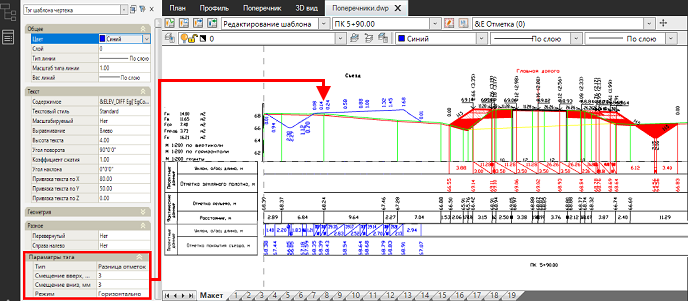

# Пример редактирования шаблона динамического чертежа

В данном разделе рассмотрен пример добавления в шаблон *поперечного профиля* новых граф для проектных данных (уклона и проектных отметок) рассекаемой проектной поверхности другой модели линейного объекта (например, когда на выходных чертежах поперечного профиля *главной дороги*, необходимо отразить данные рассекаемой поверхности *съезда*). А так же показано добавление рабочих отметок между линией земли и рассекаемой поверхностью.



Аналогичная последовательность действий применима и для других типов динамических чертежей (*Продольного профиля, Профиля сети, Колонок выработок и др*).



Для редактирования шаблона динамического чертежа:

1. С помощью примитивов (*полилиниии* и *текст*) начертите две новые графы в нижней части боковика и создайте текст с наименованием - **Уклон, o/oo; длина, м** и **Отметка покрытия съезда, м**:

   

2. Для автоматического формирования линий нужной длины в сетке данных, на ленте нажмите тег  (**Линия**) и укажите точку вставки тега на оси координат шаблона напротив линии графы боковика. Повторите действия для остальных линий сетки. В результате линии будут отрисованы и будут иметь необходимую длину:

   

3. Для формирования уклонов и расстояний по коду линии поверхности, выберите тег  (**Уклон/ длина**) и укажите точку вставки напротив графы **Уклон, o/oo; длина, м** на пересечении оси координат шаблона и линии сетки (описание вариантов вставки тега см. в подразделе **Добавление тега** раздела [Состав шаблона динамического чертежа](template_pattern.md)). В результате будет отрисован тег с данными по коду линии, который задан в свойствах тега по умолчанию, т.е. по коду **514**:

   

   В окне **Свойства** добавленного тега в поле **Код линии** задайте код **555**. В результате данные будут сформированы по коду рассекаемой поверхности и отображены в соответствующей графе под контуром рассекаемой поверхности. При необходимости в окне **Свойства** значениям тега можно задать текстовый стиль, высоту, цвет и т.д.

   

   Код рассекаемой поверхности можно посмотреть и, при необходимости, изменить в настройках модели рассекаемой поверхности во вкладке **Проектная поверхность - Общие**, см. раздел [Настройки подобъекта Автомобильная дорога.](../../../../road/general_information/setting_subobject.md)

   

   

4. Для выноса проектных отметок по рассекаемой поверхности в графу **Отметки покрытия съезда, м**, необходимо вставить тег  (**Отметка**). Вставляем тег и задаем его параметры аналогично **п.3**. В результате данные будут сформированы по коду рассекаемой поверхности и отображены в соответствующей графе под контуром рассекаемой поверхности:

   

5. На ленте выберите тег  (**Контур**), ЛКМ выберите в качестве контура рассекаемую поверхность. По рассекаемой поверхности будет отрисован тип тега **Контур**. При необходимости в окне **Свойства** тегу можно задать требуемые параметры, такие как цвет, слой, тип и толщину линий:

   

6. Чтобы показать рабочие отметки между линией земли и рассекаемой поверхностью, выберите тег  (**Разница отметок**) укажите в качестве первого контура линию земли, а в качестве второго - созданный контур в **п.5**. Рабочие отметки появятся на чертеже. При необходимости в окне **Свойства** отметкам можно задать текстовый стиль, высоту, цвет и т.д. В группе полей **Параметры** тега можно задать смещение отметок относительно контура и режим размещения отметок - вдоль контура или горизонтально оси координат шаблона:

   