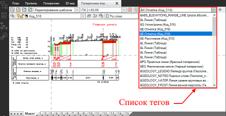
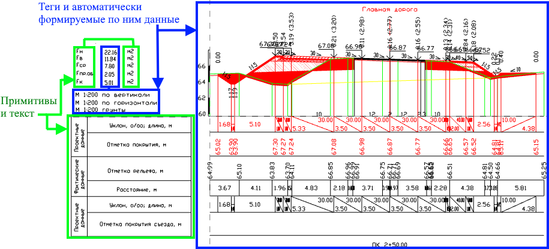
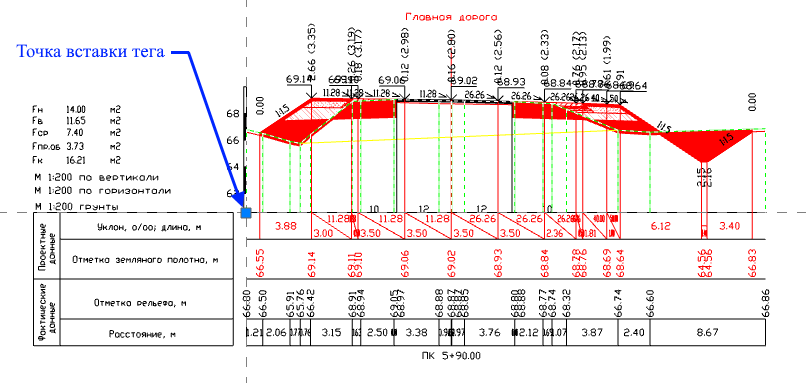
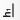
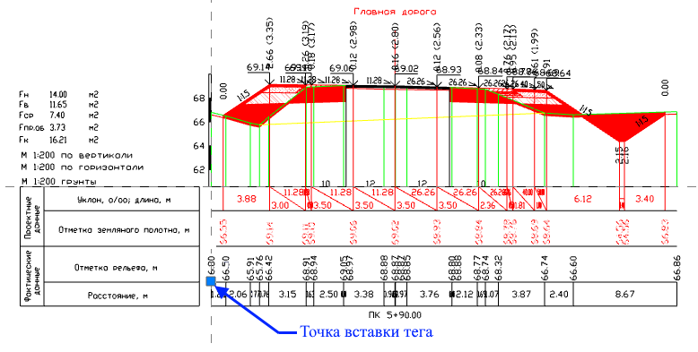
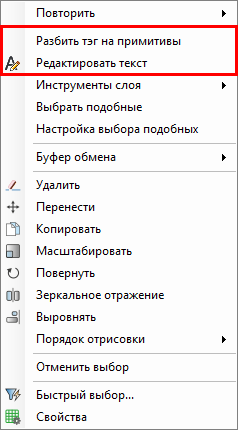
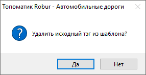
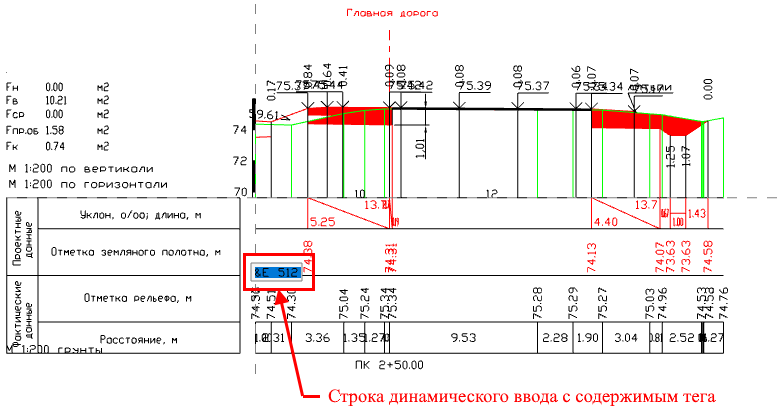
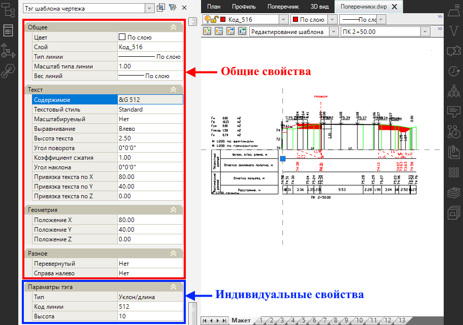

# Состав шаблона динамического чертежа

В данном разделе описываются составляющие шаблона динамического чертежа, работа с тегами шаблона, а именно их добавление/ удаление и редактирование.

## Описание шаблона

Шаблон динамического чертежа состоит из примитивов чертежа (*текст, отрезки, полилинии и т.д.*) и специальных кодов - тегов (термин **Тег** см. в разделе [Основные термины](../../basic_terms.md)).

В основном примитивы чертежа необходимы для отрисовки шапки чертежа определенного вида, вспомогательных построений и какого либо еще фиксированного набора подписей (например, наименование граф боковика, размерностей и типов объемов работ и т.д.).

Теги предназначены для автоматической прорисовки элементов динамического чертежа (линии конструкции поперечника, земли, рассекаемые поверхности и т.д.), а так же формирования и отрисовки данных чертежа (отметки, уклоны и расстояния по линиям поперечника и.т.д.). 



Список тегов содержащихся в шаблоне находится на панели инструментов. При выборе из селектора необходимого тега, программа автоматически выделит его и приблизит к нему экран.

Перечень тегов см. в разделе [Теги шаблонов чертежей.](../../tags_pattern_drawing/tags_cross_section.md) 



На схеме ниже, зеленным цветом выделена группа данных, относящаяся к примитивам, а синим - данные, которые формируются посредством тегов:

## Теги шаблона

Имеется возможность добавлять новые теги из общего списка тегов реализованных в программе, редактировать и удалять теги.

### Добавление тега

Чтобы вставить тег в текущий шаблон:

1. Выберите тип тега на ленте **Чертёж** или в меню **Рисовать – Теги шаблона**.
2. В зависимости от выбранного тега, его вставка будет отличаться:

   * Теги, которые рисуют элементы чертежа над сеткой данных (ось, проектные линии, линии фактической земли, рабочие отметки, выработки, линия уровня грунтовых вод и т.д.) будут автоматически вставлены и их точка вставки будет на пересечении системы координат шаблона:

     

   * Чтобы вставить теги, которые формируют данные по выбранным контурам или узлам шаблона (например, теги - **Разница отметок, Отметки узла на выноске, Выноска, Уклон/ заложение линии** и т.д.) следуйте указаниям в динамической подсказке возле курсора мыши. У таких тегов точка вставки будет идентична типам тегов описанным выше.
   * При выборе тегов других типов (например, тегов, которые подписывают данные в сетке профиля – уклоны, отметки и т.д., или такие теги как **Шкала абсолютных отметок, Легенда грунтов, Вертикальный/ Горизонтальный масштаб** и т.д.) необходимо в рабочем поле ЛКМ указать точку вставки напротив того места, где они должны быть отрисованы. Например, при выборе тега  (**Отметка**), чтобы расположение отметок совпадало с переломными точками линии земли, точку вставки тега необходимо указать напротив графы боковика профиля – **Отметка рельефа**, м на пересечении оси координат шаблона и линии сетки:

     

### Удаление тега

Чтобы удалить тег, выделите его и нажмите клавишу **Delete**.

### Редактирование тега

В зависимости от поставленной задачи тег можно редактировать следующими способами:

<u>**Через контекстное меню**</u>

Для этого выберите тег, нажмите ПКМ, откроется контекстное меню:

* **Разбить тег на примитивы** - тег будет разбит на исходные примитивы (*текст, отрезок и т.д.*) и удален из шаблона. Для этого выберите данный пункт, программа вынесет предупреждение, в котором нажмите **Да**:

  

* **Редактировать текст** – данная функция позволяет изменить содержимое тега, который сообщает программе, как интерпретировать данные в шаблон. Для этого выберите этот пункт, в месте точки вставки тега появится строка динамического ввода, в которой измените содержимое тега:

  

<u>**Через окно Свойства**</u>

Каждый тег имеет набор общих свойств, которые присутствуют у всех тегов и ряд индивидуальных, которые доступны только у определенного вида тегов.

К общим свойствам можно отнести цвет, слой, шрифт, геометрию (положение) и т.д. К индивидуальным свойствам относятся - код линии, код объема, высота засечки и т.д.

Все заданные свойства для тега автоматически присваиваются тем данным, которые этот тег рисует, т.е. например, задав тегу цвет, он применится и для отрисованных этим тегом данных:



Пример вставки и настройки нового тега см. в следующем разделе

